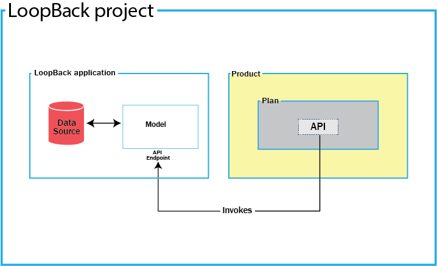

---

copyright:
  years: 2017
lastupdated: "2017-09-14"

keywords: IBM Cloud, APIs, lifecycle, catalog, manage, toolkit, develop, dev portal

subcollection: apiconnect

---

{:new_window: target="_blank"}
{:shortdesc: .shortdesc}
{:screen: .screen}
{:codeblock: .codeblock}
{:pre: .pre}

# 关于 IBM API Connect
{: #about_apic_overview}

使用 {{site.data.keyword.apiconnect_full}} 服务可迅速基于 Node.js 和 Java 运行时来创建 API 和微型服务。创建后，您可以使用业务级别控件，通过设置不同级别的安全性、可视性、收费套餐和速率限制来管理 API，同时与应用程序开发者共享 API。{{site.data.keyword.apiconnect_short}} 服务还提供了多种工具，可通过使用结构化过滤搜索进行详细分析所获得的洞察来使您的业务实现转型和发展。

<object height="315" type="application/x-shockwave-flash" width="560"
data="https://www.youtube.com/v/lmxyiNMER5Y?version=3&amp;hl=en_US">
<desc>此视频提供 {{site.data.keyword.apiconnect_short}} 服务的概述</desc>
<param name="movie" value="https://www.youtube.com/v/lmxyiNMER5Y?version=3&amp;hl=en_US"/>
<param name="allowFullScreen" value="true"/>
<param name="allowscriptaccess" value="always"/>
<param name="scale" value="noScale"/>
</object>

## API 创建
{: #creation_apic_overview}

使用 {{site.data.keyword.apiconnect_short}}，可以从 Swagger 定义中导入 API，也可以使用代理 URL 来创建 API，或通过组合 HTTP 数据源中的数据来创建 API。此外，{{site.data.keyword.apiconnect_short}} 还支持脱机创建和测试 API。开发者工具箱中嵌入了 Micro Gateway，用于支持您连接到后端数据源（例如，SQL 数据库），并执行基于创建、读取、更新和删除的操作。

开发者工具箱内已创建 API。开发者工具箱包含 CLI 和 API Designer 图形用户界面。要访问开发者工具箱，您需要从 npm 进行下载和安装。安装工具箱时，请首先创建 LoopBack 项目。下图说明了 LoopBack 项目内包含的内容。

- **LoopBack 项目**：LoopBack 项目包含 LoopBack 应用程序和 API 产品。

- **LoopBack 应用程序**：LoopBack 应用程序内有 API 端点，用于提供对数据源、业务资产或云服务的访问。

- **产品**：产品是支持您发布 API 的单元。一个产品包含一个套餐，而一个套餐包含一个 API，调用该 API 时，它将调用 API 端点。

下图演示了在开发者工具箱 CLI 或 UI 中发布 LoopBack 应用程序、API 和产品后，这些内容部署到的位置。

- **{{site.data.keyword.Bluemix_short}} 运行时**：LoopBack 应用程序会部署到您选择的 {{site.data.keyword.Bluemix_short}} 运行时。

- **网关**：API 会部署到网关。

**API Manager**：产品会部署到 API Manager，在其中可以指定产品的使用方式。

有关创建 API 所需的任务的更多信息，请参阅[创建 API](/docs/services/apiconnect?topic=apiconnect-creating_apis)。

## API 管理概述

对产品进行编译打包和发布后，可以打开 API Manager 来管理安全性、速率限制、策略和帐单信息，然后将产品发布到开发者门户网站。

如下图所示，一个产品包含一个套餐，其中包含一个或多个 API。

### 套餐
{: #plans_apic_overview}

要使 API 可供客户使用，必须将其包含在套餐内。套餐用于区分不同的产品服务。套餐可以共享 API，但是否需要预订核准取决于套餐本身。此外，还可以通过套餐或通过套餐的 API 内覆盖套餐速率限制的操作来强制执行速率限制。

套餐还可以为使用产品的客户指定计费成本。例如，您可以为单个产品定义三个不同的套餐。每个套餐可以针对不同客户具有不同的预订成本和不同的速率限制。  

### 产品
{: #products_apic_overview}

套餐和 API 按产品分组。通过产品，可以管理 API 与套餐的可用性和可视性。使用 API Designer 可创建、编辑和编译打包产品。使用 API Manager 可管理产品的生命周期。

下图演示了产品、套餐和 API 之间的彼此关联。请注意，套餐只能属于一个产品，可以拥有与相同产品内其他套餐不同的 API，还可以与任何产品中的套餐共享 API。显示产品、套餐和 API 的层次结构的图。

您只能在产品内创建套餐，随后这些产品会发布到目录中。接着，生命周期管理者可以通过 API Manager 来控制 API 和套餐的可用性和可视性。随后通过开发者门户网站，客户能够预订在 API Manager 中所确定的某个可用套餐。如果是收费套餐，客户必须在预订时提供信用卡信息。用户只能预订特定产品中的一个套餐。为单个产品定义多个套餐非常有用，不但可以实现相似的用途，而且还能提供不同级别的性能和成本。例如，您可能有“演示套餐”和“完整套餐”，前者提供单个 API，后者提供多个 API。

不同套餐可用于实施速率限制，以及控制客户可以使用哪些 API。速率限制可以实施为整个套餐中的缺省速率，也可以针对该套餐内某个 API 的特定操作实施，使其不受套餐速率限制的影响。不同套餐可采用不同的速率限制，既可以使操作采用不同的速率限制，也可以采用不同的总体限制。这有助于向客户提供不同的服务级别。例如，“演示套餐”可能强制执行 10 个调用/分钟的速率限制，而“完整套餐”可能允许最高 1000 个调用/分钟。

最后，可以使用不同的套餐来分配计费成本。套餐可以设置为免费套餐，也可以设置为收费套餐。收费套餐可与速率限制一起使用，以便为客户设置不同级别的服务。例如，每月成本 5 美元的“演示套餐”可以强制执行 10 个调用/分钟的速率限制，而每月成本 20 美元的“完整套餐”可以允许最高 1000 个调用/分钟。

**注：**在套餐级别应用速率限制会创建应用于该套餐内每个操作的缺省速率限制。如果需要针对特定操作设置特定速率限制，那么必须在这些操作本身内进行设置，并且此设置将覆盖套餐级别的设置。

IBM API Connect 还支持实施多个版本的产品。您可以选择版本号，并将其用于帮助开发产品和套餐。

**注：**产品的版本有别于关联套餐中包含的任何 API 的版本。套餐本身不能有自己的版本，而是使用其父产品的版本。

有关管理 API 所需的任务的更多信息，请参阅[管理 API](/docs/services/apiconnect?topic=apiconnect-managing_apis)。

### 目录
{: #catalogs_apic_overview}

产品必须编译打包到目录，然后发布至开发者组织，以供应用程序开发者使用。
在 {{site.data.keyword.apiconnect_short}} 中，您可以创建多个目录。
使用目录，可在将产品和 API 提供给开发者组织之前，将它们分隔开来以用于测试。

目录是打包编译的目标，其充当网关和开发者门户网站的逻辑分区。
API 调用的 URL 和开发者门户网站专用于特定目录。
在典型配置中，API 提供者组织使用开发目录来测试处于开发和生产目录下的 API，以便托管可供完整使用的 API。
常用方法是使用带有开发目录的开发云、一些测试目录和具有其自己测试目录的生产云。

#### 目录设置
{: #cat_set_apic_overview}

您可以将以下设置应用到目录：

- **开发**：缺省情况下，会为您提供开发目录。开发目录必须仅用于测试目的。在开发目录中，会强制执行编译打包和发布操作，这表示如果您重新发布之前已发布的产品，那么会直接覆盖而不会发出警告。
如果发现冲突，系统会自动解决这些冲突。这样会自动执行取消发布操作。当您在开发目录中使用测试工具时，会强制通过您所测试的任何产品，并覆盖已编译打包和已发布的产品，即使这些操作是在开发者门户网站上使用的也是如此。
通过开发目录创建的开发者门户网站必须以相同的方式使用，即仅用于测试目的而非用于真实案例。

- **自动预订**：如果启用目录的自动预订，那么 API Manager 用户界面中 API 的测试将变得更加轻松，因为通过预先提供的客户机标识和客户机私钥，使用了测试应用程序，该应用程序会自动预订目录中的所有套餐，因此在测试时您无需指定套餐或应用程序。测试应用程序不受速率限制的约束。自动预订仅可供开发目录使用。

- **缺省值**：您可以将其中一个目录设置为缺省目录。然后，对发布到目录的 API 的调用可以使用不包括目录名称的简短 URL。

有关使用开发者门户网站的更多信息，请参阅[发现和使用 API ](https://www.ibm.com/support/knowledgecenter/en/SSFS6T/com.ibm.apic.devportal.doc/capim_devportal_overview.dita){: #new_window}。

### 联合
{: #syn_apic_overview}

使用 {{site.data.keyword.apiconnect_full}} 联合功能，您可以将目录分区为空间。
每一个空间都由不同的 API 提供者开发团队使用，且具有自己的一组管理功能，这些功能特别与相关联团队发布到该空间的 API 相关，使得每一个团队都可独立地管理自己的 API。

当您将 API 编译打包并发布到启用空间的目录时，您在要编译打包或发布到的目录内指定空间。
但是，访问该目录开发者门户网站的应用程序开发者不知道命令的空间分区，而是将 API 看做协调产品。每个空间都有其自己的产品生命周期管理、预订核准和分析数据。
您使用空间特定访问控制来限制用户对每个空间的访问；例如，Flights 团队中的开发者仅可以将 API 编译打包至 Flights 空间。

**注：**缺省情况下，在目录中会禁用空间。通过修改目录设置，可以启用空间。

要对目录分区，请参阅[对目录分区](/docs/services/apiconnect?topic=apiconnect-create_catalog#apic_spaces)。
