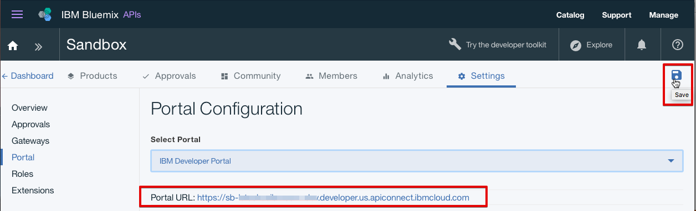
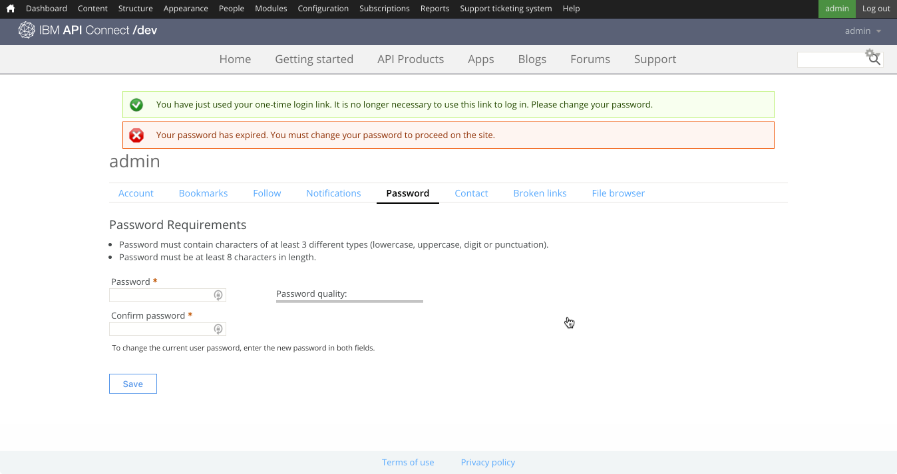
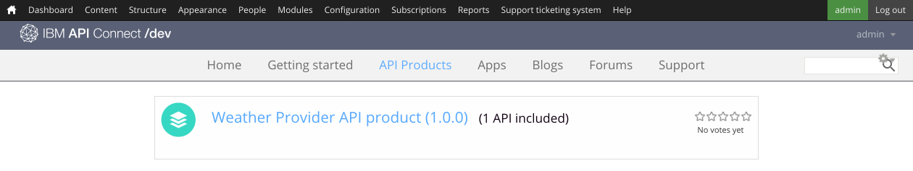

---

copyright:
  years: 2017
lastupdated: "2017-10-31"

subcollection: apiconnect

keywords: IBM Cloud, APIs, lifecycle, catalog, manage, toolkit, develop, dev portal, tutorial

---

{:new_window: target="blank"}
{:shortdesc: .shortdesc}
{:screen: .screen}
{:codeblock: .codeblock}
{:pre: .pre}

# 设置和配置开发者门户网站
{: #tut_config_dev_portal}

**持续时间**：30 分钟  
**技能级别**：初学者  

## 目标
{: #object_tut_config_dev_portal}

本教程旨在帮助您快速上手配置 **API Connect 开发者门户网站**。 

## 先决条件
{: #prereq_tut_config_dev_portal}

开始之前，需要[导入 API 规范并代理现有 REST 服务](/docs/services/apiconnect/tutorials?topic=apiconnect-tut_rest_landing)。

---

## 创建开发者门户网站
{: #create_prereq_tut_config_dev_portal}

在本部分中，您将为目录创建开发者门户网站。

*目录*是一个 IBM 术语，表示不同的环境。例如，可针对测试、编译打包和生产环境创建不同的目录。您应该有一个名为“沙箱”的目录。请自由使用此目录来创建开发者门户网站，也可创建新目录并根据您的需要命名。

1. 在 {{site.data.keyword.Bluemix_short}} 仪表板中，选择 **API Connect** 服务以启动 {{site.data.keyword.apiconnect_short}} 仪表板。

2. 在 {{site.data.keyword.apiconnect_short}} 仪表板中，选择要为其创建开发者门户网站的目录。例如，**沙箱**。

3. 在该目录中，选择**设置**选项卡。  
  

4. 在“设置”选项卡中，选择**门户网站**。  
  

5. 在“门户网站配置”页面上，从“选择门户网站”下拉列表中选择 **IBM 开发者门户网站**。 

6. 记下**门户网站 URL**，然后保存更改。  
  
  
7. 如对话框中所述，创建开发者门户网站通常需要几分钟时间。创建完成后，您会收到一封电子邮件。选择**确定**以确认对话框消息。  
  

---

## 浏览开发者门户网站
{: #explore_prereq_tut_config_dev_portal}

在本部分中，您将了解在先前步骤中创建的开发者门户网站。

1. 为目录配置开发者门户网站后，您会收到一封电子邮件，其中包含一次性登录链接。选择该链接以启动开发者门户网站。

2. 选择**登录**以登录到开发者门户网站。

3. 输入新密码，然后单击**保存**。  
  

4. 现在，您已设置了密码，下面我们将浏览开发者门户网站，从页面顶部的**主页**开始。  
  
  
|选项卡|描述| 
|:---------------- | -------------------- | 
|_主页_|“主页”是开发者门户网站的欢迎页面。可以[定制页面](/docs/service/apiconnect/tutorials?topic=apiconnect-tut_custom_dev_portal)以满足您的需求。| 
|_入门_|“入门”页面用于指示开发者如何开始使用开发者门户网站。|
|_API 产品_|“ API 产品”页面供开发者用于浏览和预订门户网站上可用的 API。| 
|_应用程序_|“应用程序”页面显示正在使用 API 的应用程序。| 
|_博客_|在“博客”页面中，可以创建和显示有关 API 的博客帖子。| 
|_论坛_|在“论坛”页面中，开发者可以讨论和发布有关 API 的问题。| 
|_支持_|在“支持”页面中，可以指导开发者如何获得有关 API 的支持。例如，可以让他们参考论坛和“常见问题解答”。您还可以提供链接，以供他们根据需要开具支持凭单。| 

注：在“API 产品”页面上，可以选择其中一个产品来查看 API 的“产品”页面和可用套餐。此页面支持开发者预订和查看 API 详细信息。 

  

### 结论
{: #conclusion_prereq_tut_config_dev_portal}

在本教程中，您已学习如何设置和配置 {{site.data.keyword.apiconnect_short}} 开发者门户网站。此外，还浏览了开发者门户网站。

---

## 下一步
{: #next_prereq_tut_config_dev_portal}

[定制开发者门户网站并选择主题](/docs/services/apiconnect/tutorials?topic=apiconnect-tut_custom_dev_portal)。

创建 > 管理 > 安全 > **社交化** > 分析
