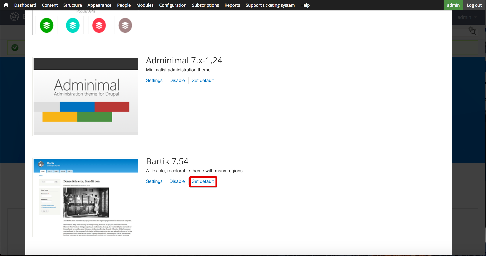
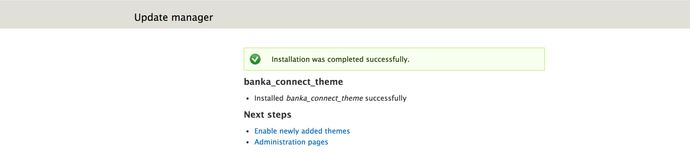

---
copyright:
  years: 2017
lastupdated: "2017-09-12"
---

{:new_window: target="blank"}
{:shortdesc: .shortdesc}
{:screen: .screen}
{:codeblock: .codeblock}
{:pre: .pre}

# 定制开发者门户网站并选择主题
**持续时间**：30 分钟  
**技能级别**：初学者  

## 目标
本教程旨在帮助您快速定制 {{site.data.keyword.apiconnect_short}} 开发者门户网站并选择适合您需求的主题。

---

## 先决条件

开始本教程之前，您应该已完成[设置和配置开发者门户网站](tut_config_dev_portal.html)教程并以门户网站管理员身份登录。

---

## 定制开发者门户网站
创建开发者门户网站后，可以对其外观进行定制。

1. 首先修改“欢迎条幅”。在顶部菜单中，选择**内容**，然后选择**块**。  
  

2. 在**欢迎条幅**块中选择**编辑**。  
  

3. 在“内容”标题下，可以通过在内容编辑器中输入文本，或者选择“编辑 HTML 源”图标来直接编辑或粘贴用于定义图像和文本规范的 HTML，从而更改“欢迎条幅”的内容文本和图像。  
   

4. 接下来再向主屏添加图像。向下滚动到“图像”标题。找到要用于背景的图像，并将其另存为适用的文件格式（png、gif、jpg 或 jpeg）。如果您没有图像，那么可以使用[此图像](images/Cloudy_Day.png)。单击**选择文件**，然后浏览以查找您所选的背景图像。选择图像后，单击**上传**。  
  

5. 图像上传后会立即显示。如果要除去图像，请单击**除去**。  
  
 
6. 在页面底部，单击**保存**以保存更改。  
  
---

## 为开发者门户网站定制主题
开发者门户网站允许您修改主题以更改其外观。

1. 要修改主题，请从顶部菜单中选择**外观**，再选择**设置**，然后选择 **IBM API Connect 主题**。这是创建开发者门户网站时的缺省主题。 

2. 通过**标准布局**选项卡，可以针对使用大屏幕的设备（例如，台式机）修改布局。通过**平板电脑布局**选项卡，可以修改平板电脑设备上使用的布局。通过**小型触摸设备布局**选项卡，可以修改智能手机等设备上使用的布局。检查这些选项卡后，选择**面板和 Gpanel**。

3. 除了修改上面的“侧边栏”布局之外，如果安装了“面板”模块，那么缺省主题还支持使用 Gpanel 或“响应式面板”。要控制标准设备、平板电脑设备和小型触摸设备上的面板布局，请展开相应部分并更新设置。 

4. 还有其他设置可以进行调整，但接下来我们将跳过这些设置，而选择**扩展**。通过此选项卡，可启用其他设置，您可以使用这些设置来配置开发者门户网站的样式。  
  

5. 在**扩展**选项卡上启用的扩展设置可以在主设置下的**扩展**部分中进行修改。     
  

6. 设置修改完成后，选择页面底部的**保存配置**。

---

## 为开发者门户网站选择其他主题
开发者门户网站随附其他主题，可供您选择和定制以更改其外观。

1. 要启用其他主题，请选择“外观”设置顶部的**列表**选项卡。 

2. 在**列表**选项卡的顶部，将显示已启用的主题。

3. 已启用主题的列表下面是已禁用主题的集合。可以通过选择**启用**来启用主题   
   

4. 主题启用后，即会显示在**列表**选项卡顶部的**已启用主题**中。可以通过选择**设置**对其进行定制。  
  

5. 完成设置修改后，可以通过选择**设置缺省值**，将该主题设置为缺省主题。     
  

---

## 为开发者门户网站安装新主题
如果修改现有主题无法满足您的需求，那么开发者门户网站还允许您安装主题来更改其外观。

1. 可以使用从 [drupal.org ](http://drupal.org){:new_window} 下载的模块或主题来定制开发者门户网站，也可以创建自己的主题。

2. 要将主题安装到开发者门户网站中，请从顶部菜单中选择**外观**，然后选择**安装新主题**。  
  

3. 您可以使用 URL 直接从 [drupal.org ](http://drupal.org){:new_window} 安装主题，也可以通过单击**选择文件**，然后单击**安装**来上传已下载或创建的主题。  
   

4. 上传完成后，需要启用主题。选择**启用新添加的主题**。  
  

5. 在列表中向下滚动并找到新安装的主题。选择**启用并设置为缺省主题**。  
  

6. 在页面底部，单击**保存**以保存更改。  

---

## 总结
祝贺您，您已完成本教程。在本教程中，您已学习如何执行以下操作：

* 定制开发者门户网站欢迎页面
* 定制开发者门户网站使用的主题 
* 选择其他主题以用于开发者门户网站
* 为开发者门户网站安装新主题

---

## 下一步

学习[用户如何浏览开发者门户网站](tut_discover_apis.html)或[如何通过基本分析获得洞察](tut_insights_analytics.html)。

创建 > 管理 > 安全 > **社交化** > 分析  

