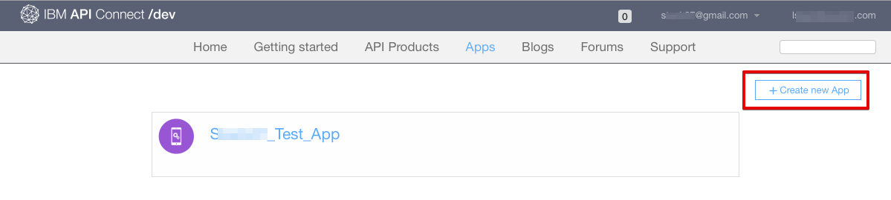

---
copyright:
  years: 2017
lastupdated: "2017-11-20"
---

{:new_window: target="_blank"}
{:shortdesc: .shortdesc}
{:screen: .screen}
{:codeblock: .codeblock}
{:pre: .pre}

# 发现 API
**持续时间**：25 分钟  
**技能级别**：初学者  

## 先决条件
本教程无先决条件。作为门户网站管理员，您还可以在浏览开发者门户网站以感受门户网站用户如何浏览开发者门户网站时完成本教程。请记住，所有开发者门户网站都有不同的外表。

 

如果您没有现有的开发者门户网站，那么可以先在 {{site.data.keyword.Bluemix_short}} 中设置和配置开发者门户网站，然后再继续本教程。

## 目标
在本教程中，您将学习门户网站用户如何在 {{site.data.keyword.apiconnect_full}} 开发者门户网站中使用 API。您将了解门户网站用户如何浏览产品和 API，查看和测试 API 以及预订 API。

 

## 浏览产品和 API
本部分显示门户网站用户将如何在开发者门户网站中浏览产品和 API。

1. 在浏览器中，导航至 **API Connect 开发者门户网站**。

2. 在 {{site.data.keyword.apiconnect_short}} 开发者门户网站中，选择“API 产品”选项卡。

3. 选择其中一个可用的 API 产品以显示该产品的可用 API 和套餐。  
  

4. 选择 API 以浏览可用 API 的详细信息。  
  

5. 在 API 的详细信息页面上，可以查看可用的操作及其参数和返回的响应。在页面末尾，可以查看 API 使用的定义。  
   

6. 在“代码示例”面板中，可以查看不同编码语言的示例，以了解调用请求的方式及其响应。选择其中一个示例（例如 **Node**）以查看该编码语言的示例。  
   

---

## 查看和测试 API
本部分显示门户网站用户将如何查看和测试产品的可用 API。 

1. 如上一部分中所概述，在 {{site.data.keyword.apiconnect_short}} 开发者门户网站中导航至 API 详细信息。  
   

2. 可以通过选择**打开 API** 来下载和查看 API Swagger YAML 信息。  
   

3. 向下滚动到其中一个操作以查看其详细信息。您还可以在页面上单击操作链接以跳至相应操作。

4. 在右侧面板的示例下，滚动到**尝试此操作**部分。输入参数，然后选择**调用操作**。  
  

5. 向下滚动以查看操作调用的请求和响应。这将显示返回的响应 **200 OK** 和消息体，指示操作调用成功。  
  

---

## 预订 API
本部分显示门户网站用户将如何在开发者门户网站中预订 API。 

1. 选择**创建帐户**。

2. 填写必填字段，然后选择页面底部的**新建帐户**。**注：**请使用与先前教程中用于创建开发者门户网站的电子邮件地址不同的电子邮件地址。

3. 创建开发者帐户后，请登录以查看主页。您必须有应用程序才能预订 API。选择**应用程序**以转至已注册应用程序页面。  
  

4. 要注册新的应用程序，请选择**新建应用程序**。  
  

5. 输入应用程序的*标题*和*描述*，然后选择**提交**。  
   

6. 现在您已有应用程序，可以预订 API 产品套餐。选择**可用 API** 或 **API 产品**以浏览 API 产品套餐。  
   

7. 选择要预订的 API 产品。  
   

8. 选择**预订**以预订该 API 产品套餐。  
   

9. 选择要预订产品套餐的应用程序，然后选择**预订**。
 

10. 应用程序已成功预订产品套餐。
 

## 结论

在本教程中，您已学习门户网站用户如何浏览产品和 API，查看和测试 API 以及预订 API。 

---

## 下一步

学习[如何通过基本分析获得洞察](tut_insights_analytics.html)。

创建 > 管理 > 安全 > **社交化** > 分析  

