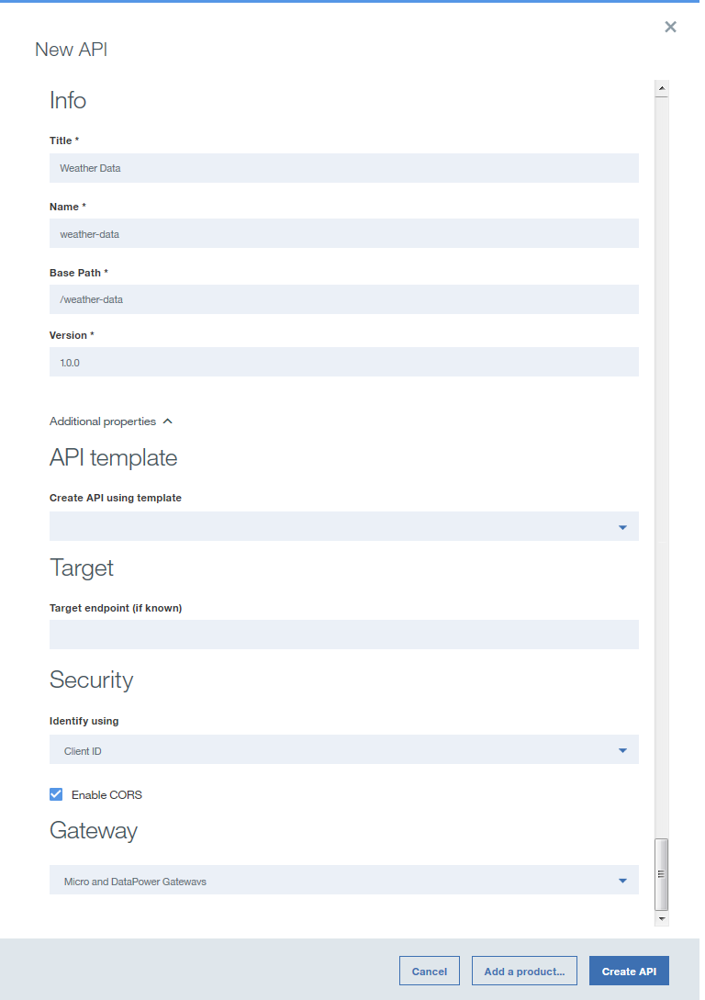
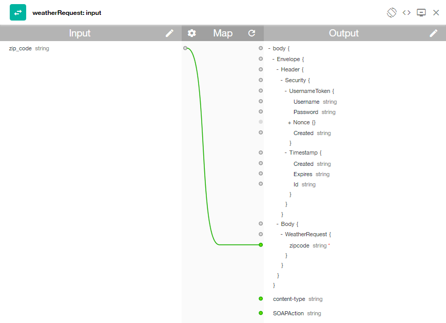
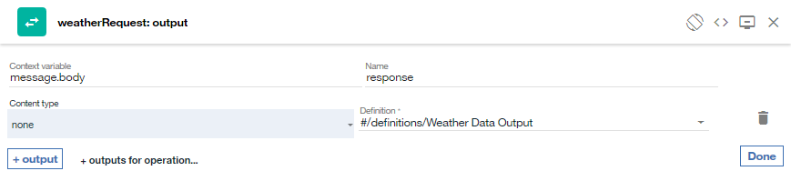

---

copyright:
years: 2019
lastupdated: "2019-3-12"

subcollection: apiconnect

keywords: IBM Cloud, APIs, lifecycle, catalog, manage, toolkit, develop, dev portal, tutorial

---

{:new_window: target="blank"}
{:shortdesc: .shortdesc}
{:screen: .screen}
{:codeblock: .codeblock}
{:pre: .pre}
 

# 将 SOAP 服务公开为 REST API
{: #tut_expose_soap_service}

**持续时间**：20 分钟  
**技能级别**：初学者  

---
## 目标
{: #object_tut_expose_soap_service}

在 API Manager 中，您将创建一个 REST API，用于访问现有 SOAP 服务并将其公开为 REST API。

## 先决条件
{: #prereq_tut_expose_soap_service}

1. 开始之前，需要[设置 {{site.data.keyword.apiconnect_full}} 实例](/docs/services/apiconnect?topic=apiconnect-tut_prereq_set_up_apic_instance)。
2. 开始之前，请将 [weatherprovider.wsdl 测试 ](https://raw.githubusercontent.com/IBM-Bluemix-Docs/apiconnect/master/tutorials/weatherprovider.wsdl){: #new_window} 文件复制到本地文件系统。
	>![images/info.png]
	>可以单击**原始**，然后将生成的页面在本地系统上另存为 `.wsdl` 文件。

---
## 设置 REST API 定义
{: #setup_tut_expose_soap_service}

1. 登录到 {{site.data.keyword.Bluemix_short}}：https://cloud.ibm.com。
2. 在 {{site.data.keyword.Bluemix_notm}} **仪表板**中，单击 **Cloud Foundary 服务**。启动 {{site.data.keyword.apiconnect_short}} 服务。 
3. 在 {{site.data.keyword.apiconnect_short}} 中，确保导航面板已打开。如果未打开，请单击 **>>** 将其打开。  

  

4. 在导航面板中选择**草稿**。
5. 选择**添加 +** > **新建 API**。

      
	6. 指定有关 API 的基本信息。
	- 在**标题**字段中，输入 `Weather Data`。
	- 输入标题时，**名称**字段会填充 `weather-data`，请保留此值不变。	
	- 将**基本路径**字段保留为 `/weather-data`。
	- 将**版本**字段保留为 `1.0.0`。
7. 展开**其他属性**以指定 API 的其他属性。
	- 从 **API 模板**字段中，选择**缺省值**以指示您想要使用缺省模板来创建 API 定义。
	- 将其余字段保留不变。
	
8. 将 API 添加到新产品，然后创建 API 定义。
	- 选择**添加产品**。
	- 在**标题**字段中，使用 `Weather Data product` 作为缺省值。
	- 将**名称**和**版本**字段保留不变。
	- 确保选中**将此产品发布到目录**复选框，然后选择**沙箱**作为目标目录。
	
	- 单击**创建 API**。这将打开 API 定义草稿的**设计**选项卡。
9. 现在，API 已创建。将显示“设计”页面。

   

10. 单击导航栏上的**定义**。单击**添加定义**图标 。

11. 通过单击新定义来将其展开。
12. 将定义命名为 `Weather Data Output`。
13. 该定义将有五个属性。请单击**添加属性**四次以添加其他属性。参考下图来对`属性名称`重命名，并对`描述`、`类型`和`示例`使用缺省值：
    a. 为 **Weather Data Output** 定义添加新属性。    
       - 名称：zip         /  类型：string   
       - 名称：temperature /  类型：integer   
       - 名称：humidity    /  类型：integer   
       - 名称：city        /  类型：string   
       - 名称：state       /  类型：string   

	
14. 单击导航栏中的**路径**。单击**添加路径**图标 。
15. 将新创建的路径的**标题**设置为 `/getweatherdata`。
16. 通过单击 **GET /getweatherdata** 操作以将其展开。
17. 对于 **GET /getweatherdata** 操作，请单击**添加参数**，然后单击**添加新参数**。
18. 将新参数命名为 `zip_code`，并将其余参数保留缺省值。
19. 在**响应**部分中 **200 OK** 响应的**模式**列中，选择 **Weather Data Output** 定义。对于 API 调用的响应，**Weather Data Output** 定义的对象将为响应对象。
	
20. 单击“保存”图标  以保存更改。

---
## 添加和配置 Web Service 调用
{: #add_web_tut_expose_soap_service}

要添加并配置用于将 Web Service 集成到 API 定义中的 invoke 和 map 策略，请完成以下步骤。
1. 在**服务**部分中，单击**添加服务**图标 。这将打开`通过 WSDL 导入 Web Service` 窗口。
	
2. 选择**上传文件**。
3. 在**文件上传**窗口中，指定在**先决条件**部分的`步骤 2` 中下载的 `weatherprovider.wsdl` 文件的位置，然后单击**打开**以继续。
4. 选择 **weatherService** SOAP 服务，然后单击**完成**。在**服务**部分中，**WeatherService** Web Service 与单个 **weatherRequest** 操作一起列出。
	

		
5. 导航至**组合**选项卡，然后确保选中 **DataPower Gateway 策略**。
6. 通过将光标悬停在画布上的现有 **invoke** 策略上并单击**删除策略**图标 ，从而删除该策略。
		
7. 将 **weatherRequest** Web Service 从选用板中拖至画布上显示的虚线框中。这会将一个 invoke 策略和两个 map 策略放入组合件中。第一个 map 策略用于将变量分配给 Web Service 调用的输入，第二个 map 策略用于将 Web Service 调用的输出分配给变量。第一个 map 的输出和第二个 map 的输入通过步骤 4 中提供的 WSDL 生成。
		
8. 单击 **weatherRequest: input** map 策略，然后单击属性表的“输入”列中的**编辑输入**图标 。
		
9. 单击 **+ 操作参数**，然后选择 `get /getweatherdata`。
10. 单击**完成**以添加 `zip_code` 参数。
	
11. 单击输入侧与 **zip_code string** 对应的圆圈，然后单击输出侧与 **zipcode string** 对应的圆圈。  
	
12. 关闭属性表。
13. 单击选用板中的 **weatherRequest: output** map 策略，然后单击属性工作表的“输出”列中的**编辑输出**图标 。
14. 选择 **+ 操作输出**，然后选择 `get /getweatherdata`。
15. 选择**完成**以添加 `Weather Data Output` 输出定义。
	
16. 单击输入侧与 **zip string** 对应的圆圈，然后单击输出侧与 **zip string** 对应的圆圈。参考下图来映射其余参数。
	
17. 单击**保存**图标  以保存更改。

您已在组合件中包含 Web Service 调用，并已将输入参数映射到 SOAP 请求的相应部分，将 SOAP 响应的相应部分映射到 JSON 输出。

---
## 测试 API 定义
{: #test_tut_expose_soap_service}

要使用 API Manager 测试工具来测试 API 定义，请完成以下步骤。
1. 单击**组合件**选项卡下的**测试**图标  以显示测试窗格。
	
2. 如果原先曾使用过测试工具，请单击**更改设置**。
3. 从产品列表中选择 `Weather Data product 1.0.0`。
	
4. 单击**重新发布产品**。
5. 单击**下一步**。
6. 从操作列表中选择 `get /getweatherdata`。  
	
7. 向下滚动到 **zip_code** 字段，然后输入 `10504`。  
	
8. 单击**调用**。API 将返回当前天气。  
	

---
## 结论
{: #conclusion_tut_expose_soap_service}

在本教程中，您已完成以下活动：
1. 设置 REST API 定义
2. 配置 API 以调用现有 Web Service 并返回其输出
3. 测试 API 定义

---

## 下一步
{: #next_tut_expose_soap_service}

利用[使用 OAuth 2.0 进行保护](/docs/services/apiconnect/tutorials?topic=apiconnect-tut_secure_oauth_2)来保护 API。

创建 > **管理** > 安全 > 社交化 > 分析

[important]: ./images/important.png "重要信息！"
[info]: ./images/info.png "参考信息"
[troubleshooting]: ./images/troubleshooting.png "故障诊断" 
