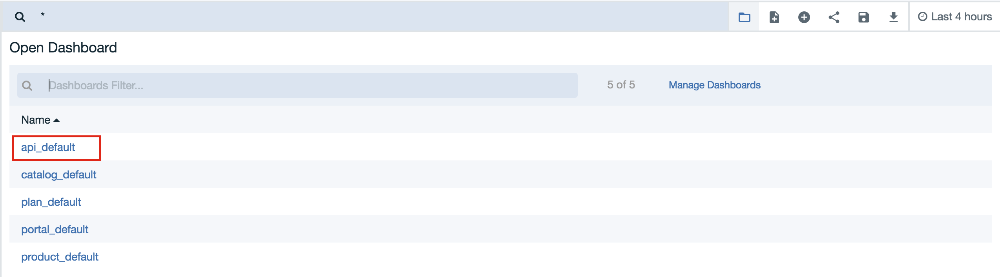
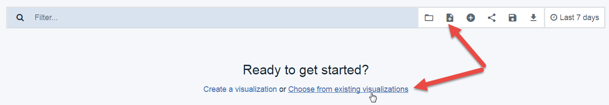

---
copyright:
  years: 2017
lastupdated: "2017-12-15"
---

{:new_window: target="blank"}
{:shortdesc: .shortdesc}
{:screen: .screen}
{:codeblock: .codeblock}
{:pre: .pre}

# 通过基本分析获得洞察
持续时间：30 分钟  
技能级别：初学者

## 目标
这是对 {{site.data.keyword.apiconnect_full}} 中 API 分析的基本介绍。我们将浏览可用的分析仪表板，并且在这个过程中，您可以使用自己的 API。

## 先决条件
为了查看您自己的 API 分析，必须已创建并发布 API 产品。此外，您还需要多次调用自己的 API 来生成一些分析数据，最好是使用已注册应用程序（而非预供应的测试应用程序）中的客户机标识。

为了在本教程中生成数据，我们使用了 Postman 的*集合运行器*通过不同的数据和客户机标识来多次调用某个 API。您可以使用类似的工具（如用于 Firefox 的 HttpRequester），或者直接使用 cURL 通过命令行多次调用您的 API。通过单击 {{site.data.keyword.apiconnect_short}} 中的**浏览**链接可以获取 API 的样本请求。

## 目录分析简介
作为 API 所有者，您需要一种方法来评估自己提供的 API 的成功程度及其性能。您将查找分析的主要位置位于目录级别。如果尚不了解目录，请参阅 IBM Knowledge Center 中的[使用目录 ](https://www.ibm.com/support/knowledgecenter/en/SSFS6T/com.ibm.apic.apionprem.doc/conref_working_with_env.html){:new_window} 以进行简要了解。 

您和应用开发者还可以在开发者门户网站中访问特定于应用程序的分析，但在本教程中，我们将重点关注“目录分析”。

您有权在长达 90 天的时间里访问有关发布到该目录的 API 和产品的实时和历史信息。此外，还会显示这些对象的当前调用者。如果目录有多个空间，那么可以导航到“空间”级别。

本教程由四个活动组成，它们向您说明如何完成以下任务：
* 查看分析
* 查看事件记录详细信息
* 构建新的仪表板
* 创建新的可视化项

## 活动 1：查看开箱即用的分析
1. 在 {{site.data.keyword.Bluemix_short}} 上的 {{site.data.keyword.apiconnect_short}} 服务中，启动“仪表板”并选择要打开的目录。 
2. 单击*分析*选项卡。

    
  
您将看到缺省“概述”仪表板，其中显示的两个条形图可视化项包含最近 7 天的以下数据：
* 前 5 大热门产品 
* 前 5 大热门 API 

3. 将鼠标悬停在任意条形上以查看其他详细信息，例如 API 计数、API 名称等。

    

4. 使用搜索栏过滤显示的数据。您还可以选择其他时间过滤器和/或自动刷新率。可视化项将更新以反映您的选择。

另外还提供有其他仪表板供您开箱即用。

5. 单击“文件夹”图标以装入保存的仪表板，然后从下拉列表中选择 **api_default**。

    

此仪表板有一组不同的可视化项，用于显示 API 状态、错误、响应时间、调用总数以及每天的调用数。

    

## 活动 2：查看事件详细信息

可视化项非常适合用于获取数据的有用概述，但您还需要一种方法来导航到用于填充图表的事件记录。

1. 将鼠标悬停在任何可视化项左下角的箭头图标上。这将显示一个小箭头。
2. 单击该箭头可查看该可视化项中使用的数据的表。 
3. 单击**查看事件**标签可导航到最多 100 个记录的单个事件详细信息。

    

可以在仪表板上编辑、移动和删除可视化项。

## 活动 3：构建新的仪表板

现在，我们将创建一个新的仪表板，用于提供 API 流量模式的视图。这些都是使用内置可视化项提供的。 

1. 单击“新建仪表板”图标，然后单击**从现有可视化项中选择**链接。 

    
这将显示可用可视化项的列表。

2. 选择要添加到仪表板的一些可视化项。例如：
  * 预订的应用程序
  * 每个套餐的应用程序数 
  * 成功率
  * 每日 API 调用数
  
  **提示**：选择每个可视化项时，选择选项卡会阻止仪表板视图显示，因此您可能不会意识到已将可视化项添加到仪表板。请一次选择一个可视化项，每次选择后关闭选择选项卡来查看仪表板的更改。

3. 单击**保存**并为仪表板提供名称：`订户仪表板`。

   

    

## 活动 4：创建新的可视化项
在已创建的“订户仪表板”上，我们包含了用于显示每日 API 调用数的内置可视化项。当查看一起显示的所有信息时，我们实际希望按应用程序查看使用情况。所以，下面将创建一个新的可视化项来显示此信息。

1. 单击**新建可视化项**，然后选择**创建可视化项**链接。
 

2. 选择**折线图**作为可视化项类型。初始化后的折线图将 Y 轴设置为 API 调用计数。这适合我们的图表。

3. 选择以下各项：
	* 存储区类型：**X 轴**
	* 聚集：**日期直方图**
	* 定制标签：**时间** 
4. 单击**运行**以查看图表。**提示**：您可能需要调整时间范围来查看数据。

   

此图表（到目前为止）显示了 API 调用的时间序列。我们希望按应用程序名称来查看 API 调用数。

5. 单击**添加子存储区**按钮。
6. 选择以下各项：
	* 存储区类型：**分割线**
	* 子聚集：**词汇**
	* 字段：**app_name**
	* 定制标签：**应用程序**
	
   
8. 单击**运行**以查看图表。
9. 单击**保存**并为图表提供名称：`按应用程序列出的 API 调用数`。
10. 要在上下文中查看可视化项，请将其添加到“订户仪表板”。

   
 
还有其他信息可用于对有关 API 调用、调用者等的详细信息进行可视化。API Connect Knowledge Center 中或创建可视化项时的“词汇”列表中提供了 API 事件的完整列表。

## 结论

借助以不同样式和组合来可视化 API 分析的能力，您可得出结论或更深入地了解 API 数据。可以使用此洞察来做出有关提供哪些 API、何时替换或引退 API 以及谁在使用 API 等的决策。

例如，来自名为“ACME”的提供者的 API V1 (V1) 和 V2 (V2) 已运行多年。他们发布 V2 时已弃用 V1。他们还确保现有 V1 使用者意识到自己必须在特定时间范围内移至 V2。随着这一截止期限的临近，ACME 希望了解使用者弃用 V1 的速度有多快，以便可以为重要合作伙伴提供帮助。 

使用类似于我们刚才所构建对象的可视化项，ACME 可以粗略掌握此信息。

在本教程中，我们逐一执行了若干活动来帮助您创建 API 和使用者数据的有用组合。使用可视化项和仪表板，我们快速创建了一些工具，它们可以提供数据来帮助确保我们提供了正确的 API 组合。

---

## 下一步

学习[如何管理 API 和版本控制](tut_manage_version_landing.html)。

创建 > 管理 > 安全 > 社交化 > **分析**  
