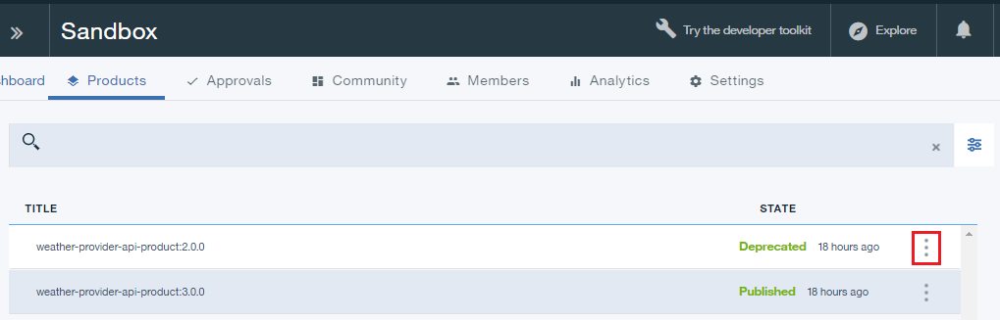
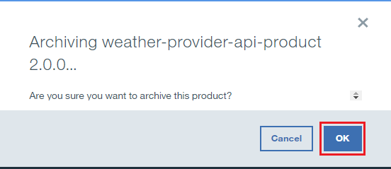
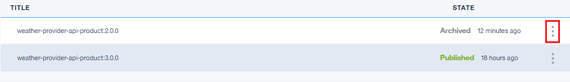

---

copyright:
  years: 2019
lastupdated: "2019-3-15"

subcollection: apiconnect

keywords: IBM Cloud, APIs, lifecycle, catalog, manage, toolkit, develop, dev portal, tutorial

---

{:new_window: target="_blank"}
{:shortdesc: .shortdesc}
{:screen: .screen}
{:codeblock: .codeblock}
{:pre: .pre}

# 归档和删除 API 产品
{: #tut_manage_remove}

**持续时间**：15 分钟  
**技能级别**：初学者 

## 目标
{: #object_tut_manage_remove}
在本教程中，您将删除、归档和引退 API。

---
## 先决条件
{: #prereq_tut_manage_remove}

1. [设置 {{site.data.keyword.apiconnect_full}} 实例](/docs/services/apiconnect/tutorials?topic=apiconnect-tut_prereq_set_up_apic_instance)。

2. 完成[取代 API 产品](/docs/services/apiconnect/tutorials?topic=apiconnect-tut_manage_supercede)教程。

---

## 删除 API 产品
{: #delete_tut_manage_remove}

1. 登录到 {{site.data.keyword.Bluemix_short}}：https://cloud.ibm.com。
2. 在 {{site.data.keyword.Bluemix_notm}} **仪表板**中，单击 **Cloud Foundary 服务**。启动 {{site.data.keyword.apiconnect_short}} 服务。 
3. 在 {{site.data.keyword.apiconnect_short}} 中，确保导航面板已打开。如果未打开，请单击 **>>** 将其打开。  

  

4. 单击**沙箱**以打开“沙箱”目录。**注**：您可能需要返回到“仪表板”来查看可用的目录。此外，“仪表板”页面可能会将目录显示为磁贴而不是列表。

5. 单击 **Weather Provider API 1.0.0** 行上的垂直省略号。  

6. 选择**从目录中删除**。  

7. 单击**确定**。  

    该产品将从目录中的产品列表中消失。此时无法对其进行恢复。

## 归档 API 产品
{: #archive_tut_manage_remove}

1. 单击 **Weather Provider API 2.0.0** 行上的垂直省略号。  

2. 选择**引退**。  

3. 单击**确定**。  

4. 单击 **Weather Provider API 2.0.0** 行上的垂直省略号。  

5. 选择**归档**。  

6. 单击**确定**。  

    该产品将从目录中的产品列表中消失。可以对其进行恢复。

7. 单击“列表视图”图标。  

8. 选中**已归档**。  

9. 单击 **Weather Provider API 2.0.0** 行上的垂直省略号。  

10. 选择**取消归档**。  

    产品的状态将更改为“已引退”。

 
 
## 结论
{: #conclusion_tut_manage_remove}

在本教程中，您已完成以下活动：

1. 删除 API 产品
2. 引退 API 产品
3. 归档 API 产品
4. 取消归档 API 产品

---

