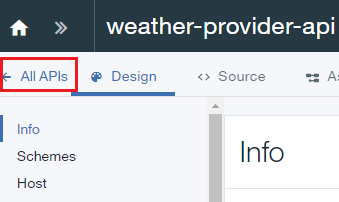
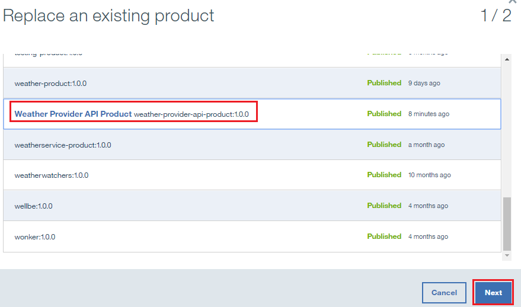

---

copyright:
  years: 2017
lastupdated: "2017-10-31"

---

{:new_window: target="_blank"}
{:shortdesc: .shortdesc}
{:screen: .screen}
{:codeblock: .codeblock}
{:pre: .pre}

# 替换 API 产品
**持续时间**：15 分钟  
**技能级别**：初学者  

## 先决条件

1. [设置 {{site.data.keyword.apiconnect_full}} 实例](tut_prereq_set_up_apic_instance.html)。

2. 完成以下其中一个教程：
 
    - [导入 OpenAPI2.0 规范并代理现有 REST 服务](tut_rest_landing.html)**或**  
    - [添加新的 API 规范并调用现有 REST 服务](tut_rest_landing.html)。

---
## 目标
在本教程中，您通过将现有 API 产品替换为较新的 API 产品，从而进行更新。替换 API 产品时，更改将立即生效，并且会自动更新所有应用程序预订。  

---
## 替换 API 产品
{: #repl_api_prod}

1. 登录到 {{site.data.keyword.Bluemix_short}}：[https://console.ng.bluemix.net/login ](https://console.ng.bluemix.net/login){:new_window}。

2. 在 {{site.data.keyword.Bluemix_notm}}“仪表板”中，启动 {{site.data.keyword.apiconnect_short}} 服务。

3. 在 API Manager 中，如果先前未锁定 UI 导航窗格，请单击**导航至**图标 。这将打开 API Manager UI 导航窗格。要锁定 UI 导航窗格，请单击**锁定菜单**图标 。

4. 单击**草稿** > **API**。

5. 在“API”面板中，单击 **Weather Provider API** 以打开 REST 代理 API。  

6. 将**版本**更改为 2.0.0。  

7. 单击“磁盘”图标以保存 API 更改。  

8. 单击**所有 API**。  

9. 单击**产品**。  

10.	选择 **Weather Provider API 产品**。  

11.	将**版本**更改为 2.0.0。在**描述**字段中，输入`更新的 API`。单击“磁盘”图标以保存更改。  

12.	单击**编译打包**图标以上传新版本。如果尚未选择**沙箱**目录，请选择该目录。
**注**：可以将新版本编译打包到其他目录，以允许控制哪些开发者受众可以看到此版本。将 API 产品从开发环境移至测试环境再移至生产环境时，此功能会很有用。

13.	单击 **>>** 以打开导航菜单，然后选择**仪表板**。  

14.	单击**沙箱**。  

15.	单击**已编译打包的 Weather Provider API 产品 2.0.0** 行上的垂直省略号。  

16.	选择**替换现有产品**。  

17.	在所提供的产品列表中选择 **Weather Provider API 产品 1.0.0**。单击**下一步**。  

18.	选择**缺省套餐**。单击**替换**。  

进行此替换后，Weather Provider API 产品 1.0.0 已引退，并且 Weather Provider API 产品 2.0.0 已发布。**注**：可以在替换过程中更改与此产品关联的套餐。通过这种方法，可轻松改变 API 产品的套餐。

## 在本教程中完成的操作

在本教程中，您已完成以下活动：
1. 更新 API 产品。
2. 将现有 API 产品替换为更新的 API 产品。

---

