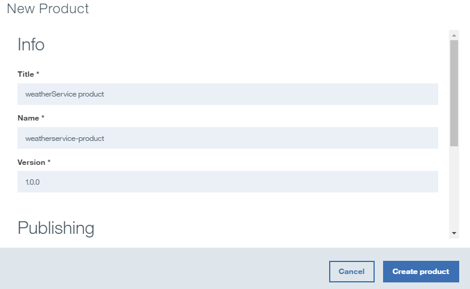

---
copyright:
  years: 2017
lastupdated: "2017-12-15"
---


{:new_window: target="_blank"}
{:shortdesc: .shortdesc}
{:screen: .screen}
{:codeblock: .codeblock}
{:pre: .pre}


# 管理 SOAP 服务
**持续时间**：15 分钟
**技能级别**：初学者

---
## 目标
在本教程中，您将使用 API Manager 来创建 SOAP API，这是基于 SOAP 的天气服务的代理。

## 先决条件
- 开始之前，需要[设置 {{site.data.keyword.apiconnect_short}} 实例](tut_prereq_set_up_apic_instance.html)。
- 开始之前，请将 [weatherprovider.wsdl 测试 ](https://raw.githubusercontent.com/IBM-Bluemix-Docs/apiconnect/master/tutorials/weatherprovider.wsdl){:new_window} 文件复制到本地文件系统。注：可以单击**原始**，然后将生成的页面在本地系统上另存为 `.wsdl` 文件。如名称所示，此 SOAP 服务在给定邮政编码时会返回相应的天气数据。

---
## 设置 SOAP API 定义
1. 登录到 {{site.data.keyword.Bluemix_short}}：[https://new-console.ng.bluemix.net/login](https://new-console.ng.bluemix.net/login){:new_window}。

2. 在 {{site.data.keyword.Bluemix_notm}} **仪表板**中，向下滚动到**所有服务**。

3. 选择 **API Connect** 以启动 {{site.data.keyword.apiconnect_short}} 服务。 
  
4. 如果您尚不在“草稿”页面中，请导航至该页面：  
    a. 在 {{site.data.keyword.apiconnect_short}} 界面中，单击 >> 以打开导航面板。
    b. 在导航面板中单击**草稿**。
    c. 转至 **API** 选项卡。

5. 在“API”选项卡中，单击`添加 +`。

6. 在下拉菜单中，选择**来自 SOAP 服务的 API**。


7. 这将打开“通过 WSDL 新建 API”对话框。单击**上传文件**。


8. 选择先前保存的 `weatherprovider.wsdl` 文件。

9. 这将再次显示“通过 WSDL 新建 API”对话框。选中 **weatherService** 复选框。单击**完成**。


10. 成功导入后，将转至 API 的“设计”视图。此外，还可以在“源”选项卡下查看 OpenAPI 定义。_在“源”选项卡中，将看到 WSDL 包装在 OpenAPI 定义中。_

11. 向下滚动到**安全性**选项卡，然后单击“删除”图标以除去创建服务时自动生成的 `clientIDHeader (API Key)`。_您将在下一个教程的“API 密钥”中学习安全性。_

12. 单击  图标以保存更改。很快将显示“API 已保存”确认通知。

13. 在带有“保存”图标的菜单栏中，**设计**选项卡会指示您的当前位置。在其旁边找到**源**选项卡，在其中可以直接查看表示您 API 的 Swagger (2.0) 文件，然后在其旁边找到**组合**选项卡，该选项卡会将您转至拖放界面进行 API 处理。单击**组合**。
  

## 测试 SOAP API 定义

1. 在**组合**选项卡中，单击**更多操作**（三个点）图标，然后从菜单中选择**生成缺省产品**。  
   

2. 接受**新建产品**弹出对话框中的缺省选项，然后选择**创建产品**。这将创建 **weatherService 产品 1.0.0**，并将其发布到“沙箱”目录。  
  
 
  _在 {{site.data.keyword.apiconnect_short}} 中，**产品**提供了用于对特定用途的 API 进行分组的机制。产品将发布到**目录**。参考：[{{site.data.keyword.apiconnect_short}} 词汇表](../apic_glossary.html)_

3. 保存更改。  

4. 在“搜索”框旁边，单击“测试”图标以测试 API 服务。这将显示“设置”菜单。

5. 从“产品”列表中，选择 `weatherService 产品 1.0.0`。  
  

6. 滚动到底部，然后单击**下一步**。

7. 从“操作”列表中，选择 `post /weatherRequest`。  
  

8. 向下滚动。在主体字段中输入以下 XML。可以选择并复制以下示例 XML，然后单击**主体**字段以激活该字段并放入示例 XML。  
  ```
  <?xml version="1.0" encoding="UTF-8"?>
  <soap:Envelope xmlns:xsi="http://www.w3.org/2001/XMLSchema-instance" xmlns:xsd="http://www.w3.org/2001/XMLSchema" xmlns:soap="http://schemas.xmlsoap.org/soap/envelope/">
   <soap:Body>
  <wdata:WeatherRequest xmlns:wdata="http://www.ibm.com/wdata">
       <zipcode>10504</zipcode>
  </wdata:WeatherRequest>
   </soap:Body>
  </soap:Envelope>
  ```
  {: codeblock}  
  

9. 根据需要向下滚动，然后单击**调用**。该 API 将返回包含当前天气的响应**主体**。  
  

## 在本教程中执行的操作
在本教程中，您已完成以下操作：
1. 设置 SOAP API 定义
2. 测试 API 定义
3. 从指示请求结果的天气 API 端点接收响应**主体**。

---

## 下一步

[将服务公开为 REST API](tut_expose_soap_service.html)，或者使用[速率限制](tut_rate_limit.html)、[客户机标识和私钥](tut_secure_landing.html)或[使用 OAuth 2.0 进行保护](tut_secure_oauth_2.html)来保护 API。

创建 > **管理** > 安全 > 社交化 > 分析
