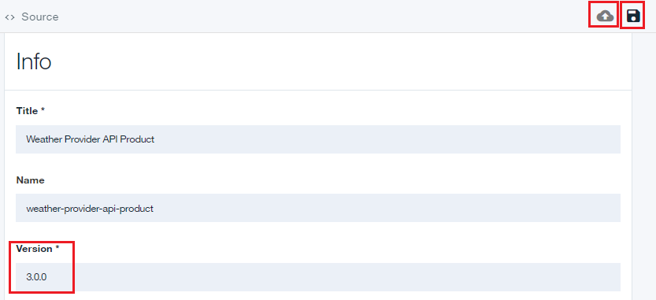
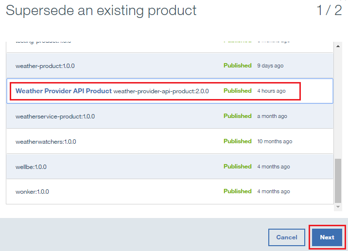
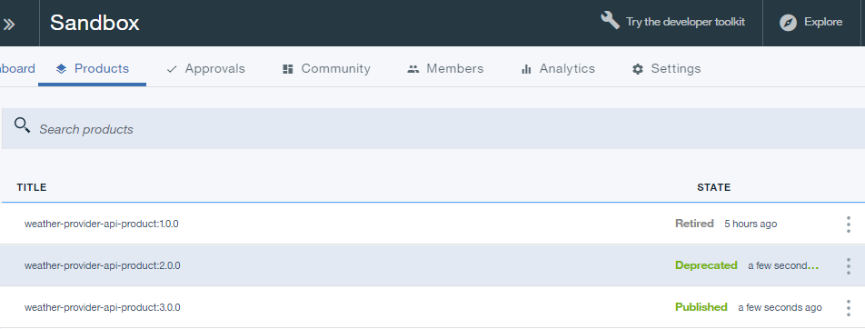
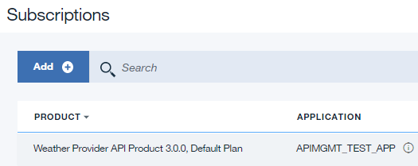

---

copyright:
  years: 2017
lastupdated: "2017-10-10"

---

{:new_window: target="_blank"}
{:shortdesc: .shortdesc}
{:screen: .screen}
{:codeblock: .codeblock}
{:pre: .pre}

# 取代 API 产品
**持续时间**：15 分钟  
**技能级别**：初学者  

## 先决条件

1. [设置 {{site.data.keyword.apiconnect_full}} 实例](tut_prereq_set_up_apic_instance.html)。

2. 完成[替换 API 产品](tut_manage_replace.html)教程。

---
## 目标
在本教程中，您将使用新的 API 取代现有 API。

---
## 取代 API 产品
1. 登录到 {{site.data.keyword.Bluemix_short}}：[https://console.ng.bluemix.net/login ](https://console.ng.bluemix.net/login){:new_window}。

2. 在 {{site.data.keyword.Bluemix_short}}“仪表板”中，启动 {{site.data.keyword.apiconnect_short}} 服务。

3. 在 API Manager 中，如果先前未锁定 UI 导航窗格，请单击**导航至**图标 。这将打开 API Manager UI 导航窗格。要锁定 UI 导航窗格，请单击**锁定菜单**图标 。

4. 单击**沙箱**以打开“沙箱”目录。**注**：您的屏幕可能会显示磁贴，而不是目录列表。

4. 单击**草稿** > **API**。

5. 在“API”面板中，单击 **Weather Provider API** 以打开 REST 代理 API。  

6. 将**版本**更改为 3.0.0。

7. 单击“磁盘”图标以保存 API 更改。  

8. 单击**所有 API**。  

9. 单击**产品**。  

10.	选择 **Weather Provider API 产品 2.0.0**。  

11.	将**版本**更改为 3.0.0。单击“磁盘”图标以保存更改。单击**编译打包**图标。  

12.	单击 **>>** 以打开导航窗格，然后选择**仪表板**。  

13.	单击**沙箱**。

14.	单击**社区**。  

15.	单击**预订**。  

16.	记下对 Weather Provider API 产品 2.0.0 的应用程序预订。单击**产品**。
  

17.	单击**已编译打包的 Weather Provider API 产品 3.0.0** 行上的垂直省略号。  

18.	选择**取代现有产品**。  

19.	在所提供的产品列表中选择 **Weather Provider API 产品 2.0.0**。单击**下一步**。  

20.	选择**缺省套餐**。单击**取代**。  

    进行此替换后，Weather Provider API 产品 2.0.0 已弃用，并且 Weather Provider API 产品 3.0.0 已发布。  
 
 
21.	单击**社区 >> 预订**。  

 
22.	单击 **Weather Provider API 产品 2.0.0** 行上的垂直省略号。选择**管理**。  
 

23.	选择“Weather Provider API 产品 3.0.0”下的**缺省套餐**。单击**迁移**。  

    进行此迁移后，Weather Provider API 产品 2.0.0 已迁移到 Weather Provider API 产品 3.0.0。  
 
 

 
## 在本教程中完成的操作
在本教程中，您已完成以下活动：

1. 更新 API 产品。
2. 使用更新的 API 产品取代现有 API 产品。
3. 将对现有 API 产品的预订迁移到更新的 API 产品。

---

