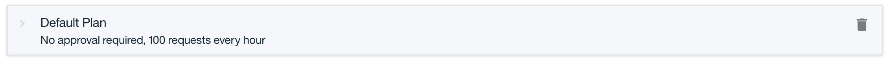
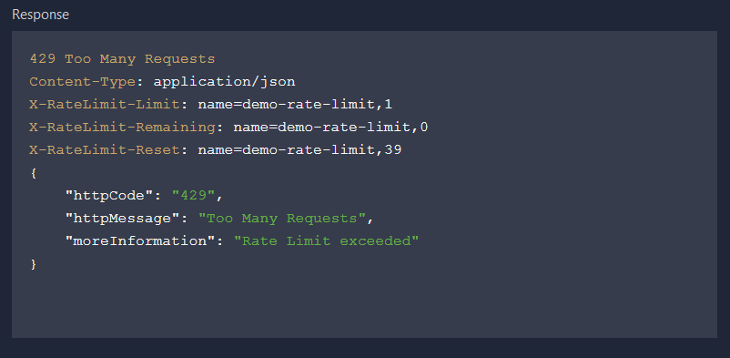

---

copyright:
  years: 2017
lastupdated: "2017-11-02"

keywords: IBM Cloud, APIs, lifecycle, catalog, manage, toolkit, develop, dev portal, tutorials

subcollection: apiconnect

---

{:new_window: target="_blank"}
{:shortdesc: .shortdesc}
{:screen: .screen}
{:codeblock: .codeblock}
{:pre: .pre}

# 设置速率限制
{: #tut_rate_limit}

**持续时间**：15 分钟  
**技能级别**：初学者  

## 目标
{: #object_tut_rate_limit}

本教程说明如何对 API 进行速率限制。通过设置速率限制，可以管理 API 以及 API 内的特定操作的网络流量。速率限制是您希望在特定时间间隔内允许的最大调用数。

在 {{site.data.keyword.apiconnect_full}} 中，*产品*用于将 API 分组为特定用例包或目标受众包。产品还包含*套餐*，用于描述您愿意向 API 使用者提供的条款。更准确地说，套餐用于定义与 API 预订关联的规则：API 速率限制以及预订是否需要核准。

应用程序开发者想要使用您的 API 时，他们将选择包含要使用的 API 的产品，并根据满足其使用需求的产品套餐来预订其中一个套餐。

在本教程中，您将执行以下操作：
1. 在现有产品中创建新的速率限制套餐。
2. 查看应用程序超过允许的速率限制时会发生的情况。

## 先决条件
{: #prereq_tut_rate_limit}

您必须已在 {{site.data.keyword.apiconnect_short}} 中创建了 API，并且至少使用 API 密钥对其进行保护。在以下指示信息中，首先从使用[客户机标识和私钥](/docs/services/apiconnect/tutorials?topic=apiconnect-tut_secure_landing)保护的 [Weather Provider API 示例文件 ](https://raw.githubusercontent.com/IBM-Bluemix-Docs/apiconnect/master/tutorials/weather-provider-api_1.yaml){: #new_window} 开始。

开始本教程之前，请先完成以下教程：
- [导入 API 规范并代理现有 REST 服务](/docs/services/apiconnect/tutorials?topic=apiconnect-tut_rest_landing)。
- [使用客户机标识和私钥保护 API](/docs/services/apiconnect/tutorials?topic=apiconnect-tut_secure_landing)。

---
## 启动 API Connect
{: #launch_tut_rate_limit}

1. 登录到 {{site.data.keyword.Bluemix_notm}}：[https://console.ng.bluemix.net/login ](https://console.ng.bluemix.net/login){: #new_window}。
2. 登录到 {{site.data.keyword.Bluemix_notm}} 后，向下滚动到**所有服务**，然后单击 **API Connect**。
3. 单击 **API Connect** 以启动 {{site.data.keyword.apiconnect_short}} 服务。

## 浏览缺省套餐
{: #explore_tut_rate_limit}

1. 在 {{site.data.keyword.apiconnect_short}} 导航面板中，选择**草稿**。（如果导航面板未打开，请单击 **>>** 以将其打开。）
2. 选择**产品**选项卡，您应该会看到列出了 Weather Provider API 产品。

         

3. 单击“产品”链接，这将打开“设计”视图，其中列出有关产品的信息。
4. 向下滚动到页面的“套餐”部分。“缺省套餐”是在生成此产品时创建的。 

       
5. 展开“缺省套餐”详细信息。请注意速率限制（100 个调用/小时）和 API 列表，可以将其展开以显示具体操作。

    

   
## 创建新的速率限制套餐
{: #create_tut_rate_limit}

现在，我们已经看到缺省套餐的内容，下面将创建一个速率限制更严格的新套餐，以演示 API 使用者超过套餐限制时会发生的情况。 
1. 单击该按钮以添加新的套餐。
 
     
    
这将创建新套餐，缺省情况下，会将其设置为允许无限使用量（即，完全没有速率限制）。我们将为其提供更有意义的名称，并设置更严格的限制。
2. 单击新套餐 (`New Plan 1`) 以展开详细信息。
3. 单击“标题”字段，然后将“套餐标题”设置为 `Demo`。
4. 单击“名称”字段，然后将“套餐名称”设置为 `demo-plan`。
5. 单击 + 以添加新的速率限制。
6. 将新的速率限制重命名为 `demo-rate-limit`，并确保将其设置为 `1 / 1 分钟`。
7. 选中`强制实施硬性限制`复选框。（启用此设置后，如果应用程序调用的 API 超过预订套餐限制所允许的次数，那么该应用程序会收到错误。）
8. 接受其他所有缺省设置并保存产品。

    

## 对更新的产品编译打包并将其发布到沙箱目录
{: #stage_tut_rate_limit}

在先前示例中，可能已使用测试工具发布了产品，该工具使用预先提供的测试应用程序凭证来调用 API。但是，此测试应用程序并不受速率限制的制约，因此我们需要在此创建一个新的应用程序以用于限制速率。有关更多信息，请参阅 [IBM Knowledge Center 中 API Connect 的内容 ](https://www.ibm.com/support/knowledgecenter/SSFS6T/com.ibm.apic.toolkit.doc/tapim_create_product.html){: #new_window}。

1. 单击“发布”图标，以将产品*编译打包*到**沙箱**目录。此操作会将草稿产品更改添加到所选目录。接下来，我们需要*发布*产品更改，以使其可供使用者通过开发者门户网站使用。
 
2. 单击 >> 按钮以打开导航菜单。
3. 选择“仪表板”，然后打开**沙箱**目录。Weather Provider API 产品会作为**已编译打包**项列出。
4. 单击省略号，然后从菜单中选择**发布**。
 
5. 接受缺省可视性设置，然后单击**发布**按钮。一旦产品发布并使其在开发者门户网站上显示后，应用程序开发者就可以预订可用套餐。

## 在开发者门户网站中注册新的（使用者）应用程序
{: #reg_tut_rate_limit}

应用程序开发者通过开发者门户网站来发现和使用 API。有关开发者门户网站的更多信息，请查看此 [IBM Knowledge Center 主题 ](https://www.ibm.com/support/knowledgecenter/SSFS6T/com.ibm.apic.devportal.doc/tapim_tutorial_using_ADP.html){: #new_window}。

如果这是您第一次使用开发者门户网站，那么您需要为“沙箱”目录供应开发者门户网站。供应门户网站时登录的帐户将是该门户网站的管理员帐户。然后，为了浏览和测试 API，您需要创建与管理员帐户不同的新开发者帐户（使用不同的电子邮件地址）并使用该帐户登录。

以下指示信息将指导您完成这些步骤。

1. 启动开发者门户网站。如果您不知道该 URL，那么可以在“沙箱”目录的“设置”选项卡中找到该 URL。如果是首次供应开发者门户网站，请参阅[设置和配置开发者门户网站](/docs/services/apiconnect/tutorials?topic=apiconnect-tut_config_dev_portal)。
    - 这可能需要一个小时才能完成。当沙箱开发者门户网站就绪后，您将收到一封电子邮件，其中包含新开发者门户网站站点的链接。这是管理员帐户的仅使用一次的链接。
2. 使用应用程序开发者凭证（而**不是**您的 IBM 标识）登录到门户网站。***（必要时，使用与 IBM 标识不同的地址来创建新的开发者帐户。）***
3. 单击工具栏上的**应用程序**链接，然后单击**新建应用程序**按钮。

4. 为应用程序提供标题，然后单击**提交**。

   
5. 保存所显示的客户机私钥和客户机标识。这是您可以复制客户机私钥的唯一机会！

   
   
   

## 预订 API 产品
{: #subscr_tut_rate_limit}

1. 单击工具栏上的 **API 产品**链接。Weather Provider API 产品已列出！ 

   
2. 单击此链接以查看详细信息和选项。您应该看到两个可用的套餐：原始缺省套餐和新的 Demo 套餐。（如果只看到一个套餐，请返回到 {{site.data.keyword.apiconnect_short}}，并确保产品更改已保存、编译打包和发布到“沙箱”目录。） 

   
3. 单击以**预订** Demo 套餐，然后选择刚注册的应用程序。现在，该应用程序可以调用与此套餐关联的 API，最高速率是每分钟*一个* API 调用。 

现在我们可随时测试此行为，并观察应用程序超过指定速率时会发生的情况。

## 调用有速率限制的 API
{: #call_tut_rate_limit}

1. 在开发者门户网站的“Weather Provider API 产品”页面上，单击该 API 链接。

   
2. 页面将刷新以显示有关该 API 及其操作的详细信息，并提供用于测试该 API 的位置。（这也是 API 使用者发现和测试 API 的方式。）请注意深色的测试窗格，然后向下滚动到第一个**尝试此操作**部分。

3. 要测试 `GET /current` 操作，请输入应用程序的客户机私钥和有效的邮政编码。单击**调用操作**按钮。您应该会获得 `200 OK` 响应，以及有关该邮政编码所代表区域的当前天气的数据。 

   

   

4. 现在，在一分钟内，再次单击**调用操作**按钮，如果您愿意，可使用其他邮政编码。这次您应该会获得 `429 Too Many Requests` 响应。

   

5. 要验证速率限制是否重置，请等待一分钟后，重试并确认是否收到有效的响应。

## 结论
{: #conclusion_tut_rate_limit}

祝贺您！您已成功创建速率限制套餐，将其与安全 API 相关联，并验证了 API 是否仅响应您指定参数内的请求。

---

## 下一步
{: #next_tut_rate_limit}

通过[设置和配置开发者门户网站](/docs/services/apiconnect/tutorials?topic=apiconnect-tut_config_dev_portal)，开始对 API 社交化。

创建 > 管理 > **安全** > 社交化 > 分析
