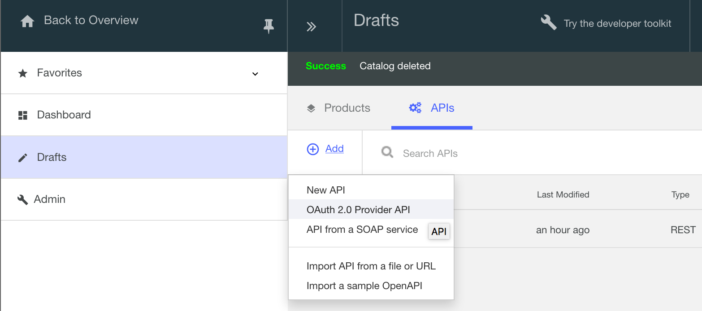
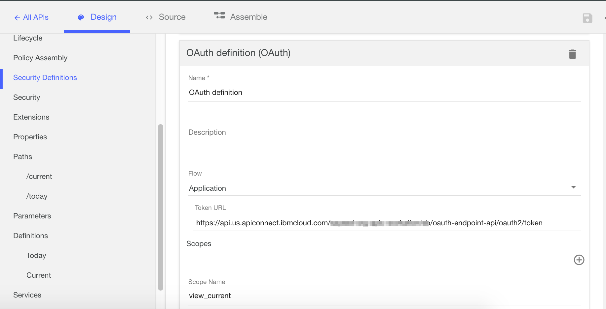
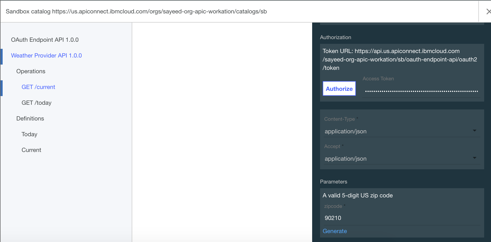

---
copyright:
  years: 2017
lastupdated: "2017-12-13"
---

{:new_window: target="blank"}
{:shortdesc: .shortdesc}
{:screen: .screen}
{:codeblock: .codeblock}
{:pre: .pre}

# 通过双路 OAuth 保护 API

持续时间：10 分钟  
技能级别：初学者

## 目标

本教程将指导您逐步完成使用双路 OAuth 2.0 流来保护 API 的过程。在此应用程序流中，OAuth 客户机会向授权服务器发起请求，并接收访问令牌。然后，OAuth 客户机可以使用此令牌通过 API 来访问受保护资源。

## 先决条件

开始之前，必须已完成以下教程。  
- [通过 {{site.data.keyword.Bluemix}} 使用客户机标识和客户机私钥保护 API](tut_secure_id_secret_bm.html) 或
- [通过工具箱使用客户机标识和客户机私钥保护 API](tut_secure_id_secret_tk.html)

注：本教程显示了在 {{site.data.keyword.Bluemix}} UI 中完成任务的步骤和屏幕快照。您还可以使用命令行完成相同的过程。在 [IBM Knowledge Center](https://www.ibm.com/support/knowledgecenter/SSMNED_5.0.0/com.ibm.apic.toolkit.doc/tutorial_apionprem_security_OAuth_v506.html) 中可查看该过程。 

## 过程

1. 创建 OAuth Provider API 并选择 OAuth 方案。  
	a. 打开**草稿**，选择 **API**，然后单击**添加** > **OAuth 2.0 Provider API**。  
    
	b. 将“标题”设置为“OAuth Endpoint API”。名称和基本路径应该会自动填充。  
	c. 选择**创建 API**。  
	d. 在新创建的 OAuth Endpoint API 中，导航至 **OAuth 2** 面板（或向下滚动到该面板），然后选择“机密”作为“客户机类型”。  
	e. 在“作用域”下，将 _scope1_ 重命名为 _view_current_。删除 _scope2_ 和 _scope3_。  
	f. 在**授予**下，取消选中**隐式**、**密码**和**访问代码**。将**应用程序**保留选中状态。  
	  
	g. 保存 API。  

2. 更新 Weather Provider API 的安全性定义以包含 OAuth。  
	a. 切换到 _Weather Provider API_。（返回到 API，然后选择 _Weather Provider API_。）  
	b. 在“安全性定义”下，为 OAuth 添加新定义。将其命名为“OAuth definition”。  
	c. 在“流”字段中，选择**应用程序**。  
	d. 输入令牌 URL：_<your base URL>/oauth-endpoint-api/oauth2/token_。  
	e. 添加新的作用域：view_current。  
	
	f. 在**安全性**下，选择 **OAuth Definition** 和 **view_current**，并将“客户机标识”和“客户机私钥”保留选中状态。  
	
	g. 单击“保存”。  
	h. 导航回**草稿**，然后选择**产品**。将 OAuth Endpoint API 添加到 Weather Provider 产品。  
	i. 保存产品，并将其编译打包到沙箱。  
	

3. 测试 OAuth 安全配置。  
	a. 将更新的产品发布到沙箱。单击**仪表板 > 沙箱**，然后发布产品。  
	
	b. 单击**浏览 > 沙箱**。  
      
	c. 在 **Weather Provider API** 中，单击操作列表中的 **GET /current**。  
	d. 在右侧面板中，请注意客户机标识和客户机私钥是否已填充。  
	e. 在**参数**部分中，输入 zipcode。  
      
	f. 在**授权**部分中，单击**授权**以获取访问令牌。  
	g. 在收到访问令牌后，单击**调用操作**以完成测试。  
      

4. 请注意，请求包含访问令牌、客户机标识和客户机私钥。要在请求中仅传递访问令牌，需要从 Weather Provider API 的安全需求中除去“客户机标识”和“客户机私钥”。  
    

5. 保存 Weather Provider API。然后将其编译打包并发布到沙箱。在浏览工具中，运行先前执行的相同测试。  
    
    
## 结论
在本教程中，您已学习如何创建 OAuth Provider API，更新该 API 的安全性定义以包含 OAuth，以及测试安全配置。

---

## 下一步

通过[设置和配置开发者门户网站](tut_config_dev_portal.html)，开始对 API 社交化。

创建 > 管理 > **安全** > 社交化 > 分析
