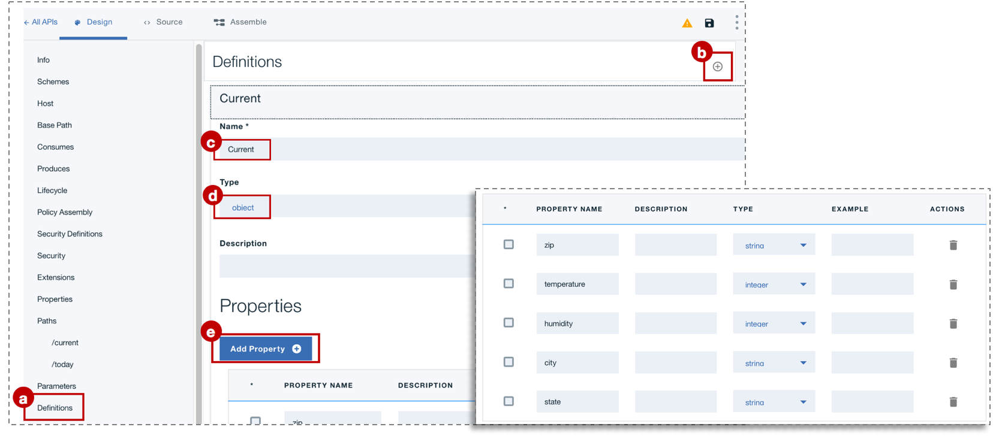

---

copyright:
  years: 2017
lastupdated: "2017-11-02"

subcollection: apiconnect

keywords: IBM Cloud, APIs, lifecycle, catalog, manage, toolkit, develop, dev portal, tutorial

---

{:new_window: target="blank"}
{:shortdesc: .shortdesc}
{:screen: .screen}
{:codeblock: .codeblock}
{:pre: .pre}

# 新增 API 規格並使用 Developer Toolkit 呼叫現有 REST 服務
{: #tut_add_openapi_rest_tk}

**持續時間**：15 分鐘  
**技能水準**：初學者  

## 目標
{: #object_tut_add_openapi_rest_tk}

本指導教學藉由說明如何對現有 API 進行管理控制，協助您快速開始使用 {{site.data.keyword.apiconnect_full}}。您將從建立新的 OpenAPI 規格開始，然後為現有 REST 服務建立透通 API Proxy。

## 必要條件
{: #prereq_tut_add_openapi_rest_tk}

開始之前，您需要[設定 API Connect 實例](/docs/services/apiconnect/tutorials?topic=apiconnect-tut_prereq_set_up_apic_instance)及[安裝 API Connect Toolkit](/docs/services/apiconnect/tutorials?topic=apiconnect-tut_prereq_install_toolkit)。

---


## 探索範例應用程式並測試目標端點
{: #expl_test_tut_add_openapi_rest_tk}

已針對本指導教學建立範例_氣象局_ 應用程式。
1. 若要探索應用程式，請移至 [http://gettingstartedweatherapp.mybluemix.net/ ](http://gettingstartedweatherapp.mybluemix.net/){: #new_window}。  
2. 輸入有效的 5 位數美國郵遞區號，以取得_**現行天氣**_ 及_**今天的預測**_。  


3. 上述範例天氣應用程式是使用可提供天氣資料的 API 所建置。用來取得**現行**天氣資料的端點是 _**https:// myweatherprovider<span></span>.mybluemix.net/current?zipcode={zipcode}**_。請造訪 [https://myweatherprovider.mybluemix.net/current?zipcode=90210](https://myweatherprovider.mybluemix.net/current?zipcode=90210){: #new_window} 以進行測試。  

  

4. 同樣地，用來取得**今天的**預測資料的端點是 `https:// myweatherprovider<span></span>.mybluemix.net/today?zipcode={zipcode}`。請造訪 [https://myweatherprovider.mybluemix.net/today?zipcode=90210](https://myweatherprovider.mybluemix.net/today?zipcode=90210){: #new_window} 以進行測試。  

  

---

## 新增 OpenAPI 規格並呼叫現有 REST 服務
{: #add_spec_tut_add_openapi_rest_tk}

1. 啟動 **API Designer**。在終端機中，輸入 `apic edit`。
2. 使用 IBM ID 登入。
    
3.   在 API Designer 中，確定導覽畫面已開啟。否則，請按一下 >> 將它開啟。在 **API Designer** 導覽畫面中，選取**草稿 > API**。
4. 在 **API** 畫面中，選取**新增 > 新建 API**。
5. 在「新建 API」視窗中，輸入 "Weather Provider API" 作為標題。_即會自動移入「名稱」及「基礎路徑」欄位資料_。  
     
6. 按一下**建立 API**，完成精靈。  

7. 建立 API 之後，會選取**設計**標籤。

8. 捲動至**主機**畫面。如果此欄位未自動填寫，請輸入 `$(catalog.host)` 作為值。

9. 捲動至**安全**標籤，然後刪除自動產生的 "clientIDHeader（API 金鑰）"。  
_（在下一個指導教學中，我們將討論使用 API 金鑰的安全）。_  

10. 在**路徑**畫面中，按一下 **+** 來建立新路徑。
  a. 將新路徑命名為 "**/current**"。  
  b. 在相同**路徑** 畫面中，選取 **GET /current** 區段。  
  c. 在 **GET /current** 區段中，新增**參數**。正如您在探索範例應用程式時所注意到的，天氣服務需要使用 zipcode 作為參數。
      - 名稱：zipcode  
      - 位於：查詢  
      - 必要：是  
      - 類型：string  
    
  d. 儲存 API。

11. 如果您在前一個步驟中定義了查詢參數，則現在需要定義在呼叫天氣 API 時傳回的回應物件。若要這樣做，請向下捲動至**定義**畫面。

  1. 新增定義。 
  2. 將新定義命名為 _Current_。
  3. 將「類型」設為 _Object_。
  4. 新增 **Current** 定義的新內容。
    - 名稱：zip         /  類型：string
    - 名稱：temperature /  類型：integer
    - 名稱：humidity    /  類型：integer
    - 名稱：city        /  類型：string
    - 名稱：state       /  類型：字串
    
  5. 儲存 API。  

12. 在前一個步驟中，您已定義回應物件。接下來，您需要確保回應物件與 **get /current** 路徑相關聯。在導覽中，向上捲回至**路徑**畫面。
  a. 開啟 **GET /current** 作業，並捲動至**回應**區段。
  b. 將 200 OK 回應的綱目從 "object" 變更為 **Current**。
  c. 儲存 API。

13. 剛才建立的路徑及作業是為了要取得現行天氣資料。現在，您需要建立類似的路徑及作業來取得今天的天氣資料。以與在步驟 11 中建立 **/current** 路徑的類似方式，建立新的路徑：**/today**。 

14. 在 **GET /today** 作業下方，新增「參數」。
    - 參數名稱：zipcode  
    - 位於：查詢  
    - 必要：是  
    - 類型：string  

15. 建立新的定義：**Today**。

16. 新增 **Today** 定義的新內容。
  - 名稱：zip / 類型：string
  - 名稱：hi / 類型：integer
  - 名稱：lo / 類型：integer
  - 名稱：nightHumidity / 類型：integer
  - 名稱：dayHumidity / 類型：integer
  - 名稱：city / 類型：string
  - 名稱：state / 類型：string

17. 將 **GET /today** 區段中的回應綱目更新為 "Today"。

18. 儲存 API。

19. 切換至**組合**標籤。您目前已建立兩個作業：**GET /current** 及 **GET /today**。若要確保已呼叫正確的目標端點，您需要建立某些會在所呼叫的作業上執行條件式的邏輯。請使用 **Operation Switch** 邏輯建構來執行這項作業。  

    a. 刪除可能已新增至_畫布_ 的 **invoke** 原則。  
    b. 從_選用區_ 中，將 **Operation Switch** 拖曳至畫布上。  
      - 對於**案例 0**，指派 **get /current** 作業。
      - 新增「案例」：**案例 1**。
      - 將 **get /today** 作業指派給**案例 1**。
      
**Operation Switch** 會提供決策點。根據動詞/路徑配對，必須呼叫適當的作業。  
    c. 從選用區中，將 **invoke** 原則拖曳至畫布上。將其中一個放置在 **/get current** 路徑中，並將另一個放置在 **/get today** 路徑中。
    d. 選取 **/get current** 路徑中的 **invoke** 原則，並將其標題更新為 "**invoke-current**"。  
    e. 將 URL 欄位更新為 `https://myweatherprovider.mybluemix.net/current?zipcode=$(request.parameters.zipcode)`。
    f. 選取 **/get today** 路徑中的 **invoke** 原則，並將其標題更新為 "**invoke-today**"。  
    g. 將 URL 欄位更新為 `https://myweatherprovider.mybluemix.net/today?zipcode=$(request.parameters.zipcode)`。  

20. 儲存 API。

---

## 測試 API Proxy
{: #test_tut_add_openapi_rest_tk}

### 使用 _API Manager 測試工具_ 進行測試
{: #test_apimgr_tut_add_openapi_rest_tk}

1. 按一下設計程式左下方的啟動伺服器圖示 (>)，以啟動本端測試伺服器。啟動「閘道」之後，您會看到狀態自動更新為「執行中」。

    

2. 在**組合**標籤中，按一下播放圖示 (>) 來測試 API Proxy 的目標呼叫。_在本指導教學中，我們應使用內嵌的 Micro Gateway，所以請確定已選取「Micro Gateway 原則」。_

    

3. 在測試畫面中，選取 **get /current** 作業。  
  a. Zipcode 是這項作業的必要參數，因此請輸入有效的美國郵遞區號（例如，90210）。  
  b. 按一下 **invoke**，然後驗證您看到的內容：
  ```
  200 OK response
  Current weather data for 90210  
  ```
      

_如果您遇到 CORS 錯誤，請遵循錯誤訊息中的指示。按一下錯誤中的鏈結以將異常狀況新增至瀏覽器，然後再按 invoke 按鈕。_

### 使用_探索工具_ 進行測試
{: #test_explore_tut_add_openapi_rest_tk}

1. 若要測試 API Proxy 端點，請選取_探索_。
2. 從選用區中，選取 **GET /current** 作業。
3. 在測試方框中，輸入有效的美國郵遞區號（例如：90210）。
4. 按一下**呼叫作業**，以查看回應。  
    
  
---

## 結論
{: #conclusion_tut_add_openapi_rest_tk}

在本指導教學中，您看到如何透過 API 透通 Proxy 來呼叫現有 REST 服務。您是從透過 Web 瀏覽器檢查範例服務可用性開始。然後，您會在 {{site.data.keyword.apiconnect_short}} 中建立新的 OpenAPI 規格，並將它鏈結至要呼叫的範例服務。最後，您使用內建測試工具來測試 API Proxy。

---

## 下一步
{: #next_tut_add_openapi_rest_tk}

使用[速率限制](/docs/services/apiconnect/tutorials?topic=apiconnect-tut_rate_limit)、[用戶端 ID 及密碼](/docs/services/apiconnect/tutorials?topic=apiconnect-tut_secure_landing)或[使用 OAuth 2.0 保護](/docs/services/apiconnect/tutorials?topic=apiconnect-tut_secure_oauth_2)來保護 API。

建立 > **管理** > 安全 > 社交化 > 分析

