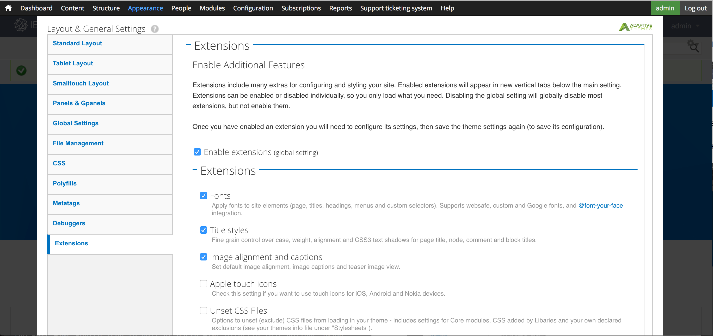
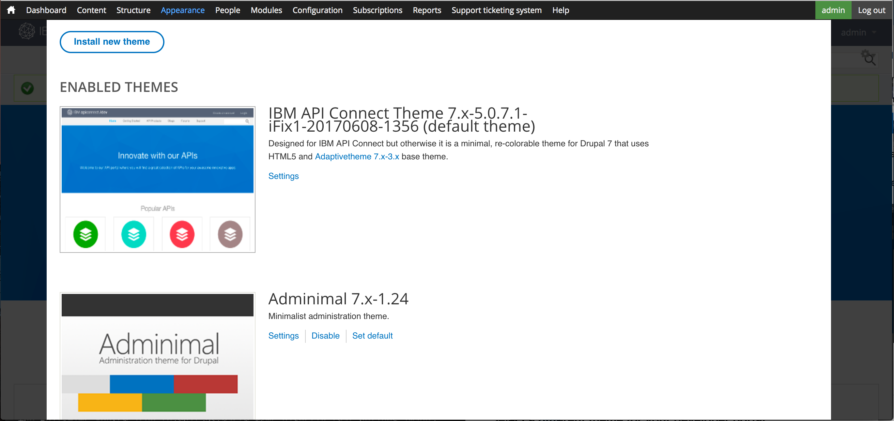
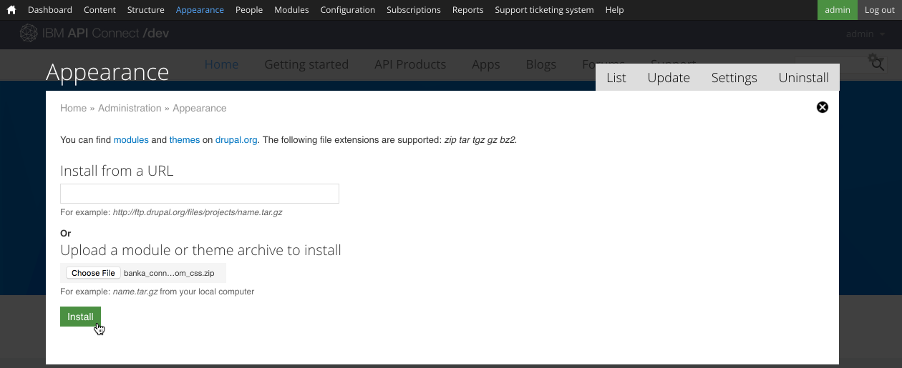

---

copyright:
  years: 2017
lastupdated: "2017-10-31"

subcollection: apiconnect

keywords: IBM Cloud, APIs, lifecycle, catalog, manage, toolkit, develop, dev portal, tutorial

---

{:new_window: target="blank"}
{:shortdesc: .shortdesc}
{:screen: .screen}
{:codeblock: .codeblock}
{:pre: .pre}

# 自訂開發人員入口網站並選取佈景主題
{: #tut_custom_dev_portal}

**持續時間**：30 分鐘  
**技能水準**：初學者  

## 目標
{: #object_tut_custom_dev_portal}

本指導教學將協助您快速自訂「{{site.data.keyword.apiconnect_full}} 開發人員入口網站」，並選取符合您需求的佈景主題。

---

## 必要條件
{: #prereq_tut_custom_dev_portal}

開始本指導教學之前，您應該已完成[設定及配置開發人員入口網站](/docs/services/apiconnect/tutorials?topic=apiconnect-tut_config_dev_portal)指導教學，並已使用入口網站管理者身分登入。

---

## 自訂開發人員入口網站
{: #cust_tut_custom_dev_portal}

在建立開發人員入口網站之後，即可自訂其外觀與操作方式。

1. 讓我們從修改「歡迎使用橫幅」開始。在頂端功能表中，選取**內容**，然後選取**區塊**。  
  

2. 在**歡迎使用橫幅**區塊中，選取**編輯**。  
  

3. 在「內容」標題下，您可以變更「歡迎使用」橫幅的「內容」文字及影像，方法是在內容編輯器中輸入文字，或是選取「編輯 HTML 原始檔」圖示直接編輯或貼上用來定義影像及文字規格的 HTML。  
   

4. 讓我們同時將影像新增至主畫面。向下捲動至「影像」標題。尋找要用於背景的影像，並以適當的檔案格式（png、gif、jpg、jpeg）儲存。如果您沒有影像，則可以使用 [這個影像](images/Cloudy_Day.png)。按一下**選擇檔案**，然後瀏覽所選擇的背景影像。選取影像之後，請按一下**上傳**。  
  

5. 影像在上傳之後即會顯示。如果您要移除它，請按一下**移除**。  
  
 
6. 在頁面底端，按一下**儲存**以儲存變更。  
  
---

## 自訂開發人員入口網站的佈景主題
{: #cust_theme_tut_custom_dev_portal}

開發人員入口網站容許您修改佈景主題，以變更其外觀與操作方式。

1. 若要修改佈景主題，請從頂端功能表中選取**外觀**，選取**設定**，然後選取 **IBM API Connect 佈景主題**。這是您建立開發人員入口網站時的預設佈景主題。
   

2. **標準佈置**標籤容許您修改大螢幕（例如桌面）裝置的佈置。**平板電腦佈置**標籤容許您修改平板電腦裝置上所使用的佈置。**小型觸控佈置**標籤容許您修改智慧型手機這類裝置上所使用的佈置。檢查這些標籤之後，請選取**畫面及 Gpanel**。
  

3. 除了修改上面的「資訊看板」佈置之外，如果您安裝「畫面」模組，則預設佈景主題也支援使用 Gpanel 或「回應式畫面」。若要控制標準、平板電腦及小型觸控裝置上的畫面佈置，請展開區段，並且更新設定。
   

4. 您可以調整其他設定，但讓我們跳過並選取**延伸**。此標籤容許您啟用其他設定，可用來配置開發人員入口網站的樣式。  
  

5. 您可以在主要設定下的**延伸**區段中修改**延伸**標籤上所啟用的延伸設定。     
  

6. 設定修改完成之後，請選取頁面底端的**儲存配置**。

---

## 選取開發人員入口網站的不同佈景主題
{: #diff_theme_tut_custom_dev_portal}

開發人員入口網站隨附其他佈景主題，可供您選擇並自訂，以變更其外觀與操作方式。

1. 若要啟用不同的佈景主題，請選取「外觀設定」頂端的**清單**標籤。
   

2. 在**清單**標籤頂端，會顯示已啟用的佈景主題。
  

3. 已啟用的佈景主題清單下方是已停用佈景主題的集合。您可以選取**啟用**來啟用佈景主題   
   

4. 在佈景主題啟用之後，它就會出現在**已啟用的佈景主題**的**清單**標籤頂端。您可以選取**設定**進行自訂。  
  

5. 完成修改設定之後，即可選取**設定預設值**，將佈景主題設為預設值。     
  

---

## 安裝開發人員入口網站的新佈景主題
{: #new_theme_tut_custom_dev_portal}

如果修改現有佈景主題並不符合您的需要，則「開發人員入口網站」也容許您安裝佈景主題來變更其外觀與操作方式。

1. 您可以使用從 [drupal.org ](http://drupal.org){: #new_window} 下載的模組或佈景主題來自訂開發人員入口網站，也可以自行建立。

2. 若要將佈景主題安裝至開發人員入口網站，請從頂端功能表中選取**外觀**，然後選取**安裝新的佈景主題**。  
  

3. 您可以使用 URL 直接從 [drupal.org ](http://drupal.org){: #new_window} 安裝佈景主題，也可以依序按一下**選擇檔案**及**安裝**來上傳所下載或建立的佈景主題。  
   

4. 上傳完成時，您需要啟用佈景主題。請選取**啟用最近新增的佈景主題**。  
  

5. 向下捲動清單，並尋找最近安裝的佈景主題。請選取**啟用並設定預設值**。  
  

6. 在頁面底端，按一下**儲存**以儲存變更。  

---

## 結論
{: #conclusion_tut_custom_dev_portal}
恭喜，您已完成本指導教學。在本指導教學中，您已學習到如何進行下列作業：

* 自訂開發人員入口網站歡迎使用頁面
* 自訂開發人員入口網站所使用的佈景主題 
* 選取另一個要用於開發人員入口網站的佈景主題
* 安裝開發人員入口網站的新佈景主題

---

## 下一步
{: #next_tut_custom_dev_portal}

學習[使用者如何導覽開發人員入口網站](/docs/services/apiconnect/tutorials?topic=apiconnect-tut_discover_apis)或[如何從基本分析瞭解](/docs/services/apiconnect/tutorials?topic=apiconnect-tut_insights_analytics)。

建立 >管理> 安全 > ** 社交化 ** > 分析  

