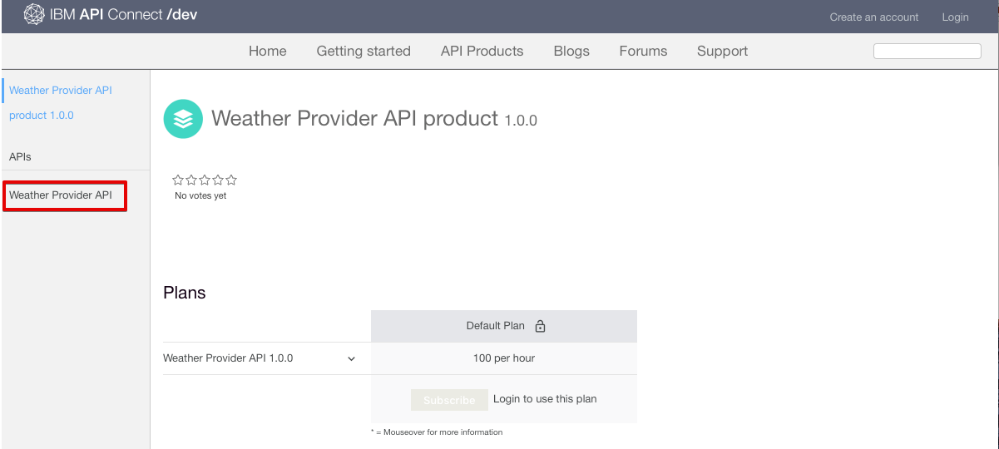
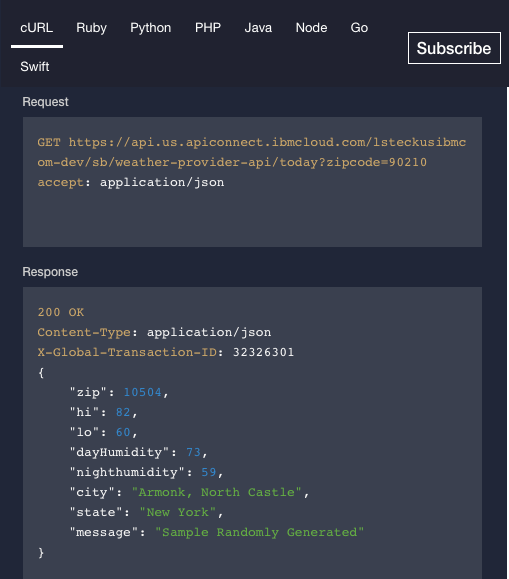
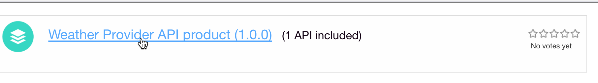

---

copyright:
  years: 2017
lastupdated: "2017-11-20"

subcollection: apiconnect

keywords: IBM Cloud, APIs, lifecycle, catalog, manage, toolkit, develop, dev portal, tutorial

---

{:new_window: target="_blank"}
{:shortdesc: .shortdesc}
{:screen: .screen}
{:codeblock: .codeblock}
{:pre: .pre}

# 探索 API
{: #tut_discover_apis}

**持續時間**：25 分鐘  
**技能水準**：初學者  

## 目標
{: #object_tut_discover_apis}

在本指導教學中，您將學習到入口網站使用者在「{{site.data.keyword.apiconnect_full}} 開發人員入口網站」中取用 API 的方式。您將瞭解入口網站使用者如何探索產品及 API、檢視及測試 API，以及訂閱 API。

 

## 必要條件
{: #prereq_tut_discover_apis}

本指導教學沒有必要條件。身為入口網站管理者，您可以在導覽開發人員入口網站以體驗入口網站使用者如何導覽您的開發人員入口網站時，同時完成本指導教學。請謹記，所有開發人員入口網站都有不同的外觀。

 

如果您沒有現有開發人員入口網站，可以先在 {{site.data.keyword.Bluemix_short}} 中設定並配置開發人員入口網站，然後再繼續本指導教學。

## 探索產品及 API
{: #explore_tut_discover_apis}

本節顯示入口網站使用者在開發人員入口網站中探索產品及 API 的方式。

1. 在瀏覽器中，導覽至 **API Connect 開發人員入口網站**。

2. 在「{{site.data.keyword.apiconnect_short}} 開發人員入口網站」中，選取「API 產品」標籤。

3. 選取其中一個可用的 API 產品，顯示此產品可用的 API 及「方案」。  
  

4. 選取 API，以探索可用 API 的詳細資料。  
  

5. 在 API 的詳細資料頁面上，您可以檢視可用的作業以及其參數和傳回的回應。在頁面尾端，您可以檢視 API 所使用的定義。  
   

6. 在「程式碼範例」畫面中，您可以檢視不同編碼語言的範例，以瞭解如何呼叫要求及其回應。選取其中一個範例（例如**節點**），以查看該編碼語言的範例。  
   

---

## 檢視及測試 API
{: #view_tut_discover_apis}

本節顯示入口網站使用者檢視及測試產品可用 API 的方式。 

1. 如上一節所概述，在「{{site.data.keyword.apiconnect_short}} 開發人員入口網站」中導覽至 API 詳細資料。  
   

2. 您可以藉由選取**開啟 API**，來下載及檢視 API Swagger yaml 資訊。  
   

3. 向下捲動至其中一個作業，以檢視其詳細資料。您也可以按一下作業鏈結，以跳至頁面上的該作業。

4. 在右側畫面的範例下，捲動至**重試此作業**區段。輸入參數，然後選取**呼叫作業**。  
  

5. 向下捲動，以檢視作業呼叫的要求及回應。即會顯示所傳回回應 **200 OK** 及訊息內文，指出作業呼叫已順利完成。  
  

---

## 訂閱 API
{: #subscr_tut_discover_apis}

本節顯示入口網站使用者在開發人員入口網站中訂閱 API 的方式。 

1. 選取**建立帳戶**。

2. 完成必要欄位，然後選取頁面底端的**建立新的帳戶**。
**附註：**使用另一個電子郵件位址，與您在前一個指導教學中用來建立開發人員入口網站的電子郵件位址不同。

3. 建立開發人員帳戶之後，請登入以檢視首頁。您必須具有應用程式，才能訂閱 API。選取**應用程式**，以移至已登錄的應用程式頁面。  
  

4. 若要登錄新的應用程式，請選取**建立新的應用程式**。  
  

5. 輸入應用程式的*標題* 及*說明*，然後選取**提交**。  
   

6. 現在，您已具有一個應用程式，因此可以訂閱「API 產品」方案。選取**可用的 API** 或 **API 產品**，以瀏覽「API 產品」方案。  
   

7. 選取您要訂閱的「API 產品」。  
   

8. 選取**訂閱**，以訂閱「API 產品方案」。  
   

9. 選取您要訂閱產品「方案」的應用程式，然後選取**訂閱**。
   

10. 您的應用程式已順利訂閱產品「方案」。
   

## 結論
{: #conclusion_tut_discover_apis}

在本指導教學中，您學習到入口網站使用者如何探索產品及 API、檢視及測試 API，以及訂閱 API。 

---

## 下一步
{: #next_tut_discover_apis}

學習[如何從基本分析瞭解](/docs/services/apiconnect/tutorials?topic=apiconnect-tut_insights_analytics)。

建立 >管理> 安全 > ** 社交化 ** > 分析  

