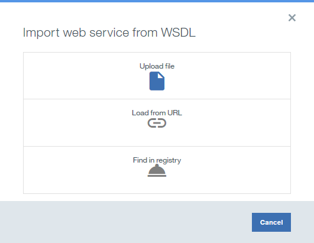
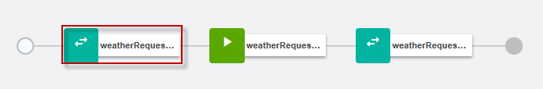
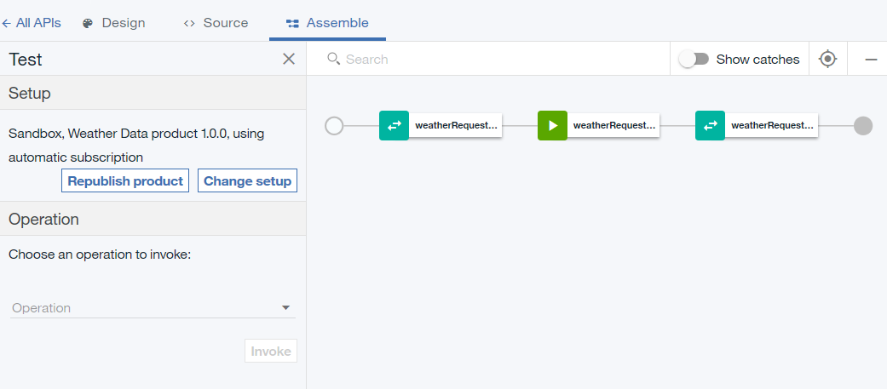

---

copyright:
years: 2017
lastupdated: "2017-11-14"

---

{:new_window: target="blank"}
{:shortdesc: .shortdesc}
{:screen: .screen}
{:codeblock: .codeblock}
{:pre: .pre}
 

# 將 SOAP 服務公開為 REST API
**持續時間**：20 分鐘  
**技能水準**：初學者  

---
## 目標
在 API Manager 中，您將建立可存取現有 SOAP 服務的 REST API，並會將其公開為 REST API。

## 必要條件
1. 開始之前，您需要[設定 {{site.data.keyword.apiconnect_full}} 實例](tut_prereq_set_up_apic_instance.html)。
2. 開始之前，請將 [weatherprovider.wsdl 測試 ](https://raw.githubusercontent.com/IBM-Bluemix-Docs/apiconnect/master/tutorials/weatherprovider.wsdl){:new_window} 檔案複製到本端檔案系統。
	>![images/info.png]
	>您可以按一下**原始**，然後將產生的頁面以 `.wsdl` 檔案形式儲存在本端系統上。

---
## 設定 REST API 定義
1. 登入 {{site.data.keyword.Bluemix_short}}：[https://new-console.ng.bluemix.net/login ](https://new-console.ng.bluemix.net/login){:new_window}。
2. 在 {{site.data.keyword.Bluemix_notm}} **儀表板**中，向下捲動並選取 {{site.data.keyword.apiconnect_short}}。或者，從功能表圖示中，依序選擇**服務**及 **API** 以到達**使用 API** 視窗，然後選取 **API Connect**。從 **API Connect** 頁面中，您可以簡單地按下`建立`，也可以調整預設值。基於本練習的目的，請保持實例不連結，並於稍後調整「服務」名稱以更輕鬆地識別。其中一個範例是 `API Connect-weather-exercise`。
按`建立`按鈕，以啟動 {{site.data.keyword.apiconnect_short}} 服務。  
您可能會看到說明新增功能的警示，或**草稿 API** 參考資訊啟動頁面。閱讀資訊之後，請按一下**了解**圖示來檢視 API Manager。
3. 在 {{site.data.keyword.apiconnect_short}} 中，如果您先前未固定使用者介面導覽窗格，則請按一下**導覽至**圖示 。即會開啟 API Manager 使用者介面導覽窗格。若要固定「使用者介面導覽」窗格，請按一下**固定功能表**圖示 。
4. 在使用者介面導覽窗格中選取**草稿**，然後按一下 **API** 標籤。即會開啟 **API** 標籤。
	
5. 選取**新增 +** > **新建 API**。
6. 指定有關 API 的基本資訊。
	- 在**標題**欄位中，輸入 `Weather Data`。
	- 在輸入標題時，讓**名稱**欄位在填寫時保留為 `weather-data`。	
	- 讓**基礎路徑**欄位保留為 `/weather-data`。
	- 讓**版本**欄位保留為 `1.0.0`。
7. 展開**其他內容**，以指定 API 的其他內容。
	- 從 **API 範本**欄位中，選取**預設**，指出您要使用預設範本來建立 API 定義。
	- 讓其餘的欄位保持不變。
	
8. 將您的 API 新增至新「產品」，然後建立 API 定義。
	- 選取**新增產品**。
	- 在**標題**欄位中，使用 `Weather Data 產品`作為預設值。
	- 讓**名稱**及**版本**欄位保持不變。
	- 確定已選取**將此產品發佈至型錄**勾選框，然後選取**沙盤推演**作為目標「型錄」。
	
	- 按一下**建立 API**。即會開啟 API 定義草稿的**設計**標籤。
9. 現在已建立 API。會顯示「設計」頁面。按一下導覽列中的**安全**。

10. 取消勾選 **ClientID** 選項。

	>
	
>您可能會發現儲存磁碟圖示旁出現一個黃色三角形圖示。這是有可能已定義但尚未使用之定義的警告（這不會影響 API 定義）。
11. 在**定義**區段中，按一下**新增定義**圖示 ，然後按一下新定義將它展開。
12. 將定義命名為 `Weather Data Output`。
13. 定義會有五個內容。按一下**新增內容**四次，以新增其他內容。使用下列內容作為指引來重新命名`內容名稱`，並使用`說明`、`類型`及`範例`的預設值：
	
14. 在**路徑**區段中，按一下**新增路徑**圖示 。
15. 在您最近建立的「路徑」的**路徑**欄位中，將內容取代為 `/getweatherdata`。
16. 按一下 **GET /getweatherdata** 作業將它展開。
	
17. 針對 **GET /getweatherdata** 作業，按一下**新增參數**，然後按一下**新增參數**。
18. 將新的參數命名為 `zip_code`，讓其餘參數保留為預設值。
19. 在**回應**區段的 **200 OK** 回應的**綱目**直欄中，選取 **Weather Data Output** 定義。針對 API 呼叫的回應，**Weather Data Output** 所定義的物件會是回應物件。
	
20. 按一下「儲存」圖示 ，儲存變更。

---
## 新增及配置 Web 服務呼叫
若要新增及配置將 Web 服務整合至 API 定義的呼叫和對映原則，請完成下面的步驟。
1. 在**服務**區段中，按一下**新增服務**圖示 。即會開啟`從 WSDL 匯入 Web 服務`視窗。
	
2. 選取**上傳檔案**。
3. 在**檔案上傳**視窗中，指定**必要條件**小節的`步驟 2` 中所下載之 `weatherprovider.wsdl` 檔案的位置，然後按一下**開啟**以繼續。
4. 選取 **weatherService** SOAP 服務，然後按一下**完成**。在**服務**區段中，**WeatherService** Web 服務會與單一 **weatherRequest** 作業一起列出。
	

		
5. 導覽至**組合**標籤，然後確定已選取 **DataPower Gateway 原則**。
6. 藉由將游標移至原則上方，然後按一下**刪除原則**圖示 ，以刪除畫布上的現有**呼叫**原則。
		
7. 從選用區中，將 **weatherRequest** Web 服務拖曳至畫布上顯示的虛線框。在組合中，會放置一個呼叫原則及兩個對映原則。第一個對映原則會將變數指派給 Web 服務呼叫的輸入，而第二個原則會將 Web 服務呼叫的輸出指派給變數。第一個對映的輸出及第二個對映的輸入是從步驟 4 所提供的 WSDL 產生。
		
8. 按一下 **weatherRequest: input** 對映原則，然後在內容表的「輸入」直欄中按一下**編輯輸入**圖示 。
		
9. 按一下**作業的 + 參數**，然後選取 `get /getweatherdata`。
10. 按一下**完成**，以新增 `zip_code` 參數。
	
11. 按一下輸入端上對應於 **zip_code string** 的圓圈，然後按一下輸出端上對應於 **zipcode string** 的圓圈。  
	
12. 關閉內容表。
13. 按一下選用區中的 **weatherRequest: output** 對映原則，然後在內容表的「輸出」直欄中按一下**編輯輸出**圖示 。
14. 選取**作業的 + 輸出**，然後選取 `get /getweatherdata`。
15. 選取**完成**，以新增 `Weather Data Output` 輸出定義。
	
16. 按一下輸入端上對應於 **zip string** 的圓圈，然後按一下輸出端上對應於 **zip string** 的圓圈。使用下列內容作為指引來對映其餘的參數。
	
17. 按一下**儲存**圖示 ，儲存變更。

您已在組合中併入 Web 服務呼叫，並將輸入參數對映至 SOAP 要求的適當部分，然後將 SOAP 回應的適當部分對映至 JSON 輸出。

---
## 測試 API 定義
若要使用 API Manager 測試工具來測試 API 定義，請完成下面的步驟。
1. 按一下**組合**標籤下的**測試**圖示 ，以顯示測試窗格。
	
2. 如果您之前使用過測試工具，請按一下**變更設定**。
3. 從產品清單中，選擇 `Weather Data 產品 1.0.0`。
	
4. 按一下**重新發佈產品**。
5. 按**下一步**。
6. 從作業清單中，選取 `get /getweatherdata`。  
	
7. 向下捲動至 **zip_code** 欄位，輸入 `90210`。  
	
8. 按一下**呼叫**。API 會傳回現行天氣。  
	

---
## 您在本指導教學中執行的作業
在本指導教學中，您已完成下列活動：
1. 已設定 REST API 定義
2. 已配置 API 來呼叫現有 Web 服務，並傳回其輸出
3. 已測試 API 定義

---

## 下一步

使用[速率限制](tut_rate_limit.html)、[用戶端 ID 及密碼](tut_secure_landing.html)或[使用 OAuth 2.0 保護](tut_secure_oauth_2.html)來保護 API。

建立 > **管理** > 安全 > 社交化 > 分析

[important]: ./images/important.png "重要事項！"
[info]: ./images/info.png "資訊"
[troubleshooting]: ./images/troubleshooting.png "疑難排解" 
