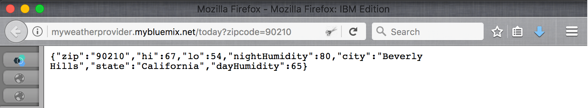
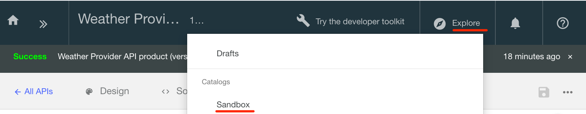

---
copyright:
  years: 2017
lastupdated: "2017-11-02"
---

{:new_window: target="blank"}
{:shortdesc: .shortdesc}
{:screen: .screen}
{:codeblock: .codeblock}
{:pre: .pre}

# 匯入 API 規格並使用 {{site.data.keyword.Bluemix_notm}} 對現有 REST 服務進行 Proxy 處理
持續時間：5 分鐘  
技能水準：初學者  

## 目標
本指導教學藉由說明如何對現有 API 進行管理控制，協助您快速開始使用 {{site.data.keyword.apiconnect_full}}。我們將從匯入 OpenAPI 規格開始，然後為現有 REST 服務建立透通 API Proxy。

## 必要條件
開始之前，您需要[設定 {{site.data.keyword.apiconnect_short}} 實例](tut_prereq_set_up_apic_instance.html)。

---


## 探索範例應用程式並測試目標端點

已針對本指導教學建立範例_氣象局_ 應用程式。對應的 API 規格 (Swagger 2.0) 位於 [weather-provider-api_1.yaml](https://raw.githubusercontent.com/IBM-Bluemix-Docs/apiconnect/master/tutorials/weather-provider-api_1.yaml){:new_window} 檔案中。

1. 若要探索應用程式，請移至 [http://gettingstartedweatherapp.mybluemix.net/ ](http://gettingstartedweatherapp.mybluemix.net/){:new_window}。  
2. 輸入有效的 5 位數美國郵遞區號，以取得_**現行天氣**_ 及_**今天的預測**_。  


3. 上述範例天氣應用程式是使用可提供天氣資料的 API 所建置。用來取得**現行**天氣資料的端點是 `https:// myweatherprovider<span></span>.mybluemix.net/current?zipcode={zipcode}`。請造訪 [https://myweatherprovider.mybluemix.net/current?zipcode=90210 ](https://myweatherprovider.mybluemix.net/current?zipcode=90210){:new_window}，以進行測試。  

  

4. 同樣地，用來取得**今天的**預測資料的端點是 `https:// myweatherprovider<span></span>.mybluemix.net/today?zipcode={zipcode}`。請造訪 [https://myweatherprovider.mybluemix.net/today?zipcode=90210 ](https://myweatherprovider.mybluemix.net/today?zipcode=90210){:new_window}，以進行測試。  

  


---

## 匯入範例應用程式的 OpenAPI 規格以建立 REST API Proxy
1. 登入 {{site.data.keyword.Bluemix_short}}：https://new-console.ng.bluemix.net/login。
2. 在 {{site.data.keyword.Bluemix_notm}} 導覽畫面中，選取**服務**，然後選取**儀表板**。啟動 {{site.data.keyword.apiconnect_short}} 服務。 
3. 在 {{site.data.keyword.apiconnect_short}} 中，確定左側的導覽畫面已開啟。否則，請按一下 **>>** 將它開啟。  
4. 在導覽畫面中，選取**草稿**。   
5. 在 **API** 標籤中，按一下**新增**。從下拉功能表中，選取**從檔案或 URL 匯入 API**。  
     

6. 我們現在將匯入 OpenAPI 天氣定義。在開啟的「匯入 OpenAPI (Swagger)」對話框中，輸入下列 URL：`https://raw.githubusercontent.com/IBM-Bluemix-Docs/apiconnect/master/tutorials/weather-provider-api_1.yaml`。請讓其他選項保留為其預設值，然後按一下**匯入**。  
      

7. 匯入 OpenAPI 規格之後，您會被帶到 API 的**設計**視圖。您可以在這裡檢視 OpenAPI 定義的各個區段。捲動以進行探索，並記下**主機**值。您也可以在**來源**標籤下檢視 OpenAPI。
_附註：您會注意到「主機」值設為 _`$(catalog.host)`_。這是 API Proxy 的基本 URL。_
8. 已儲存 API。 


## 測試 API Proxy

### 使用 _API Manager 測試工具_ 進行測試。
1. 在**組合**標籤中，按一下其他動作的圖示，然後選取**產生預設產品**。  
     

2. 接受**新建產品**對話框中的預設選項，然後按一下**建立產品**。即會建立 **Weather Provider API 產品**，並將其發佈至「沙盤推演」型錄。會顯示一則訊息，指出產品產生成功。  
    

  

  _在 {{site.data.keyword.apiconnect_short}} 中，**產品**提供一種用來對特定用途的 API 進行分組的方式。產品會發佈至**型錄**。[{{site.data.keyword.apiconnect_short}} 名詞解釋](../apic_glossary.html)_

3. 在「組合」標籤中，按一下播放圖示來測試 API Proxy 的目標呼叫。

4. 在測試畫面中，選取 **get /current** 作業。  
    a. Zipcode 是這項作業的必要參數，因此請輸入有效的美國郵遞區號（例如，90210）。  
    b. 按一下**呼叫**，然後驗證您看到的內容：  
    ```
    - 200 OK response
    - Current weather data for 90210  
    ```
_如果您遇到 CORS 錯誤，請遵循錯誤訊息中的指示。按一下錯誤中的鏈結以將異常狀況新增至瀏覽器，然後再按「呼叫」按鈕。_

    


### 使用_探索工具_ 進行測試。
_「探索工具」容許使用者藉由強制執行 OpenAPI 定義中所設定的任何參數需求，來測試 API 的正確作業。這項強制執行不是在「組合」標籤內發現的「API 測試工具」中完成，因此，遺漏參數時，容許使用者驗證 API 行為。_

1. 若要測試 API Proxy 端點，請選取**探索**，然後選取**沙盤推演**。
    
2. 從選用區中，選取 **GET /current** 作業。
3. 選取「試用」。  
4. 在測試方框中，輸入有效的美國郵遞區號（例如：90210）。
5. 按一下**呼叫作業**，以查看回應。
  

    


### 結論
在本指導教學中，您看到如何透過 API 透通 Proxy 來呼叫現有 REST 服務。您是從透過 Web 瀏覽器檢查範例服務可用性開始。然後，您會在 {{site.data.keyword.apiconnect_short}} 中建立 API Proxy，並將此 Proxy 鏈結至要呼叫的範例服務。您已將 API 包裝成產品、已將產品發佈至型錄，並且已測試 Proxy。

---

## 下一步

使用[速率限制](tut_rate_limit.html)、[用戶端 ID 及密碼](tut_secure_landing.html)或[使用 OAuth 2.0 保護](tut_secure_oauth_2.html)來保護 API。

建立 > **管理** > 安全 > 社交化 > 分析

