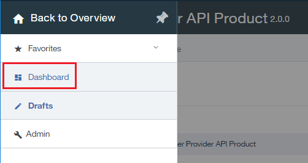

---

copyright:
  years: 2017
lastupdated: "2017-10-31"

---

{:new_window: target="_blank"}
{:shortdesc: .shortdesc}
{:screen: .screen}
{:codeblock: .codeblock}
{:pre: .pre}

# 取代 API 產品
**持續時間**：15 分鐘  
**技能水準**：初學者  

## 必要條件

1. [設定 {{site.data.keyword.apiconnect_full}} 實例](tut_prereq_set_up_apic_instance.html)。

2. 完成下列其中一個指導教學：
 
    - [匯入 OpenAPI2.0 規格並對現有 REST 服務進行 Proxy 處理](tut_rest_landing.html)**或**  
    - [新增 API 規格並呼叫現有 REST 服務](tut_rest_landing.html)。

---
## 目標
在本指導教學中，您會將現有 API 產品取代為較新的 API 產品，以進行更新。取代 API 產品時，變更會立即生效，並會自動更新所有應用程式訂閱。  

---
## 取代 API 產品
{: #repl_api_prod}

1. 登入 {{site.data.keyword.Bluemix_short}}：[https://console.ng.bluemix.net/login ](https://console.ng.bluemix.net/login){:new_window}。

2. 在「{{site.data.keyword.Bluemix_notm}} 儀表板」中，啟動 {{site.data.keyword.apiconnect_short}} 服務。

3. 在 API Manager 中，如果您先前未固定使用者介面導覽窗格，請按一下**導覽至**圖示 。即會開啟 API Manager 使用者介面導覽窗格。若要固定「使用者介面導覽」窗格，請按一下**固定功能表**圖示 。

4. 按一下**草稿** > **API**。

5. 在 API 畫面中，按一下 **Weather Provider API**，以開啟 REST Proxy API。  

6. 將**版本**變更為 2.0.0。  

7. 按一下磁碟圖示，以儲存 API 變更。  

8. 按一下**所有 API**。  

9. 按一下**產品**。  

10.	選取 **Weather Provider API 產品**。  

11.	將**版本**變更為 2.0.0。在**說明**欄位中，輸入 `Updated API`。按一下磁碟圖示，以儲存變更。  

12.	按一下**編譯打包**圖示，以上傳新版本。如果尚未選取，請選取**沙盤推演**型錄。

    **附註**：可以將新版本編譯打包至不同型錄，以控制可以看到此版本的開發人員觀眾。將 API 產品從開發環境移至測試環境再移至正式作業環境時，此功能非常有用。

13.	按一下 **>>** 以開啟導覽功能表，然後選取**儀表板**。  

14.	按一下**沙盤推演**。  

15.	按一下**已編譯打包 Weather Provider API 產品 2.0.0** 行上的垂直省略符號。  

16.	選取**取代現有產品**。  

17.	在所提供的產品清單中，選取 **Weather Provider API 產品 1.0.0**。按**下一步**。  

18.	選取**預設方案**。按一下**取代**。  

    這項替換的結果是棄用「Weather Provider API 產品 1.0.0」，並發佈「Weather Provider API 產品 2.0.0」。**附註**：在替換處理程序期間，可以變更與本產品相關聯的方案。這是用來變更 API 產品方案的簡單方法。
 

## 您在本指導教學中達成的作業

在本指導教學中，您已完成下列活動：
1. 已更新 API 產品。
2. 已將現有 API 產品取代為更新的 API 產品。

---

