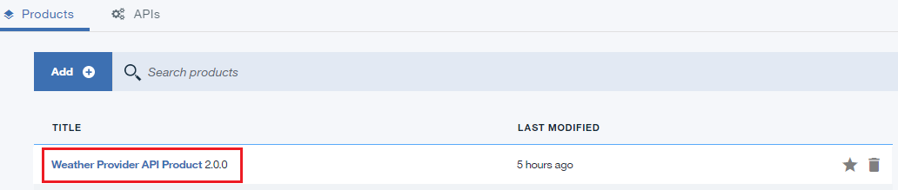
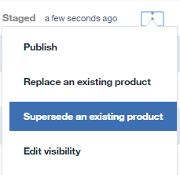

---

copyright:
  years: 2017
lastupdated: "2017-10-31"

---

{:new_window: target="_blank"}
{:shortdesc: .shortdesc}
{:screen: .screen}
{:codeblock: .codeblock}
{:pre: .pre}

# 接替 API 產品
**持續時間**：15 分鐘  
**技能水準**：初學者  

## 必要條件

1. [設定 {{site.data.keyword.apiconnect_full}} 實例](tut_prereq_set_up_apic_instance.html)。

2. 完成[取代 API 產品指導教學](tut_manage_replace.html)。

---
## 目標
在本指導教學中，您會將現有 API 接替為新的 API。

---
## 接替 API 產品
1. 登入 {{site.data.keyword.Bluemix_short}}：[https://console.ng.bluemix.net/login ](https://console.ng.bluemix.net/login){:new_window}。

2. 在「{{site.data.keyword.Bluemix_notm}} 儀表板」中，啟動 {{site.data.keyword.apiconnect_short}} 服務。

3. 在 API Manager 中，如果您先前未固定使用者介面導覽窗格，請按一下**導覽至**圖示 。即會開啟 API Manager 使用者介面導覽窗格。若要固定「使用者介面導覽」窗格，請按一下**固定功能表**圖示 。

4. 按一下**沙盤推演**，以開啟「沙盤推演」型錄。**附註**：您的畫面可能會顯示磚，而不是型錄清單。

4. 按一下**草稿** > **API**。

5. 在 API 畫面中，按一下 **Weather Provider API**，以開啟 REST Proxy API。  

6. 將**版本**變更為 3.0.0。

7. 按一下磁碟圖示，以儲存 API 變更。  

8. 按一下**所有 API**。  

9. 按一下**產品**。  

10.	選取 **Weather Provider API 產品 2.0.0**。  

11.	將**版本**變更為 3.0.0。按一下磁碟圖示，以儲存變更。按一下**編譯打包**圖示。  

12.	按一下 **>>** 以開啟導覽窗格，然後選取**儀表板**。  

13.	按一下**沙盤推演**。

14.	按一下**社群**。  

15.	按一下**訂閱**。  

16.	請注意「Weather Provider API 產品 2.0.0」的應用程式訂閱。按一下**產品**。
  

17.	按一下**已編譯打包 Weather Provider API 產品 3.0.0** 行上的垂直省略符號。  

18.	選取**接替現有產品**。  

19.	在呈現的產品清單中，選取 **Weather Provider API 產品 2.0.0**。按**下一步**。  

20.	選取**預設方案**。按一下**接替**。  

    這項替換的結果是淘汰「Weather Provider API 產品 2.0.0」，並發佈「Weather Provider API 產品 3.0.0」。  
 
 
21.	按一下**社群 >> 訂閱**。  

 
22.	按一下 **Weather Provider API 產品 2.0.0** 行上的垂直省略符號。選取**管理**。  
 

23.	選取「Weather Provider API 產品 3.0.0」下的**預設方案**。按一下**移轉**。  

    這項移轉的結果是將「Weather Provider API 產品 2.0.0」移轉至「Weather Provider API 產品 3.0.0」。  
 
 

 
## 您在本指導教學中達成的作業
在本指導教學中，您已完成下列活動：

1. 已更新 API 產品。
2. 已將現有 API 產品接替為更新的「API 產品」。
3. 已將現有「API 產品」的訂閱移轉至更新的「API 產品」。

---

