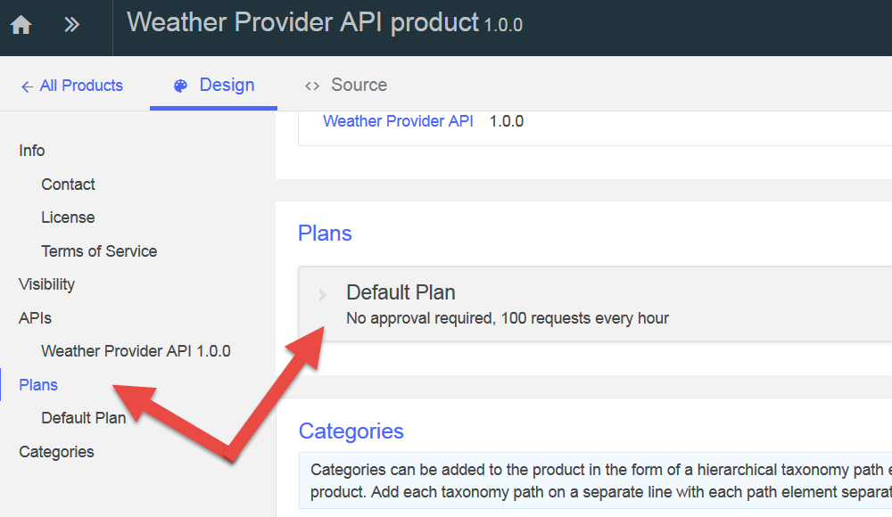
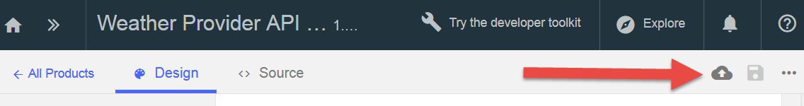
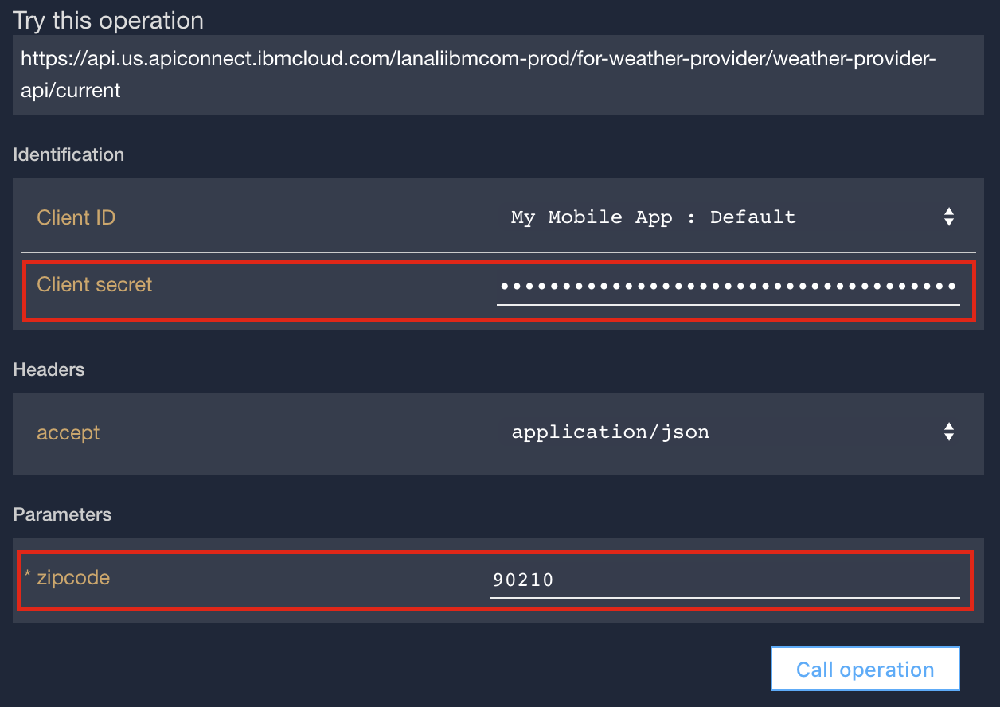

---
copyright:
  years: 2017
lastupdated: "2017-11-02"
---

{:new_window: target="_blank"}
{:shortdesc: .shortdesc}
{:screen: .screen}
{:codeblock: .codeblock}
{:pre: .pre}

# 設定速率限制
**持續時間**：15 分鐘  
**技能水準**：初學者  

## 目標
本指導教學顯示如何設定 API 的速率限制。設定速率限制可讓您管理 API 的網路資料流量，以及 API 內特定作業的網路資料流量。速率限制是在特定時間間隔內容許的呼叫數目上限。

在 {{site.data.keyword.apiconnect_full}} 中，*產品* 提供一種將 API 分組到特定使用案例或目標讀者的套件的方式。「產品」也包含*方案*，其說明您願意提供給 API 消費者的期限。更精確地說，「方案」定義與 API 訂閱相關聯的規則：API 速率限制，以及是否需要核准訂閱。

應用程式開發人員要使用您的 API 時，將會選取包含他們要使用之 API 的「產品」，然後根據符合其使用需求的「方案」，來訂閱該「產品」的其中一個「方案」。

在本指導教學中，您將執行下列作業：
1. 在現有「產品」中，建立新的速率限制「方案」。
2. 查看應用程式超出容許的速率限制時會發生什麼情況。

## 必要條件
您必須已在使用至少一個「API 金鑰」保護的 {{site.data.keyword.apiconnect_short}} 中建立 API。在下列指示中，我們是從使用[用戶端 ID 及密碼](tut_secure_landing.html)所保護的 [Weather Provider API 範例檔案 ](https://raw.githubusercontent.com/IBM-Bluemix-Docs/apiconnect/master/tutorials/weather-provider-api_1.yaml){:new_window} 開始。

開始本指導教學之前，請完成下列指導教學：
- [匯入 API 規格並對現有 REST 服務進行 Proxy 處理](tut_rest_landing.html)。
- [使用用戶端 ID 及密碼來保護 API](tut_secure_landing.html)。

---
## 啟動 API Connect

1. 登入 {{site.data.keyword.Bluemix_notm}}：[https://console.ng.bluemix.net/login ](https://console.ng.bluemix.net/login){:new_window}。
2. 登入 {{site.data.keyword.Bluemix_notm}} 之後，請向下捲動至**所有服務**，然後按一下 **API Connect**。
3. 按一下 **API Connect**，以啟動 {{site.data.keyword.apiconnect_short}} 服務。

## 探索預設方案
1. 在 {{site.data.keyword.apiconnect_short}} 導覽畫面中，選取**草稿**（如果導覽畫面未開啟，請按一下 **>>** 將它開啟）。
2. 選取**產品標籤**，您應該會看到列出 Weather Provider API 產品。

         

3. 按一下「產品」鏈結，開啟的「設計」視圖會列出「產品」的相關資訊。
4. 向下捲動至頁面的「方案」區段。「預設方案」是在產生此「產品」時建立的。 

       
5. 展開「預設方案」詳細資料。請注意可展開以顯示特定作業的速率限制（100 次呼叫/1 小時）及 API 清單。

    

   
## 建立新的速率限制方案

現在，我們已看到預設「方案」的樣子，讓我們建立具有更高限制性之速率限制的新「方案」，以示範在 API 消費者超出「方案」限制時會發生什麼情況。 
1. 按一下按鈕以新增「方案」。
 
     
    
    即會為您建立新的「方案」，依預設，會將它設為容許無限制使用（也就是根本沒有任何速率限制）。請提供更有意義的名稱，並設定更高限制性的限制。
2. 按一下新的「方案」(`New Plan 1`)，以展開詳細資料。
3. 按一下「標題」欄位，並將「方案」標題設為：`Demo`。
4. 按一下「名稱」欄位，並將「方案」名稱設為 `demo-plan`。
5. 按一下 +，以新增速率限制。
6. 將新的速率限制重新命名為 `demo-rate-limit`，並確定它已設為 `1/1 Minute`。
7. 勾選`強制硬性限制`勾選框（啟用此設定時，如果應用程式呼叫的 API 超過已訂閱「方案」限制所容許的限制，則會收到一個錯誤）。
8. 接受所有其他預設值，並儲存「產品」。

    

## 將已更新的產品編譯打包及發佈至沙盤推演型錄

在先前的範例中，您可能已使用測試工具來發佈「產品」，而測試工具會使用預先提供的測試應用程式認證來呼叫您的 API。不過，這個測試應用程式不受限於速率限制，因此我們需要在這裡建立新的應用程式，以達到速率限制。如需相關資訊，請參閱 [IBM Knowledge Center 的 API Connect 內容 ](https://www.ibm.com/support/knowledgecenter/SSFS6T/com.ibm.apic.toolkit.doc/tapim_create_product.html){:new_window}。

1. 按一下「發佈」圖示，以將「產品」*編譯打包* 到**沙盤推演**「型錄」。此動作會將您的草稿「產品」變更新增至選取的「型錄」。我們接下來需要*發佈*「產品」變更，以透過「開發人員入口網站」讓消費者可以使用它們。
    
2. 按一下 >> 按鈕以開啟導覽功能表。
3. 選取「儀表板」，然後開啟**沙盤推演**「型錄」。「Weather Provider API 產品」會列為**已編譯打包**。
4. 按一下省略符號，然後從功能表中選取**發佈**。
    
5. 接受預設可見性設定，然後按一下**發佈**按鈕。在「開發人員入口網站」上發佈並顯示「產品」之後，應用程式開發人員就可以訂閱可用的「方案」。

## 在開發人員入口網站中登錄新的（消費者）應用程式
應用程式開發人員會使用「開發人員入口網站」來探索及使用您的 API。如需「開發人員入口網站」的相關資訊，請參閱此 [IBM Knowledge Center 主題 ](https://www.ibm.com/support/knowledgecenter/SSFS6T/com.ibm.apic.devportal.doc/tapim_tutorial_using_ADP.html){:new_window}。

如果這是您第一次使用「開發人員入口網站」，則需要為「沙盤推演型錄」佈建「開發人員入口網站」。您在佈建「入口網站」時用來登入的帳戶將會是該「入口網站」的管理帳戶。然後，為了能夠探索及測試 API，您需要使用不同於管理帳戶的新開發人員帳戶來建立及登入（使用不同的電子郵件位址）。

下列指示將引導您完成這些步驟。

1. 啟動「開發人員入口網站」。如果您不知道 URL，可以在「沙盤推演型錄」的「設定」標籤中找到它。若要第一次佈建「開發人員入口網站」，請參閱[查看設定及配置開發人員入口網站](tut_config_dev_portal.html)。

    - 這最多可能需要一個小時才能完成。「沙盤推演開發人員入口網站」備妥時，您就會收到內含新「開發人員入口網站」鏈結的電子郵件。此鏈結是提供給管理者帳戶的僅限單次使用鏈結。
2. 使用應用程式開發人員認證（**非** IBM ID）來登入「入口網站」***（必要的話，請使用不同於您 IBM ID 的位址來建立新的開發人員帳戶）。***
3. 按一下工具列上的**應用程式**鏈結，然後按一下**建立新的應用程式**按鈕。

4. 提供應用程式標題，然後按一下**提交**。

   
5. 儲存顯示的用戶端密碼及用戶端 ID。這將是您唯一可以複製用戶端密碼的機會！

   
   
   

## 訂閱 API 產品

1. 按一下工具列上的 **API 產品**鏈結。即會列出「Weather Provider API 產品」！ 

   
2. 按一下鏈結，以查看詳細資料及選項。您應該會看到兩個可用的「方案」：原始「預設方案」及新的「展示方案」。（如果您只看到一個「方案」，請回到 {{site.data.keyword.apiconnect_short}}，並確定已儲存「產品」變更並編譯打包及發佈至「沙盤推演型錄」。） 

   
3. 按一下以**訂閱**「展示方案」，然後選取您剛才登錄的應用程式。現在，您的應用程式可以呼叫與此「方案」相關聯的 API，而且速率是每分鐘最多*一次* API 呼叫。 

我們已準備好測試此行為，並觀察在應用程式超出指定速率時會發生什麼情況。

## 呼叫速率限制 API

1. 在「開發人員入口網站」的「Weather Provider API 產品」頁面上，按一下 API 鏈結。

   
2. 即會重新整理頁面，以顯示 API 及其作業的詳細資料，並提供其測試位置（這也就是 API 消費者將如何探索及測試 API）。請注意深色測試窗格，向下捲動至第一個**嘗試此作業**區段。

3. 若要測試 `GET /current` 作業，請輸入應用程式的用戶端密碼及有效的郵遞區號。按一下**呼叫作業**按鈕。您應該會收到 `200 OK` 回應，內含該郵遞區號中現行天氣的相關資料。 

   

   

4. 現在，在一分鐘開始並使用您要的不同郵遞區號之前，請再按一下**呼叫作業**按鈕。您這次應該會收到 `429 Too Many Requests` 回應。

   

5. 若要驗證速率限制已重設，請等待一分鐘後再試一次，並確認您收到有效的回應。

## 結論

恭喜！您已順利建立速率限制「方案」、將它與安全 API 相關聯，並驗證 API 只回應您指定之參數內的要求。

---

## 下一步

[設定及配置開發人員入口網站](tut_config_dev_portal.html)，以開始進行 API 社交化。

建立 >管理> ** 安全 ** > 社交化 > 分析
