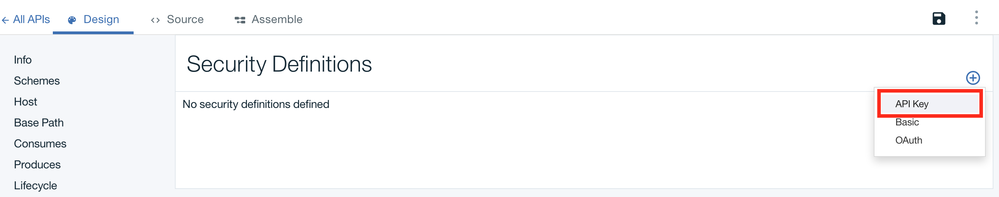
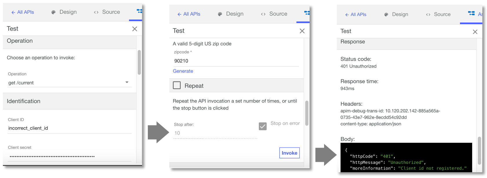

---
copyright:
  years: 2017
lastupdated: "2017-09-30"
---

{:new_window: target="blank"}
{:shortdesc: .shortdesc}
{:screen: .screen}
{:codeblock: .codeblock}
{:pre: .pre}

# 使用 Toolkit 搭配用戶端 ID 及用戶端密碼來保護 API

**持續時間**：10 分鐘  
**技能水準**：初學者

## 目標

本指導教學將引導您使用「用戶端 ID」及「用戶端密碼」來保護 API。在「開發人員入口網站」中登錄應用程式時，會產生用來識別應用程式的「用戶端 ID」。也可以選擇性地產生「用戶端密碼」（作為密碼）。應用程式需要提供產生的「用戶端 ID」及「用戶端密碼」金鑰，才能存取您的 API。

## 必要條件
開始之前，您必須已完成下列其中一個指導教學：
- [匯入 OpenAPI2.0 規格並對現有 REST 服務進行 Proxy 處理](tut_rest_landing.html)**或**  
- [新增 API 規格並呼叫現有 REST 服務](tut_rest_landing.html)

## 設定 API 的識別機制

1. 啟動 API Designer（如果尚未開啟）：  
   a. 開啟終端機。  
   b. 在指令行中，輸入 `apic edit`。_即會在 Web 瀏覽器中啟動 API Designer_    
   c. 按一下**使用 Bluemix 登入**。  
   d. 輸入 {{site.data.keyword.Bluemix_short}} 登入資訊。  

2. 導覽至 API 的「設計」視圖：
    a. 在左側導覽畫面中，按一下**草稿** 
    b. 然後，按一下 **API** 標籤
    c. 按一下您在前一個指導教學中建立的 _Weather Provider API_。這會開啟 API 的**設計**視圖。  
      

3. 在「設計」視圖中：  
   a. 向下捲動至**安全定義**。  
     

   b. 按一下**新增安全定義**圖示 (+)，然後按一下 **API 金鑰**。  
      - 名稱：用戶端 ID；參數名稱：X-IBM-Client-ID  
      - 名稱：用戶端密碼；參數名稱：X-IBM-Client-Secret  
      - 針對這兩個新金鑰，確定**位於**欄位設為「標頭」。  
          

4. 向下捲動至**安全**畫面，然後新增安全選項。  
   a. 選取最近建立的「用戶端 ID」及「用戶端密碼」金鑰。  
   b. 儲存 API。  
   c. 切換至**組合**標籤。  
     

## 測試對 API 所做的變更

1. 在「組合」標籤中，按一下 ► 來測試變更。
2. 在測試畫面中，按一下 **get /current** 作業。
3. 在測試畫面中向下捲動，注意已移入「用戶端 ID」及「用戶端密碼」值。_這些是針對沙盤推演產生的測試值，代表將使用 API 之應用程式的金鑰。_  
> 附註：您也可以在**儀表板** > **型錄** > **設定** > **端點**下找到這些「用戶端 ID」及「用戶端密碼」金鑰  

 

4. 進一步向下捲動，並輸入郵遞區號（例如：90210）。 
5. 然後，按一下**呼叫**。_您應該會收到 200 OK 回應，以及傳回天氣資訊的訊息內文。_  
6. 向上捲回至「用戶端 ID」欄位，並將「用戶端 ID」值取代為隨機值（以查看傳遞不正確「用戶端 ID」時的行為）  
7. 按一下**呼叫**，以重新執行測試。_您會看到「401 未獲授權」回應，以及「未登錄用戶端 ID」訊息。_  
    
  

## 使用用戶端 ID 及用戶端密碼來呼叫 API

也可以使用明確呼叫 Proxy 端點的「探索」工具來測試安全設定，並將「用戶端 ID」及「用戶端密碼」金鑰作為標頭值傳遞。

1. 按一下**探索**，然後按一下**沙盤推演**。  
    

2. 按一下清單中的 **GET /current** 作業。  

3. 在右側直欄中，按一下**呼叫作業**以重新執行測試。  
      
    
---

### 結論
在本指導教學中，您學習到如何設定 API 的識別機制、測試對 API 所做的變更，以及使用「用戶端 ID」及「用戶端密碼」來呼叫 API。 

---

## 下一步

[設定及配置開發人員入口網站](tut_config_dev_portal.html)，以開始進行 API 社交化。

建立 >管理> ** 安全 ** > 社交化 > 分析
