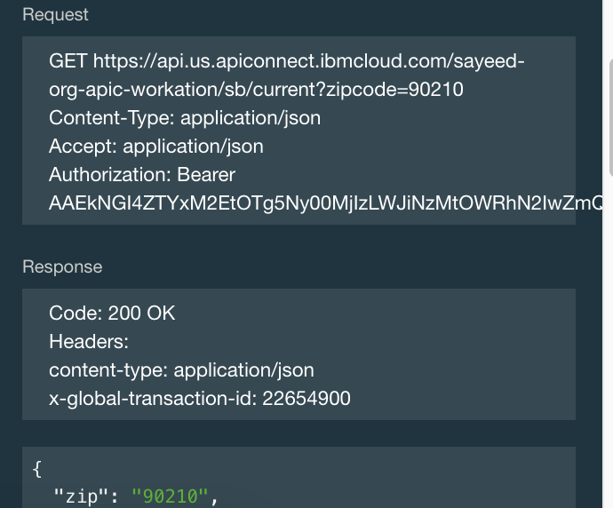

---

copyright:
  years: 2019
lastupdated: "2019-3-14"

subcollection: apiconnect

keywords: IBM Cloud, APIs, lifecycle, catalog, manage, toolkit, develop, dev portal, tutorial

---

{:new_window: target="blank"}
{:shortdesc: .shortdesc}
{:screen: .screen}
{:codeblock: .codeblock}
{:pre: .pre}

# 使用雙足式 OAuth 保護 API
{: #tut_secure_oauth_2}

持續時間：10 分鐘  
技能水準：初學者

## 目標
{: #object_tut_secure_oauth_2}

本指導教學將引導您使用雙足式 OAuth 2.0 流程來保護 API。在這個應用程式流程中，OAuth 用戶端會使用授權伺服器起始要求，並收到存取記號。OAuth 用戶端接著可以使用這個記號，透過 API 來存取受保護的資源。

## 必要條件
{: #prereq_tut_secure_oauth_2}

開始之前，您必須已完成下列指導教學。  
- [使用 {{site.data.keyword.Bluemix}} 搭配用戶端 ID 及用戶端密碼金鑰來保護 API](/docs/services/apiconnect/tutorials?topic=apiconnect-tut_secure_id_secret_bm)
或
- [使用 Toolkit 搭配用戶端 ID 及用戶端密碼金鑰來保護 API](/docs/services/apiconnect/tutorials?topic=apiconnect-tut_secure_id_secret_tk)

附註：本指導教學顯示在 {{site.data.keyword.Bluemix}} 使用者介面內完成作業的步驟及擷取畫面。您也可以使用指令行來完成相同的程序。您可以在 [IBM Knowledge Center ](https://www.ibm.com/support/knowledgecenter/SSMNED_5.0.0/com.ibm.apic.toolkit.doc/tutorial_apionprem_security_OAuth_v506.html){: #new_window} 中檢視該程序。 

## 程序
{: #steps_tut_secure_oauth_2}

1. 建立「OAuth 提供者 API」，然後選取 OAuth 方法。  
	a. 開啟**草稿**，選取 **API**，然後按一下**新增** > **OAuth 2.0 提供者 API**。  
    
	b. 將其標題設為 "OAuth Endpoint API"。應會自動移入名稱及基礎路徑。  
	c. 選取**建立 API**。  
	d. 在最近建立的「OAuth 端點 API」中，導覽或向下捲動至 **OAuth 2** 畫面，然後選取「機密」作為「用戶端類型」。  
	e. 在「範圍」下，將 _scope1_ 重新命名為 _view_current_。刪除 _scope2_ 及 _scope3_。  
	   
	
	f. 在**授與**下，取消選取**隱含**、**密碼**及**存取碼**。保持已選取**應用程式**。  
	    
	
	g. 儲存 API。  

2. 更新 Weather Provider API 的安全定義，以併入 OAuth。  
	a. 切換至 _Weather Provider API_（回到 API，然後選取 _Weather Provider API_）。  
	  
	
	b. 在「安全定義」下，按一下 **+** 圖示新增 OAuth 的定義。
	
	c. 將名稱設為 "OAuth definition"。  
	d. 在「流程」欄位中，選取**應用程式**。  
	e. 輸入記號 URL _**your base URL**/oauth-endpoint-api/oauth2/token_。  
	  
	
	f. 新增「範圍」：view_current。  
	  
	g. 在**安全**下，選取 **OAuth 定義**及 **view_current**，並保持已選取「用戶端 ID」及「用戶端密碼」。  
	  
	
	h. 按一下「儲存」。  
	
	i. 導覽回**草稿**，然後選取**產品**。開啟 **Weather Provider API 產品**。
	
	
	j. 按一下導覽列中的 **API**。按一下 **+** 圖示新增 API。將「OAuth 端點 API」新增至 Weather Provider 產品。  
	  
	k. 儲存產品，並將它編譯打包至「沙盤推演」。  
	

3. 測試 OAuth 安全配置。  
	a. 將已更新的產品發佈至沙盤推演。按一下**儀表板 > 沙盤推演**，然後發佈您的產品。  
	  
	b. 接受「可見性」對話框上的預設值。按一下**發佈**。
	  
	  
	c. 按一下**探索 > 沙盤推演**。  
      
	d. 在 **Weather Provider API** 中，按一下作業清單中的 **GET /current**。 
	
	e. 按一下**試用**。 
	
	f. 在右側畫面中，注意已移入「用戶端 ID」及「用戶端密碼」值。  
	
	g. 在**參數**區段中，在 **zipcode** 欄位輸入 _10504_。  
	  
	
	h. 在**授權**區段中，按一下**授權**以取得您的存取記號。
	  
	
	i. 收到存取記號之後，請按一下**呼叫作業**來完成您的測試。  
      

4. 請注意，此要求包括存取記號、「用戶端 ID」及「用戶端密碼」。若只要在要求中傳遞存取記號，您需要從 Weather Provider API 的安全需求中移除「用戶端 ID」及「用戶端密碼」。  
    

5. 儲存 Weather Provider API。然後，將它編譯打包並發佈至「沙盤推演」。從「探索」工具中，執行先前所執行的相同測試。  
    
    
## 結論
{: #conclusion_tut_secure_oauth_2}

在本指導教學中，您學習到如何建立「OAuth 提供者 API」、更新 API 的安全定義以併入 OAuth，以及測試安全配置。

---

## 下一步
{: #next_tut_secure_oauth_2}

[設定及配置開發人員入口網站](/docs/services/apiconnect/tutorials?topic=apiconnect-tut_config_dev_portal)，以開始進行 API 社交化。

建立 >管理> ** 安全 ** > 社交化 > 分析
