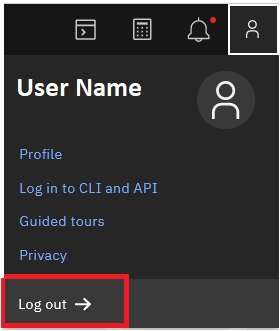

---

copyright:
   years: 2020, 2024
lastupdated: "2024-10-09"

keywords: IBM Cloud, API Connect, Reserved instance, lifecycle, develop, create, manage, API, user, role, access, group, catalog, space, provider organization, resource, permission

subcollection: apiconnect

---

{{site.data.keyword.attribute-definition-list}}

# Managing users
{: #ri-mng-users}

Create provider organizations to manage {{site.data.keyword.apiconnect_short}}, and map them to {{site.data.keyword.cloud_notm}} IAM access groups to specify user permissions to the Catalogs and Spaces contained in each provider organization.
{: shortdesc}

In {{site.data.keyword.apiconnect_short}} Reserved, users are grouped into provider organizations. Each provider organization owns a set of assets including APIs, products, catalogs, spaces, and developer portals, and the users who are members of that provider organization can be assigned to roles that determine their level of access to the those assets. User access is managed with the {{site.data.keyword.cloud_notm}} Identity and Access Management (IAM) service. When a user logs in to a Reserved instance, their permissions are determined by the IAM settings and overwrite any role definitions set in the API Connect UI.

Custom roles are not supported by the IAM service, so if you create custom roles in {{site.data.keyword.apiconnect_short}}, they are deleted the next time each user logs in and their permissions sync with the IAM service.
{: note}

You must assign a predefined role to each user to ensure they can access your resources. In {{site.data.keyword.apiconnect_short}}, resources are managed in the following hierarchy:

{: caption="Resource hierarchy" caption-side="bottom"}

To grant users permissions to the {{site.data.keyword.apiconnect_short}} resources owned by a particular provider organization, add the users to that provider organization. The role that a user is assigned to for the provider organization is inherited by the catalogs within it, and by the spaces within each catalog. You can override this access at the lower levels by assigning the user to a different role. For example, if you only want the user to have Edit access in a particular space, assign the user to the Reader role for the provider organization, and then assign the user to a role with Edit access on the selected space. The user will still have only Reader access to the catalog owning the space, to all other spaces within the same catalog, and to alwildcard
l other catalogs and spaces owned by the provider organization.

At a minimum, each user must be assigned at least Reader role on the Reserved instance and on each provider organization that they are allowed to view. Then you can decide what additional roles each should be be assigned to on the provider organization and to each of the catalogs and spaces within it.

Complete the following tasks to grant members of your {{site.data.keyword.cloud_notm}} account the appropriate access to resources in your Reserved instance.

## Creating provider organizations
{: #porg_ri-mng-users}

You can create a single provider organization (for example, in a company with only a few employees) or create multiple provider organizations (for example, different departments in a company with many employees). Some users might belong to multiple provider organizations, and might receive different levels of access with each.

### Decide how many provider organizations you need
{: #porg-decide_ri-mng-users}

In {{site.data.keyword.apiconnect_short}} Reserved, all of the members of a provider organization receive the same level of access to {{site.data.keyword.apiconnect_short}}. Review the members of your company's {{site.data.keyword.cloud_notm}} account and the descriptions of [who does what in {{site.data.keyword.apiconnect_short}}](/docs/apiconnect?topic=apiconnect-ri-user-over#whodoeswhat_ri-user-over), and determine how many provider organizations you need to create.

### Create your provider organizations in {{site.data.keyword.apiconnect_short}}
{: #porg-create_ri-mng-users}

Use the {{site.data.keyword.apiconnect_short}} administration console to create a provider organization and map it to the new IAM access group.

1. Open the {{site.data.keyword.apiconnect_short}} Reserved instance's administration console.

   a. [Log in](https://cloud.ibm.com/login/){: external} to {{site.data.keyword.cloud_notm}}.
  
   b. On the Dashboard, click  and select **API Management**.

   c. In the navigation list, expand **API Connect** and click **Services**.
  
   d. On the **Services** page, click your Reserved instance's name to open its administration console.

      On the **Services** page, a Reserved instance is labeled as "infrastructure".

2. On the administration console's home page, click the **Provider organizations** tile.

3. On the **Provider organizations** page, click **Create provider organization**.

4. On the **Create provider organization** page, provide a **Title**, select a **Resource group**, and then click **Create**.

   The title is the display name of your provider organization; a lowercase version of the title is automatically generated as the provider organization's name for internal use.

Repeat steps 3 and 4 for each additional provider organization. Then, create an IAM access group that will map to each provider organization and define user permissions.

## Creating IAM access groups
{: #access_ri-mng-users}

After you create a provider organization in {{site.data.keyword.apiconnect_short}}, use the {{site.data.keyword.cloud_notm}} Identity and Access Management (IAM) service to set permissions for it. You can define IAM access groups with policies that determine permissions within each provider organization in {{site.data.keyword.apiconnect_short}}, and then you can add members of your company's {{site.data.keyword.cloud_notm}} account to the appropriate access groups, which map users to provider organizations.

### Determine access needs for users
{: #access-needs_ri-mng-users}

For each provider organization, you need to create an IAM access group and assign the appropriate permissions. To decide what type of permissions each access group (provider organization) requires, review Table 1 to see how suggested jobs in {{site.data.keyword.apiconnect_short}} map to access roles in IAM.

Each user must be assigned to at least the Reader role on the Reserved instance and on each provider organization that they are allowed to see. If a user can see a provider organization, they can also see all catalogs and spaces within it. Although the user can see all of the catalogs and spaces within the provider organization, they cannot make changes unless you assign them to a role that provides the needed level of permissions for that resource.

Table 1 suggests IAM roles for typical {{site.data.keyword.apiconnect_short}} jobs that users perform. For a complete list of the IAM roles and how they are used in {{site.data.keyword.apiconnect_short}} V10 Reserved, see [Managing access](/docs/apiconnect?topic=apiconnect-iam).

| API Connect job   | Needs this IAM role                | Allowed actions                                                                                        |
| ----------------- | ---------------------------------- | ------------------------------------------------------------------------------------------------------ |
| API Developer     | Service: Writer                    | Create, edit, and publish APIs                                                                         |
| API Administrator | Service: Manager, Platform: Editor | Create, edit, and publish APIs; Full control over data within the service; Modify the service instance |
| Product Manager   | Platform: Operator                 | Create, edit, and publish APIs                                                                         |
| Administrator     | Platform: Administrator            | Full control of the service instance                                                                   |
{: caption="Mapping {{site.data.keyword.apiconnect_short}} jobs to IAM roles" caption-side="top"}

The IAM service provides roles for both the "platform" (the Reserved instance itself) and the "service" (the product features provided in the Reserved instance). {{site.data.keyword.apiconnect_short}} administrators and API administrators perform tasks that use the platform roles; for example, provisioning a service instance and managing user access to it. Other users perform tasks that use the service roles; for example, creating an API or viewing event analytics.

### Create access groups in IAM
{: #access-create-group_ri-mng-users}

In IAM, an access group contains a set of users that are assigned to the same access roles for the same {{site.data.keyword.cloud_notm}} resource. For your purposes, each access group represents a provider organization and should be assigned to the appropriate access roles for that provider organization.

1. [Log in](https://cloud.ibm.com/login/){: external} to {{site.data.keyword.cloud_notm}}.
  
2. On the {{site.data.keyword.cloud_notm}} Dashboard, locate the "User access" tile and click **Manage users**.

   The IAM service dashboard opens to the [Access (IAM)](https://cloud.ibm.com/iam) page.

3. On the **Access (IAM)** page, look in the navigation menu and click **Access groups**.

4. On the **Access groups** page, click **Create**.

5. In the **Create access group** box, provide a name and description for the new access group, and then click **Create**.

Repeat steps 4 and 5 for each access group.

### Assign access policies to the access groups
{: #access-assign-policies_ri-mng-users}

An IAM access policy assigns roles (each role represents a set of permissions) to an access group. You can add one or more roles to each access group in IAM, and you can map one or more access groups to each of your {{site.data.keyword.apiconnect_short}} provider organizations.

1. On the page for your access group, click the **Access policies** tab.

2. On the **Access policies** tab, click **Assign access**.
  
3. On the **Assign access** page, select **IAM services**.

      You are only defining access to {{site.data.keyword.apiconnect_short}}, which is an IAM-enabled service.  

4. For **What type of access do you want to assign?** select **API Connect** from the list.

      Your provider organizations only apply to {{site.data.keyword.apiconnect_short}} Reserved.

5. Select a provider organization:

   a. For **Which services do you want to assign access to?**, select **Services based on attributes**.

   b. For **Add attributes** select **Service Instance**, plus:

      - In the first list, select **string equals**.  

      - In the second (service instances) list, select the name of the provider organization where you want to apply the access policy.

      The new access policy applies only to the specified provider organization. Mapping the policy directly to a provider organization ensures that you don't accidentally grant users a wider range of permissions to the Reserved instance.

6. Optionally select one or more catalogs owned by the provider organization.

   If you want to assign access only to particular catalogs (instead of all catalogs within that provider organization), select **Resource**, plus:

   - In the first list, select **string equals**.  

   - In the second (resources) list, select or type the name of the catalog where you want to apply the access policy. You can use wildcards for strings (\*) and numbers (?). For example, to apply the access to all catalogs beginning with "catalog-1" followed by any character (as in catalog-1a, catalog-1b), type "catalog-1*".

   Specify catalog names rather than display titles.

7. Optionally select one or more spaces within a specified catalog.

   If you want to assign access only to particular spaces within a selected catalog, append "/" plus the space name to the catalog name. Specify space names rather than display titles. You can use wildcards for letters and numbers.

   For example, if you specified catalog-1a in the previous step and now want to include only space-1a within that catalog, update the resource name to "catalog-1a/space-1a".

8. Select the roles that you want to assign to the members of this access group.
  
   Click the number next to each role to see the detailed list of permissions that are available with that role.

9. Select **Add** to add the selected roles to the access group.

10. Review the "Access summary" section and click **Assign** to save the access groups with the access policies.

Next, add users to the access group so that the permissions you just configured can be assigned to them.

### Add users to the access group
{: #access-add-users_ri-mng-users}

Adding users to an access group maps them to the provider organization that is associated with that access group, and determines their permissions in {{site.data.keyword.apiconnect_short}} when they log in with that provider organization.

1. On the page for your access group, click the **Users** tab.

2. On the **Users** tab, click **Add users**.

   The names of all of the users who belong to your company's {{site.data.keyword.cloud_notm}} account display.

3. Select users to be added to the access group.

   You can quickly add all of the users in the list by clicking the checkbox next to **Users** at the beginning of the table.

4. At the beginning of the table, click **Add to group**.

## Notifying users that the provider organization is available
{: #invite-porg_ri-mng-users}

When you set up IAM access for your users, there is no automatic notification. After you finish configuring access for a provider organization, you should notify its members so they can start working with {{site.data.keyword.apiconnect_short}}. For example, you could send an email or post a message where your users will see it. You should tell users the following information:

- The name of the Reserved instance (especially if you provisioned more than one)
- The name of the provider organization that the user is assigned to
- Where to find documentation: [https://cloud.ibm.com/docs/apiconnect](https://cloud.ibm.com/docs/apiconnect)

Each user must log out from IBM Cloud and then log in again for the permission changes to take effect.

{: caption="IBM Cloud log out" caption-side="bottom"}

## Managing provider organizations
{: #mng-porg_ri-mng-users}

Use IAM to add and remove users, and to manage their permissions.

When you request the deletion of a provider organization in API Connect V10 Reserved, the provider organization is not immediately removed from the system. This delay is part of the resource reclamation process and might prevent you from recreating the provider organization immediately.
If you need to recreate the provider organization immediately after deletion, you can speed up the process by forcing the early reclamation of the deleted provider organization as explained in [Using resource reclamations](/docs/account?topic=account-resource-reclamation&interface=cli).
Additionally, if you decide to restore the deleted provider organization, the resource reclamation process allows for the restoration of resources within a limited time frame.
{: note}

### Assign ownership of a provider organization
{: #mng-porg-owner_ri-mng-users}

Instead of managing all provider organizations yourself, you can designate other users as owners and give them the appropriate access. To assign owner-level access to a provider organization, create an IAM access group that has administrative access to the provider organization, and add the user to that access group.

### Manage user permissions
{: #mng-porg-user-perms_ri-mng-users}

To change a user's permissions in {{site.data.keyword.apiconnect_short}}, either change the roles assigned to the IAM access group containing that user, or move the user to a different access group.

### Remove users from a provider organization
{: #mng-porg-remove-user_ri-mng-users}

To remove a user from a provider organization, delete that user from the corresponding access role in IAM. The next time that the user attempts to log in to the provider organization, the login will not be allowed.

A user who is already logged in to {{site.data.keyword.apiconnect_short}} when you remove them from the access group remains logged in and still has access to the provider organization's assets. To stop the user from working with assets immediately, remove them from all catalog and space memberships within the Reserved instance.
{: note}
