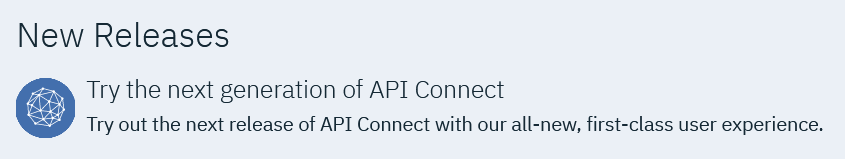

---

copyright:
  years: 2018
lastupdated: "2018-04-16"

---

{:new_window: target="_blank"}
{:shortdesc: .shortdesc}
{:screen: .screen}
{:codeblock: .codeblock}
{:pre: .pre}

# Try the next generation of IBM API Connect for IBM Cloud
{: #try_next}

{{site.data.keyword.apiconnect_short}} for {{site.data.keyword.Bluemix}} is getting a new look and feel! We are focusing on the user experience and improving the usability of the {{site.data.keyword.apiconnect_short}}  service, and would appreciate your feedback.

## How do I sign up?

* Sign up to try the new experience: If you haven’t already, you can request to try the new experience. Sign up here [Try the next generation of API Connect ](https://console.bluemix.net/apis/overview){:new_window}

* When your space is available, you will receive an email with additional instructions.

## What can I expect?

* Use this initial release of the next generation of API Connect for IBM Cloud to learn about the new user experience. Note that existing catalogs, products, and APIs will not be migrated at this time, so you will need to start from scratch.
* Use this initial release as a development sandbox only. Your assets and custom settings may be removed as we deploy updates.
* Do not use this initial release to support production-level APIs. 
* As you experiment with the new API Connect user interface, keep in mind that we cannot guarantee that your data will be saved or migrated when we move this version into full production.
* If you find bugs or usability issues, let us know by using the FEEDBACK link that is located on each page so we can get them fixed!

## Where can I find more information?

For detailed instructions for major tasks, visit the IBM Knowledge Center for API Connect 2018.1:
* [About IBM API Connect ](https://www.ibm.com/support/knowledgecenter/SSMNED_2018/com.ibm.apic.overview.doc/api_management_overview.html){:new_window}
* [Developing your APIs and applications ](https://www.ibm.com/support/knowledgecenter/SSMNED_2018/com.ibm.apic.toolkit.doc/capim_cli_overview.html){:new_window}
* [Managing your APIs ](https://www.ibm.com/support/knowledgecenter/SSMNED_2018/com.ibm.apic.apionprem.doc/APIonPrem_gettingstarted.html){:new_window}
* [Socializing your APIs with the Developer Portal ](https://www.ibm.com/support/knowledgecenter/SSMNED_2018/com.ibm.apic.devportal.doc/discover_apis_landing_page.html){:new_window}

## How do I provide feedback on the experience.

To help us improve this experience before it is finalized, use the FEEDBACK link on the page that you want to comment on. The FEEDBACK link is located on each page. We want to know what you think, where you ran into issues, and what you like about the new look and feel. Your comments will help us make this a world-class experience for our clients, including you!