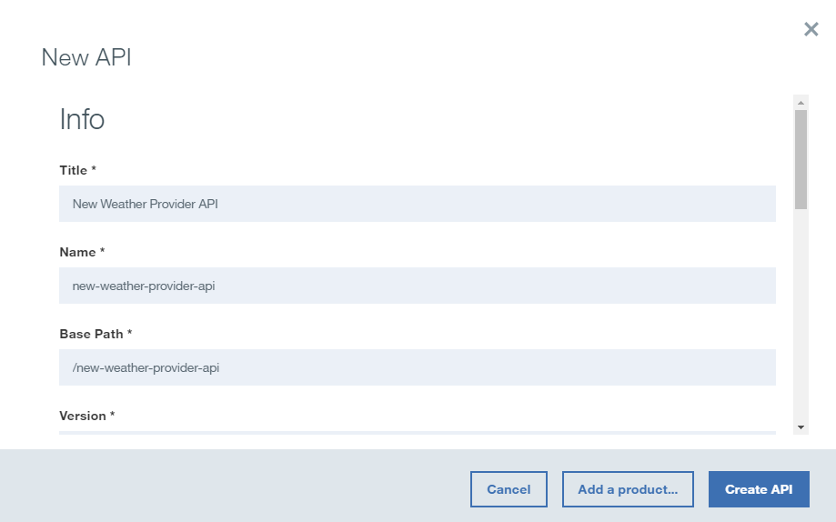
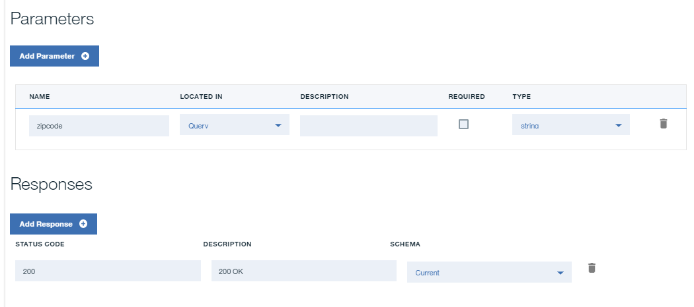
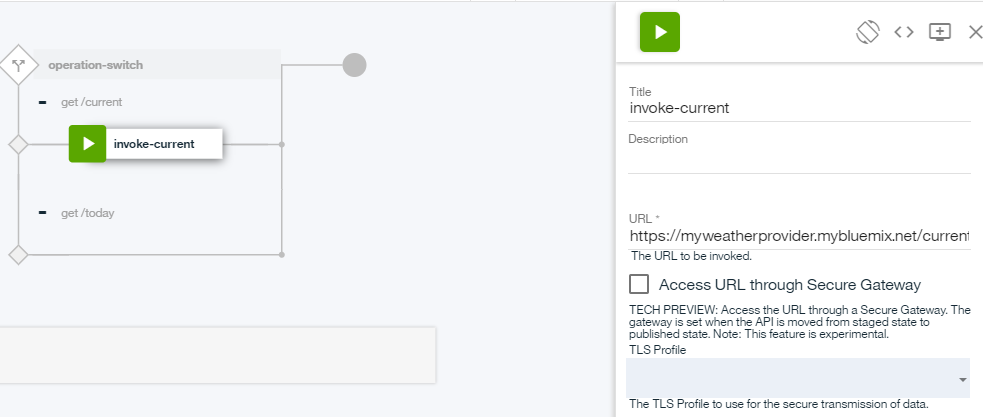
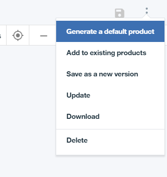
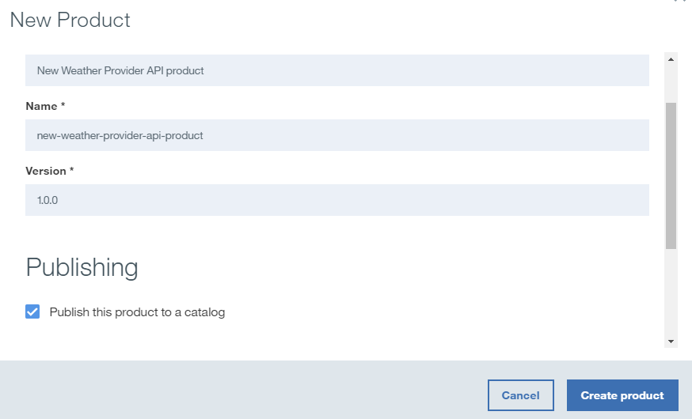
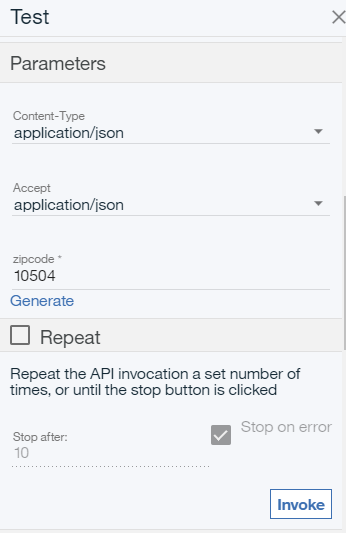
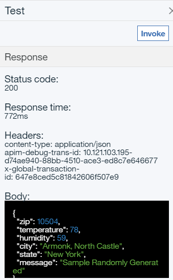

---
copyright:
  years: 2019
lastupdated: "2019-3-9"

subcollection: apiconnect

keywords: IBM Cloud, APIs, lifecycle, catalog, manage, toolkit, develop, dev portal, tutorial

---

{:external: target="_blank" .external}
{:screen: .screen}
{:codeblock: .codeblock}
{:pre: .pre}

# Add an API spec and invoke a REST service with {{site.data.keyword.cloud_notm}}
{: #tut_add_openapi_rest_bm}

**Duration**: 15 mins  
**Skill level**: Beginner  

## Objective
{: #object_tut_add_openapi_rest_bm}

This tutorial helps you get started quickly with {{site.data.keyword.apiconnect_full}}. You will build a new API in a few minutes that acts as a pass-through API proxy for an existing REST service.  The API that you build provides security and monitoring.

## Prerequisite
{: #prereq_tut_add_openapi_rest_bm}

Before you begin, you need to [set up your API Connect Instance](/docs/apiconnect/tutorials?topic=apiconnect-tut_prereq_set_up_apic_instance).

---

### Explore the sample app and test the target endpoints
{: #expl_tut_add_openapi_rest_bm}

A sample _weather provider_ app was created for this tutorial.
1. To explore the app, go to [http://gettingstartedweatherapp.mybluemix.net/](http://gettingstartedweatherapp.mybluemix.net/){: external}.  
2. Enter a valid 5-digit US zip code to get the _**current weather**_ and _**today's forecast**_.  

3. The sample weather app was built with APIs that provide the weather data. The endpoint to get the **current** weather data is `https://myweatherprovider.mybluemix.net/current?zipcode={zipcode}`. Test it out by visiting [https://myweatherprovider.mybluemix.net/current?zipcode=90210](https://myweatherprovider.mybluemix.net/current?zipcode=90210){: external}.  

  

4. Similarly, the endpoint to get **today's** forecast data is `https:// myweatherprovider.mybluemix.net/today?zipcode={zipcode}`. Test it out by going to [https://myweatherprovider.mybluemix.net/today?zipcode=90210](https://myweatherprovider.mybluemix.net/today?zipcode=90210){: external}.  

  

---

### Add a new OpenAPI spec to create a REST API proxy  
{: #add_spec_tut_add_openapi_rest_bm}

1. Log in to {{site.data.keyword.cloud_notm}}: https://cloud.ibm.com.
2. In the {{site.data.keyword.cloud_notm}} **Dashboard**, click **Cloud Foundry Services**. Launch the {{site.data.keyword.apiconnect_short}} service. 
3. In {{site.data.keyword.apiconnect_short}}, make sure that the navigation panel is open. If not, click **>>** to open it.  

  

4. Select **Drafts** in the navigation panel.
5. In the **APIs** tab, click **Add** > **New API**.    
    
6. In the *New API* window, enter `New Weather Provider API` for the title.
_The Name and Base Path are auto-populated_.  
  
7. Click **Create API** to complete the wizard.  
8. After you create your API, the **Design** tab is selected. 
9. Scroll to the **Host** panel. Enter `$(catalog.host)` as the value if the field is not automatically completed.
10. In the **Base Path** panel, note the auto-populated value: `/new-weather-provider-api`. Your API's target URL is created from these values.  

11. You now need to define the response object that is returned when you invoke the weather API. To do so, click **Definitions** in the navigation bar.   
    a. Add a new definition.  
    b. Name the new definition _Current_.  
    c. Set the Type to _Object_.  
    d. Add new properties for the **Current** definition as shown in Table 1.    
	   
	   |    Name    |   Type   |
	   | ---------- | -------- |
	   |zip         |string    |
	   |temperature |integer   |
	   |humidity    |integer   |
	   |city        |string    |
	   |state       |string    |
	   {: caption="Table 1. Properties for the Current definition" caption-side="top"}

       
	
    e. Save your API.  

12. Create a new definition: **Today**.

13. Add new properties for the **Today** definition as shown in Table 2.
	
	   |    Name      |   Type   |
	   | ------------ | -------- |
	   |zip           |string    |
	   |hi            |integer   |
	   |lowe          |integer   |
	   |nighthumidity |integer   |
   	   |dayhumidity   |integer   |
	   |city          |string    |
	   |state         |string    |
	   {: caption="Table 2. Properties for the Today definition" caption-side="top"}

14. With our data formats defined, we can create invocation paths.  In the navigation bar, click **Paths**. Create a new path by clicking **+**.     
    a. Name the new path "**/current**".  
    b. In the same *Paths* panel, select the **GET /current** section.    
    c. In the **GET /current** section, add a new **Parameter**. As you noticed while exploring the sample app, the weather service requires `zipcode` as a parameter.   
      - Name: zipcode  
      - Located in: Query  
      - Required: Yes  
      - Type: string   
	  
       
	
    d. Scroll down.  In the **Responses** section, change the **SCHEMA** to _Current_.  
	
	
	
	e. Save your API.  

15. Repeat the process in step 11 to create another path named "**/today**".  In this case, set the **Responses** schema to _Today_.  Save your API.

16. Save your API.

17. Click the **Assemble** tab. You created two operations so far: **GET /current** and **GET /today**. To ensure that the correct target endpoint is invoked, create some logic that executes a conditional on the operation that's being called. Let's use the **Operation Switch** logic construct to do this.  The **Operation Switch** provides a decision point. Based on the verb and path pair, the appropriate operation needs to be invoked.

    a. If the _canvas_ displays a default **invoke** policy, delete the policy now.  
    b. From the palette, drag the **Operation Switch** and drop it on the canvas.  
      - To **case 0**, assign the **get /current** operation.
      - Add a new Case: **case 1**.
      - Assign the **get /today** operation to **case 1**.
	  
	  
      
	  
    c. Drag the **invoke** policy from the palette and drop it on the processing line beneath **get /current**. _The invoke action is used to call an existing service from within an operation_.   
    d. Update the action title to "**invoke-current**".  
    e. Update the URL field with `https://myweatherprovider.mybluemix.net/current?zipcode=$(request.parameters.zipcode)`.  
	
	
	
	
	f. Drag the **invoke** policy from the palette and drop it on the processing line beneath **get /today**. 
    g. Update its title to "**invoke-today**".  
    h. Update the URL field with `https://myweatherprovider.mybluemix.net/today?zipcode=$(request.parameters.zipcode)`.  
	
       
	   

18. Close the action configuration panel.  Save your API.

---

### Test your API proxy
{: #test_proxy_tut_add_openapi_rest_bm}

1. In the **Assemble** tab, click the icon for more actions, then select **Generate a default product**.  
    

2. Accept the default options in the **New Product** dialog box, and click **Create Product**. The Weather Provider API product is created and published to the Sandbox catalog. A message indicating successful product generation is displayed.  

   

  In {{site.data.keyword.apiconnect_short}}, **Products** provide a way to group APIs that are intended for a particular use. Products are published to a **Catalog**.

3. In the Assemble tab, click the play icon to test your API proxy's target invocation.

4. In the test panel, select the **get /current** operation.

	a. `zipcode` is a required parameter for this operation, so enter a valid US zip code (for example, 10504). 
	
	  
		
	b. Click **Invoke**.   

	_If you run into a CORS error, follow the instructions in the error message. Click the link in the error to add the exception to your browser, and then hit the "invoke" button again._
  
      

---

### Conclusion
{: #conclusion_tut_add_openapi_rest_bm}

In this tutorial, you learned how an existing REST service can be invoked through an API pass-through proxy. You started by checking the availability of the sample service through the web browser. Then, you created a new OpenAPI spec in {{site.data.keyword.apiconnect_short}}, and linked it to the sample service to be invoked. You packaged your API into a product, published the product to catalog, and tested the proxy.

---

## Next step
{: #next_tut_add_openapi_rest_bm}

[Secure your API using OAuth 2.0](/docs/apiconnect/tutorials?topic=apiconnect-tut_secure_oauth_2).

Create > **Manage** > Secure > Socialize > Analyze
