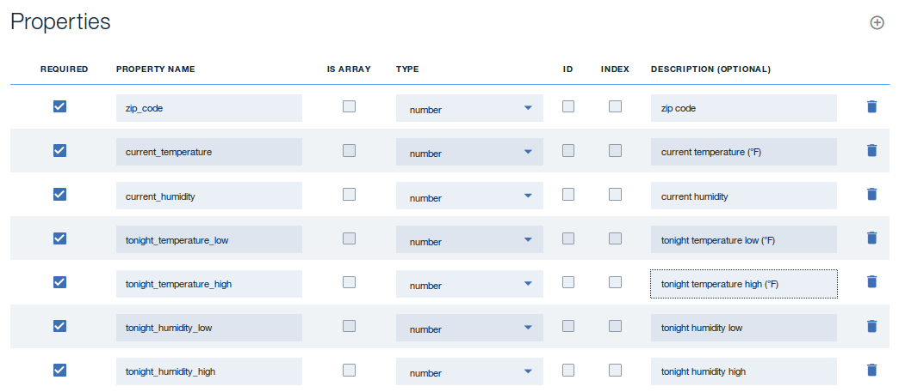

---

copyright:
  years: 2017
lastupdated: "2017-08-24"

---


{:new_window: target="_blank"}
{:shortdesc: .shortdesc}
{:screen: .screen}
{:codeblock: .codeblock}
{:pre: .pre}


# Creating an API in Node.js

**Duration**: 20 mins  
**Skill level**: Beginner  

---
## Objective

This tutorial guides you through creating an API in Node.js using the LoopBack framework. The tutorial describes how to:
1. Create a new LoopBack project.
2. Add a new data source and model to a LoopBack project using the API Designer in the IBM API Connect toolkit.
3. Test your API endpoints using the API Designer Explore tool.

---
## Prerequisites

Before you begin, [install the {{site.data.keyword.apiconnect_short}} toolkit](https://www.ibm.com/support/knowledgecenter/SSFS6T/com.ibm.apic.toolkit.doc/tapim_cli_install.html).

---
## Create a Loopback project

You can create a Loopback project using either the API Connect toolkit command-line interface or the API Designer interface. 
 
### Create a LoopBack project using the toolkit command line

To create a LoopBack project using the {{site.data.keyword.apiconnect_short}} toolkit command line, complete the following steps:
1.  From the command-line interface, enter the following command. It is used to create and manage LoopBack applications.
	```bash 
	apic loopback
	```
	>![info]
	>For this tutorial, you will create a project called weather-data.
2.  At the prompt, enter ```weather-data``` as the project name and press **Enter**.
	```bash
	? What's the name of your application? weather-data
	```
  	>![important]
  	>In general, a project name can contain any characters except blank space (" "), forward slash ("/"), ampersand ("&"), at ("@"), plus ("+"), percent ("%"), and colon (":").
3.  Enter the name of the directory in which to create the project. Press **Enter** to use a directory with the same name as the project, or type a new name and press **Enter**.
	```bash
	? Enter name of the directory to contain the project: weather-data
	```
4.  Select the version of LoopBack to use. Choose the current production version: 3.x.
	```bash
	? Which version of LoopBack would you like to use? 
  	2.x (long term support) 
	? 3.x (current) 
	```
5.  Specify the kind of application that you want to create by using the arrow keys to select **empty-server**.
	```bash
	? What kind of application do you have in mind? (Use arrow keys)
	? empty-server (An empty LoopBack API, without any configured models or datasources) 
  	hello-world (A project containing a basic working example, including a memory database) 
  	notes (A project containing a basic working example, including a memory database)
	```
6.  Press **Enter** to create an empty LoopBack API. 

The tool displays a number of messages as it creates the project directory and adds a number of directories and files to it. It also runs npm install to install all the project dependencies, as specified in package.json. This process creates a node_modules directory and might take some time.

An empty LoopBack project contains the following directories:
- server: contains server model and data source definitions, and other server code
- definitions: contains YAML definition files
- node_modules: created by node.js


### Create a LoopBack project using the API Designer interface

To create a LoopBack project using the API Designer, complete the following steps:
1.  From the command-line interface, enter the following command to start the API Designer:
	```bash
	apic edit
	```
	
	>![info]
	>The above command initializes the APIC toolkit and launches the API Designer in the default browser when it is done.
	>![info]
	>In this tutorial, you will create a project called weather-data.
2.  If you have not previously pinned the UI navigation pane, click the Navigate to icon . The API Manager UI navigation pane opens. To pin the UI navigation pane, click the Pin menu icon .
3.  In the side bar, click the Projects Plus icon .
4.  Click **Create LoopBack Project**. You'll see the **Add new LoopBack project ** dialog.
5.  Select **empty-server** as the project template.
6.  For **LoopBack Version**, select version 3.x (the current version).
7.  Enter ```weather-data``` for the Display Name and Name fields.
8.  For the **Project Directory**, select the ```weather-data``` folder created in step 1 by clicking the **Browse** button.
	
9. Click **Add** to add the project.
	>![info]
	>A number of messages will be displayed in the **Add new LoopBack project** window as it creates the project directory and adds a number of directories and files to it. It also runs npm install to install all the project dependencies, as specified in package.json. This process creates a node_modules directory and might take some time.
	
	>An empty LoopBack project contains the following directories:
	- server: contains server model and data source definitions, and other server code
	- definitions: contains YAML definition files
	- node_modules: created by node.js
10. Click **Finished** to close the **Add new LoopBack project** dialog box.
11. Exit **API Designer** by going back to the command line in step 1 and entering ```Ctrl + C```.  Type ```Y``` to confirm the exit.
12. Close the browser session.

---
## Add a new data source and model

To add a new model and data source to a LoopBack project using the API Designer, complete the following steps:

### Add a data source
To add a new data source to a LoopBack project using the API Designer, complete the following steps.
1. You must also create a LoopBack project (the "weather-data" project) as described in ```Create a LoopBack project from the command line``` and make sure the current working directory is the project root directory:
	```bash
	cd weather-data
	```
2. From the command line, enter the following command:
	```bash
	apic edit
	```
	After a brief pause, the console displays this message:
	```bash
	Express server listening on http://127.0.0.1:9000
	```
	The API Designer opens in your default web browser, initially displaying the login page if you haven't logged in recently.  
	>![info]
	>You can log in using your Bluemix account or create one.
3. Click the **Data Sources** icon .
4. Click **Add**. The New LoopBack Data Source window opens.
5. Enter ```weatherDS``` in the **Name** text field.
	>![info]
	>You can use any alphanumeric characters, dashes, and underscores in a data source name.
6. Click **New**.
7. By default, the **Connector** setting shows **In-memory db** and the other settings are blank. Keep the default settings for now, and API Designer automatically saves the new data source.
	>![info]
	>The In-memory data source is built into LoopBack and is suitable only for development and initial testing. When you are ready to connect your models to a real data source such as a database server, change the **Connector** setting accordingly and install the data source connector by following the instructions in [Installing LoopBack connectors](https://www.ibm.com/support/knowledgecenter/SSMNED_5.0.0/com.ibm.apic.toolkit.doc/tapim-connector-install.html#task_i2p_dnw_vv). Enter the connector settings (host name, port, database name, user name, password) as appropriate for your Connector type, and click the **Save** icon . API Designer automatically tests the connection to the data source. If the test is successful, it displays the message **Success - Data source connection test succeeded**.
8. Click the Test Connection icon  to test the data source connection. The message "Data source connection test succeeded" is displayed.
9. Click **All Data Sources**. The data source will appear in the list of data sources, and the editor updates the server/datasources.json file with settings for the new data source.

### Add a model

To add a new model to a LoopBack project using the API Designer, complete the following steps:
1. Click the **Models** icon .
2. Click **Add**. The New LoopBack Model window opens.
3. Enter ```weather``` in the **Name** text field, then click **New**.
4. In the **Data Source** field, select **weatherDS**.
	
5. In the **Properties**, click the **Add property** icon .
6. In the **Property Name** text field, enter ```zip_code```.
7. For **Type**, select **number**.
8. Select **Required** to make the property required. This means that it must have a value when you add or update a model instance. For now, keep the default values for the other settings:
	- **Is Array**: Whether the property is a JavaScript array with elements of the specified type.
	- **ID**: Whether the property is a unique identifier.
	- **Index**: Whether the property represents a column (field) that is a database index.
	- **Description**: Text description of the property.
9. Click the **Add property** icon  again to add another property.  Reference the table below to complete the remaining properties:
	
10. Click the **Save** icon  to save your changes.
11. Click **All Models** to finish editing the model.

This completes adding a new data source and model to the weather-data LoopBack project.

---

## Test your LoopBack project

>![info]
	>You can go directly to step 2 below if you did not exit {{site.data.keyword.apiconnect_short}} designer after completing the "Add a new model and data source" section.
	
To test your API endpoints using the API Designer Explore tool, complete the following steps:
1. From the command line, enter the following command:
	```bash
	apic edit
	```
	After a brief pause, the console displays this message:
	```bash
	Express server listening on http://127.0.0.1:9000
	```
	The API Designer opens in your default web browser, initially displaying the login page if you haven't logged in recently.
	
2. Start the local test servers.
	a. In the test console at the bottom of the screen, click the **Start the servers** icon :
	
	b. Wait until the Running message is displayed:
	

	>![info]
	>Depending on your project configuration and whether other processes are running, different port numbers might be displayed.
3. Click **http://127.0.0.1:port_number** to display the API root endpoint. For the default LoopBack (empty or hello-world) project, you'll see something like this:
	```bash
	{"started":"2017-05-24T19:21:47.807Z","uptime":80.876}
	```
	>![info]
	>To stop your project, click the **Stop the servers** icon :
	>
	
	>To restart it, click the **Restart the servers** icon :
	>
	
4. Click the **Explore** icon  to see the API Designer Explore tool. The sidebar shows all of the REST operations for the LoopBack models in the API. Models that are based on PersistedModel by default have a [standard set of create, read, update, and delete operations](http://loopback.io/doc/en/lb2/PersistedModel-REST-API).

5. Click the operation **weather.create** in the left pane to display the endpoint.

The center pane displays summary information about the endpoint, including its parameters, security, model instance data, and response codes. The right pane provides template code to call the endpoint using the curl command, and languages such as Ruby, Python, Java, and Node.

6. To test the REST endpoints in the API Designer Explore tool, on the right pane click **Try it**. Scroll down to **Parameters** and click **Generate** to generate some dummy data. By default, the generated data includes the ```zip_code```, ```current_temperature```, ```current_humidity```, ```tonight_temperature_low```, ```tonight_temperature_high```, ```tonight_humidity_low```, ```tonight_humidity_high``` and ```id``` properties. The ```id``` property is created by LoopBack for a given model and the value is automatically generated. Remove the ```id``` property from the sample data, update the generated data as required, and click **Call operation**.

>![troubleshooting]
>If you see an error message due to an untrusted certificate for localhost, click the link provided in the error message in API Designer Explore tool to accept the certificate, then proceed to call the operations in your web browser. The exact procedure depends on the web browser you are using. If you load the REST endpoints directly in your browser, you will see the message: {"name":"PreFlowError","message":"unable to process the request"}. You must use the API Designer Explore tool to test REST endpoints in your browser because it includes the requisite headers and other request parameters.
>
>![troubleshooting]
>If you get a response code of **422 - Unprocessable Entity** with the following payload:
>
>
>the ```id``` data element has not been removed from the generated data. Remove the ```id``` data element and re-run the test.
>![troubleshooting]
>If you get the error **failed to parse request body**, you have to remove the comma following the last ```humidity_high``` number.
7. Edit the values in the JSON shown in the **data** section. Try changing the generated dummy data, and click **Call operation** again. You should see the request and response parameters, along with the JSON instance data that you entered.


8. To confirm that the operation added a model instance, click **weather.find**. Click **Call operation** to display all weather instances. For example (with two model instances):

	
---

### What you accomplished in this tutorial
In this tutorial, you completed the following:
1. Created a new LoopBack project using the {{site.data.keyword.apiconnect_short}} toolkit command line.
2. Added a new model and data source to a LoopBack project by using the API Designer in {{site.data.keyword.apiconnect_short}} toolkit.
3. Tested your API endpoints by using the API Designer Explore tool.

---

[important]: ./images/important.png "Important!"
[info]: ./images/info.png "Information"
[troubleshooting]: ./images/troubleshooting.png "Troubleshooting" 

