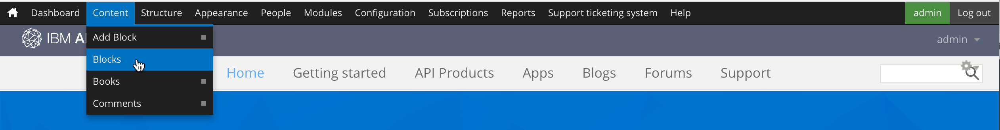
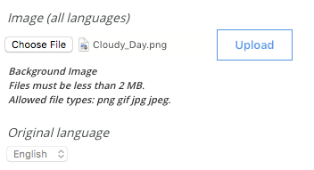
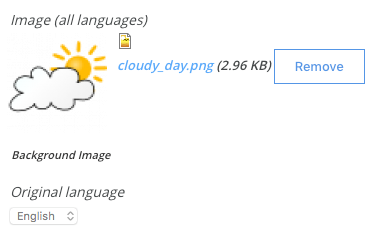
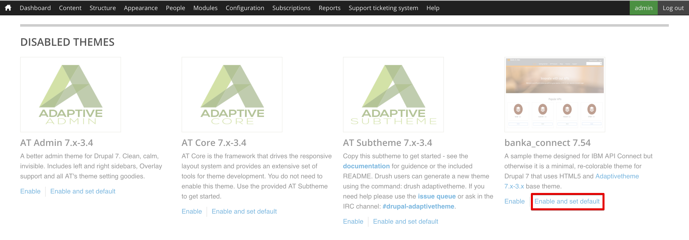

---

copyright:
  years: 2017
lastupdated: "2017-10-31"

subcollection: apiconnect

keywords: IBM Cloud, APIs, lifecycle, catalog, manage, toolkit, develop, dev portal, tutorial

---

{:external: target="_blank" .external}
{:shortdesc: .shortdesc}
{:screen: .screen}
{:codeblock: .codeblock}
{:pre: .pre}

# Customizing your Developer Portal and selecting a theme
{: #tut_custom_dev_portal}

**Duration**: 30 mins  
**Skill level**: Beginner  

## Objective
{: #object_tut_custom_dev_portal}

This tutorial helps you to quickly customize your {{site.data.keyword.apiconnect_full}} Developer Portal and select a theme that suits your needs.

---

## Prerequisites
{: #prereq_tut_custom_dev_portal}

Before starting this tutorial, complete the [Setting up and configuring your Developer Portal](/docs/apiconnect/tutorials?topic=apiconnect-tut_config_dev_portal) tutorial and log to the portal in as the portal administrator.

---

## Customize your developer portal
{: #cust_tut_custom_dev_portal}

Customize the portal by modifying the banner and headings, and then applying a visual theme.

1. Begin by modifying the "Welcome" banner. In the menu, select **Content**, and then click **Blocks**.  
  

2. Select **Edit** in the **Welcome Banner** block.  
  

3. After the "Content" heading, you can change the text and image for the "Welcome" banner. You can enter text directly into the content editor, or select the "Edit HTML Source" icon and edit the HTML specifications directly. 
   

4. Add an image to the home screen. Locate the "Image" heading and click **Choose File**. Browse for na image and click **Upload**. 

   Supported image formats include: png, gif, jpg, and jpeg. If you don't have an image, you can use [this one](images/Cloudy_Day.png).  
  

   If you want to remove the image, click **Remove**.  
  
 
5. Click **Save** to save your changes.  
  
---

## Customize the theme for your developer portal
{: #cust_theme_tut_custom_dev_portal}

The developer portal allows you to modify the theme to change its look and feel.

1. To modify the theme, select **Appearance** from the menu, then select **Settings** > **IBM API Connect Theme**. 
   This is the default theme for the developer portal.
    

   The **Standard Layout** tab allows you to modify the layouts for devices with large screens, such as desktops. The **Tablet Layout** tab allows you to modify the layouts used on tablet devices. The **Smalltouch Layout** tab allows you to modify the layouts used on smaller devices such as smartphones. 
   
   The default theme supports the use of Gpanels, or Responsive Panels, if you install the Panels module. Panels let you define settings that control the panels layout on standard, tablet, and small touch devices. 
   

  There are other settings that you can adjust, but for this tutorial, skip to the Extensions tab. 
  
2. Click select **Extensions** to enable additional settings you can use to configure the styling of your developer portal.  
  

  YOu can modify the settings of the extensions enabled on the **Extensions** tab.     
  

3. When the settings modifications are complete, click **Save configuration**.

---

## Select a different theme for your developer portal
{: #diff_theme_tut_custom_dev_portal}

The developer portal comes with additional themes that change its look and feel.

1. To enable a different theme, select the **List** tab in the Appearance settings.
   
 
   Enabled themes display on the **Lists** tab. 
   

2. Disabled themes display after enabled themes in the list. Enable a theme by selecting it and clicking **Enable**.
    

   When the theme is enabled, it will appear at the top of the **List** tab in the **Enabled Themes**. 
  
3. Customize a them by selecting it and clicking **Settings**.  
   

4. When you finish the settings, set the theme as the default by selecting it and clicking **Set Default**.     
   

---

## Install a new theme for your developer portal
{: #new_theme_tut_custom_dev_portal}

If modifying an existing theme doesn't suit your needs, you can install a new theme. You can use modules or themes from [drupal.org](http://drupal.org){: external} to customize your developer portal, or you can create your own theme.

1. To install a theme into the developer portal, select **Appearance** from the menu, then click **Install new theme**.  
  

2. To install a theme directly from [drupal.org](http://drupal.org){: external}, enter the URL. To upload a theme from your device, click **Choose File** and then select **Install**.  
   

3. When the upload completes, enable the theme by clicking **Enable newly added themes**.  
  

4. Locate the newly installed theme in the list, and then select **Enable and set default**.  
  

5. Click **Save** to save your changes.  

---

## Conclusion
{: #conclusion_tut_custom_dev_portal}
Congratulations, you have completed this tutorial. In this tutorial you learned how to:

* Customize your developer portal welcome page
* Customize the theme used by your developer portal 
* Select a different theme to use for your developer portal
* Install a new theme for your developer portal

---

## Next step
{: #next_tut_custom_dev_portal}

Learn [how a user navigates through a Developer Portal](/docs/apiconnect/tutorials?topic=apiconnect-tut_discover_apis) or [how to gain insights from basic analytics](/docs/apiconnect/tutorials?topic=apiconnect-tut_insights_analytics).

Create > Manage > Secure > **Socialize** > Analyze  

