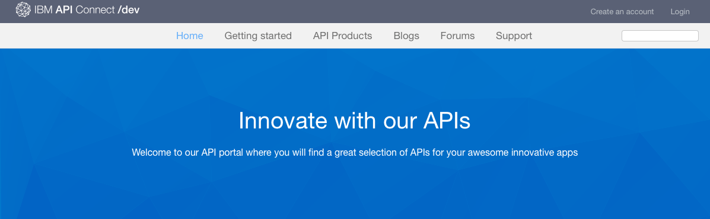
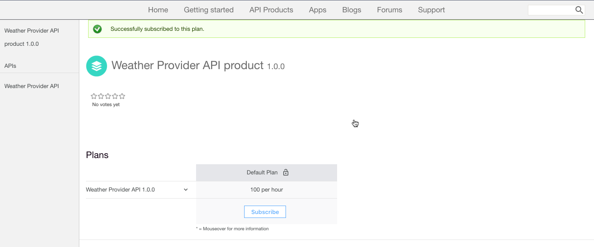

---

copyright:
  years: 2017
lastupdated: "2017-11-20"

subcollection: apiconnect

keywords: IBM Cloud, APIs, lifecycle, catalog, manage, toolkit, develop, dev portal, tutorial

---

{:new_window: target="_blank"}
{:shortdesc: .shortdesc}
{:screen: .screen}
{:codeblock: .codeblock}
{:pre: .pre}

# Discovering APIs
{: #tut_discover_apis}

**Duration**: 25 mins  
**Skill level**: Beginner  

## Objective
{: #object_tut_discover_apis}

In this tutorial, you will learn how a portal user might consume the APIs in the {{site.data.keyword.apiconnect_full}} Developer Portal. You will gain an understanding of how a portal user would explore products and APIs, view and test APIs, and subscribe to APIs. 

## Prerequisite
{: #prereq_tut_discover_apis}

There is no prerequisite for this tutorial. As a portal administrator, you can also complete this tutorial while you navigate your developer portal to experience how your portal users navigate your developer portal. Keep in mind that all developer portals have different skins. 

If you do not have an existing developer portal, you can set up and configure a developer portal in {{site.data.keyword.Bluemix_short}} before proceeding with this tutorial.

## Explore Products & APIs
{: #explore_tut_discover_apis}

This section shows how a portal user would explore the products and APIs in the developer portal.

1. In a browser, navigate to your **API Connect Developer Portal**.

2. In the {{site.data.keyword.apiconnect_short}} Developer Portal, select the API Products tab. 

3. Select one of the available API products to display the available APIs and Plans for the product.  
  

4. Select an API to explore the details of the available APIs.  
  

5. On the details page of an API, you can view the available operations along with their parameters and the responses returned. At the end of the page, you can view the definitions that are used by the API.  
   

6. In the Code examples panel, you can view examples in different coding languages of how to invoke the requests and their responses. Select one of the examples, such as **Node**, to see an example in that coding language.  
   

---

## View and test the APIs
{: #view_tut_discover_apis}

This section shows how a portal user would view and test the available APIs for a product. 

1. Navigate to the API details in the {{site.data.keyword.apiconnect_short}} Developer Portal as outlined in the previous section.  
   

2. You can download and view the APIs Swagger yaml information by selecting **Open API**.  
   

3. Scroll down to one of the operations to view its details. You can also click on the operations link to jump to it on the page. 

4. In the right panel under the examples, scroll to the **Try this operation** section. Enter the parameters and select **Call operation**.  
  

5. Scroll down to view the request and response of the operation call. A returned response of **200 OK** and the message body are displayed, indicating that the operation call was successful.  
  

---

## Subscribe to APIs
{: #subscr_tut_discover_apis}

This section shows how a portal user would subscribe to APIs in the developer portal. 

1. Select **Create an account**. 

2. Complete the required fields and select **Create new account** at the bottom of the page. 
**Note:** Use a different email address than the one that you used to create your developer portal in the previous tutorial.

3. After the developer account is created, log in to view the home page. You must have an app to subscribe to the APIs. Select **Apps** to go to the registered apps page.  
  

4. To register a new application, select **Create new App**.  
  

5. Enter a *Title* and *Description* for your app and select **Submit**.  
   

6. Now that you have an App, you can subscribe to API Product plans. Select **available APIs** or **API Products** to browse the API Product plans.  
   

7. Select the API Product you want to subscribe to.  
   

8. Select **Subscribe** to subscribe to the API Product Plan.  
   

9. Select the app that you want to subscribe to the product Plan, then select **Subscribe**. 
   

10. Your application has successfully subscribed to the product Plan. 
   

## Conclusion
{: #conclusion_tut_discover_apis}

In this tutorial, you learned how your portal users would explore products and APIs, view and test APIs, and subscribe to APIs. 

---

## Next step
{: #next_tut_discover_apis}

Learn [how to gain insights from basic analytics](/docs/services/apiconnect/tutorials?topic=tut_insights_analytics).

Create > Manage > Secure > **Socialize** > Analyze  

