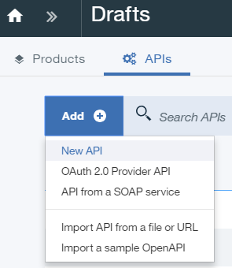
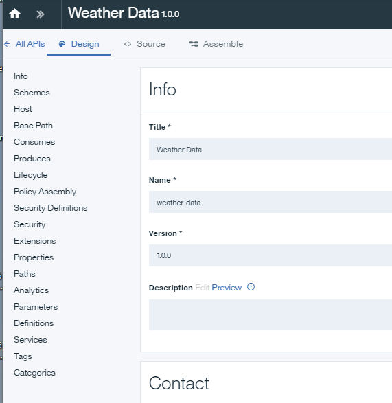
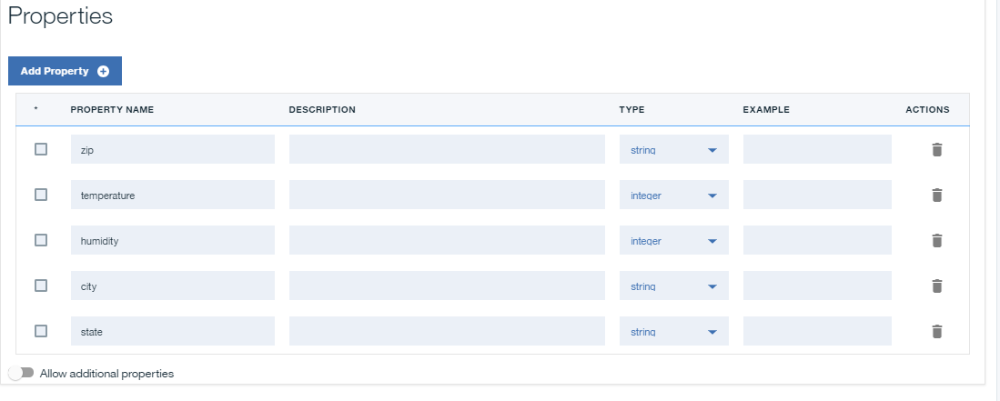
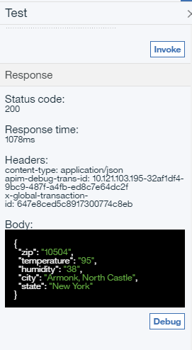

---

copyright:
years: 2019, 2021
lastupdated: "2019-3-12"

subcollection: apiconnect

keywords: IBM Cloud, APIs, lifecycle, catalog, manage, toolkit, develop, dev portal, tutorial

---

{:external: target="_blank" .external}
{:shortdesc: .shortdesc}
{:screen: .screen}
{:codeblock: .codeblock}
{:pre: .pre}
 

# Exposing a SOAP service as a REST API
{: #tut_expose_soap_service}

**Duration**: 20 mins  
**Skill level**: Beginner  

---
## Objective
{: #object_tut_expose_soap_service}

In the API Connect V5 API Manager, create a REST API that accesses an existing SOAP Service and expose it as a REST API.

## Prerequisites
{: #prereq_tut_expose_soap_service}

1. Before you begin, [set up your {{site.data.keyword.apiconnect_full}} instance](/docs/apiconnect?topic=apiconnect-tut_prereq_set_up_apic_instance).
2. Before you begin, copy the [weatherprovider.wsdl test](https://raw.githubusercontent.com/IBM-Bluemix-Docs/apiconnect/master/tutorials/weatherprovider.wsdl){: external} file to your local file system.
	Click **Raw** and then save the page on your local system as a `.wsdl` file.

---
## Setting up a REST API definition
{: #setup_tut_expose_soap_service}

1. Log in to {{site.data.keyword.Bluemix_short}}: https://cloud.ibm.com.
2. In the {{site.data.keyword.Bluemix_notm}} **Dashboard**, click **Cloud Foundry Services**. Launch the {{site.data.keyword.apiconnect_short}} service. 
3. In {{site.data.keyword.apiconnect_short}}, make sure the navigation panel is open. If not, click **>>** to open it.  

  

4. Select **Drafts** in the navigation panel.
5. Select **Add +** > **New API**.

      

	
6. Specify basic information about the API.
	- In the **Title** field, enter `Weather Data`.
	- Leave the **Name** field as `weather-data` when it is filled while you enter your title.	
	- Leave the **Base** Path field as `/weather-data`.
	- Leave the **Version** field as `1.0.0`.
7. Expand **Additional properties** to specify additional properties for the API.
	- From the **API template** field, select **Default** to indicate that you want to use the default template to create the API definition.
	- Leave the remaining fields unchanged.
	
8. Add your API to a new Product and then create the API definition.
	- Select **Add a product**.
	- In the **Title** field, use `Weather Data product` as the default.
	- Leave the **Name** and **Version** fields unchanged.
	- Ensure that the **Publish this product to a catalog** check box is selected and then select **Sandbox** as the target Catalog.
	
	- Click **Create API**. The **Design** tab for the draft of your API definition opens.
9. Your API is now created. The Design page displays.

   

10. Click **Definitions** on the navigation bar. Click the **Add Definition** icon .

11. Expand the new definition by clicking it.
12. Name the definition `Weather Data Output`.
13. The definition uses five properties. Click **Add Property** four times to add rows, and define the properties shown in Table 1. 

    You can ignore the `Description` and `Example` fields.
	   	   
	   |    Name    |   Type   |
	   | ---------- | -------- |
	   |zip         |string    |
	   |temperature |integer   |
	   |humidity    |integer   |
	   |city        |string    |
	   |state       |string    |
	   {: caption="Table 1. Properties for the Weather Data Output definition" caption-side="top"}
	   
	
14. Click **Paths** in the navigation bar. Click the **Add Path** icon .
15. Set the **Title** of your newly created Path to `/getweatherdata`.
16. Expand the **GET /getweatherdata** operation by clicking it.
	
17. For your **GET /getweatherdata** operation, click **Add Parameter**, and then click **Add new parameter**.
18. Name your new parameter `zip_code` and leave the rest as default.
19. In the **Schema** column of the **200 OK** response in the **Responses** section, select your **Weather Data Output** definition. For the response to the API call, the object defined by the **Weather Data Output** is the response object.
	
20. Click the Save icon  to save your changes.

---
## Adding and configuring your web service invocation
{: #add_web_tut_expose_soap_service}

To add and configure the invoke and map policies that integrate your web service into your API definition, complete the steps below.
1. In the **Services** section, click the **Add service** icon . The `Import web service from WSDL` window opens.
	
2. Select **Upload file**.
3. In the **File Upload** window, specify the location to the `weatherprovider.wsdl` file that you downloaded in `step 2` of the **Prerequisites** section and click **Open** to continue.
4. Select the **weatherService** SOAP service and then click **Done**. In the **Services** section, **WeatherService** web service is listed with a single **weatherRequest** operation.
	

		
5. Navigate to the **Assemble** tab and then ensure that **DataPower Gateway policies** is selected.
6. Delete the existing **invoke** policy on the canvas by hovering your cursor over the policy and then clicking the **Delete policy** icon .
		
7. From the palette, drag the **weatherRequest** web service onto the dashed box that is displayed on the canvas. An invoke policy and two map policies are placed in the assembly. The first map policy assigns variables to the input of your web service invocation, while the second policy assigns outputs of your web service invocation to variables. The outputs of the first map and the inputs of the second map are generated from the WSDL provided in step 4.
		
8. Click the **weatherRequest: input** map policy and then click the **Edit inputs** icon  in the Input column of the property sheet.
		
9. Click **+ parameters for operation** and select `get /getweatherdata`.
10. Click **Done** to add the `zip_code` parameter.
	
11. Click the circle corresponding to **zip_code string** on the input side and then click the circle corresponding to **zipcode string** on the output side.  
	
12. Close the property sheet.
13. Click the **weatherRequest: output** map policy in the palette and then click the **Edit outputs** icon  in the Output column of the property sheet.
14. Select **+ outputs for operation** and select `get /getweatherdata`.
15. Select **Done** to add the `Weather Data Output` output definition.
	
16. Click the circle corresponding to **zip string** on the input side and then click the circle corresponding to **zip string** on the output side. Map the remaining parameters using the following as a guide.
	
17. Click the **Save** icon  to save your changes.

You have included the web service invocation in your assembly and mapped an input parameter to the appropriate part of the SOAP request and mapped the appropriate part of the SOAP response to a JSON output.

---
## Testing your API definition
{: #test_tut_expose_soap_service}

To test your API definition by using the API Manager test tool, complete the steps below.
1. Click the **Test** icon  under the **Assembly** tab to reveal the test pane.
	
2. If you have used the test tool before, click **Change setup**.
3. Choose `Weather Data product 1.0.0` from the list of products.
	
4. Click **Republish product**.
5. Click **Next**.
6. Select `get /getweatherdata` from the list of operations.  
	
7. Scroll down to the **zip_code** field, enter `10504`.  
	
8. Click **Invoke**. The API returns the current weather.  
	

---
## Conclusion
{: #conclusion_tut_expose_soap_service}

In this tutorial, you completed the following activities:
1. Set up a REST API definition
2. Configured an API to invoke an existing web service and return its output
3. Tested your API definition

---

## Next step
{: #next_tut_expose_soap_service}

[Secure your API using OAuth 2.0](/docs/apiconnect/tutorials?topic=apiconnect-tut_secure_oauth_2).

Create > **Manage** > Secure > Socialize > Analyze

