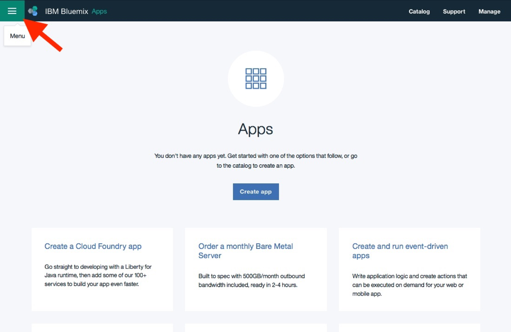
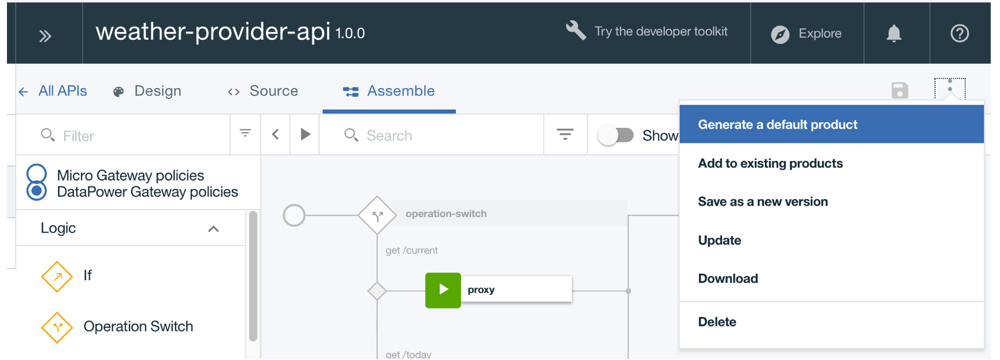
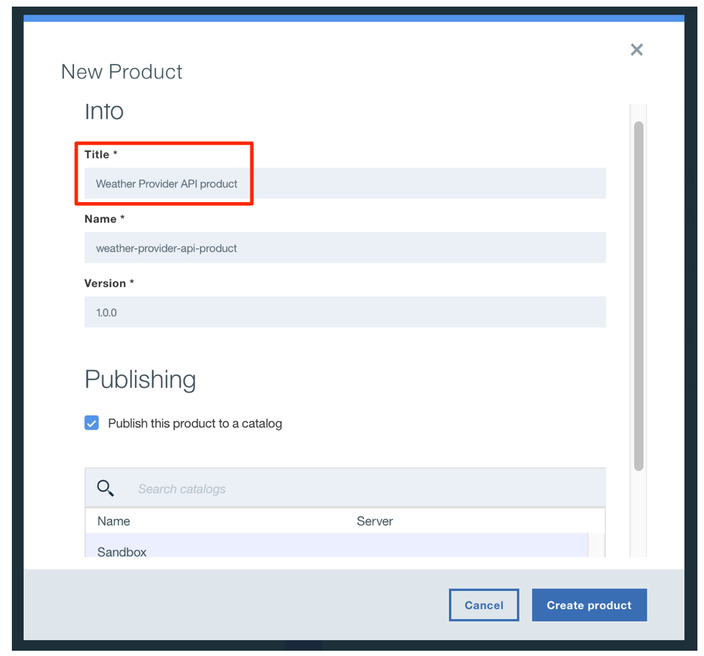
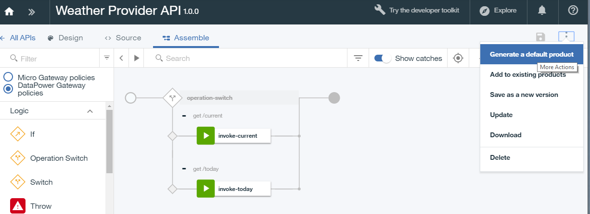
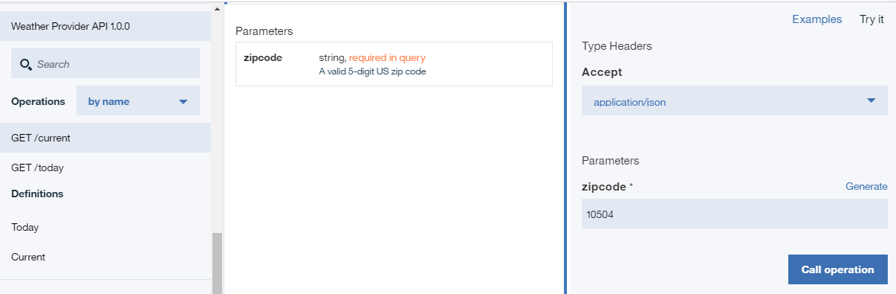

---
copyright:
  years: 2017
lastupdated: "2017-09-30"
---

{:new_window: target="blank"}
{:shortdesc: .shortdesc}
{:screen: .screen}
{:codeblock: .codeblock}
{:pre: .pre}

# Import your API spec and proxy an existing REST service with IBM Bluemix
Duration: 5 mins  
Skill level: Beginner  

## Objective
This tutorial helps you get started quickly with {{site.data.keyword.apiconnect_full}} by illustrating how you can bring your existing API under management control. We'll start by importing an OpenAPI spec, and then create a passthrough API proxy for an existing REST service.

## Prerequisites
Before you begin, you will need to [set up your {{site.data.keyword.apiconnect_short}} instance](tut_prereq_set_up_apic_instance.html).

---


## Explore the sample app and test the target endpoints

A sample _weather provider_ app has been created for this tutorial. The corresponding API specification (Swagger 2.0) is in the [weather-provider-api_1.0.0.yaml ](https://raw.githubusercontent.com/ibm-apiconnect/getting-started/master/toolkit/1a-import/weather-provider-api_1.0.0.yaml){:new_window} file.

1. To explore the app, go to [http://gettingstartedweatherapp.mybluemix.net/ ](http://gettingstartedweatherapp.mybluemix.net/){:new_window}.  
2. Enter a valid 5-digit U.S. zipcode to get the _**current weather**_ and _**today's forecast**_.  


3. The above sample weather app was built using APIs that provide the weather data. The endpoint to get the **current** weather data is ```https:// myweatherprovider<span></span>.mybluemix.net/current?zipcode={zipcode}```. Test it out by visiting [https://myweatherprovider.mybluemix.net/current?zipcode=90210 ](https://myweatherprovider.mybluemix.net/current?zipcode=90210){:new_window}.  

  

4. Similarly, the Endpoint to get **today's** forecast data is ```https:// myweatherprovider<span></span>.mybluemix.net/today?zipcode={zipcode}```. Test it out by going to [https://myweatherprovider.mybluemix.net/today?zipcode=90210 ](https://myweatherprovider.mybluemix.net/today?zipcode=90210){:new_window}.  

  


---

## Import the sample app's OpenAPI spec to create a REST API proxy
1. Log in to {{site.data.keyword.Bluemix_short}}: https://new-console.ng.bluemix.net/login.
2. In the {{site.data.keyword.Bluemix_short}} navigation panel, select **Services**, then **Dashboard**. Launch the API Connect service.  
        

3. In {{site.data.keyword.apiconnect_short}}, make sure the navigation panel on the left side is open. If not, click **>>** to open it.  
4. Select **Drafts** in the navigation panel.   
5. In the **APIs** tab, click **Add**. From the dropdown menu, select **Import API from a file or URL**.  
     

6. We will now import the OpenAPI weather definition. In the "Import OpenAPI (Swagger)" dialog box that opens, enter the following URL:
```https://raw.githubusercontent.com/ibm-apiconnect/getting-started/master/bluemix/1a/weather-provider-api_1.0.0.yaml```. Leave the other options with their default values and click **Import**.  
      

7. After you import the OpenAPI spec, you are taken to the **Design** view of the API. Here you can view various sections of the OpenAPI definition. Scroll to explore, and note the **Host** value. You can also view the OpenAPI under the **Source** tab.
  _Note: You'll notice that the Host value is set to_ ```$(catalog.host)``` _. This is the base URL for your API proxy._
8. Save your API.


## Test your API proxy

### Test with the _API Manager test tool_.
1. In the **Assemble** tab, click the icon for more actions, then select **Generate a default product**.  
     

2. Accept the default options in the **New Product** dialog box, and click **Create Product**. The **Weather Provider API product** is created and published to the Sandbox catalog. A message indicating successful product generation is displayed.  
    

  

  _In API Connect, **Products** provide a way to group APIs that are intended for a particular use. Products are published to a **Catalog**.  [{{site.data.keyword.apiconnect_short}} glossary](../apic_glossary.html)_

3. In the Assemble tab, click the play icon to test your API proxy's target invocation.

4. In the test panel, select the **get /current** operation.  
    a. Zipcode is a required parameter for this operation, so enter a valid U.S. zip (for example, 90210).  
    b. Click **invoke**, and verify that you see:  
    ```
    - 200 OK response
    - Current weather data for 90210  
    ```
_If you run into a CORS error, follow the instructions in the error message. Click the link in the error to add the exception to your browser, and then hit the "invoke" button again._

    


### Test with the _Explore tool_.
_The Explore Tool allows users to test the correct operation of the API by enforcing any parameter requirements that are set in the OpenAPI definition. This enforcement is not done in the API Test Tool found in the Assemble tab, so it allows the user to verify the API behavior when the parameter is missing._

1. To test your API proxy endpoints, select **Explore**, then select **Sandbox**.
    
2. Select the **GET /current** operation from the palette.
3. Select "Try it".  
4. Enter a valid U.S. zipcode (e.g. 90210) in the test box.
5. Click **Call operation** to see the response.
  

    


### Conclusion
In this tutorial, you saw how an existing REST service can be invoked through an API passthrough proxy. You started by checking the availability of the sample service through the web browser. Then you created an API proxy in API Connect, and linked the proxy to the sample service to be invoked. You packaged your API into a product, published the product to catalog, and tested the proxy.

---

## Next step

Secure your API using [rate limiting](tut_rate_limit.html), [client ID and secret](tut_secure_landing.html), or [securing using OAuth 2.0](tut_secure_oauth_2.html).

Create > **Manage** > Secure > Socialize > Analyze

