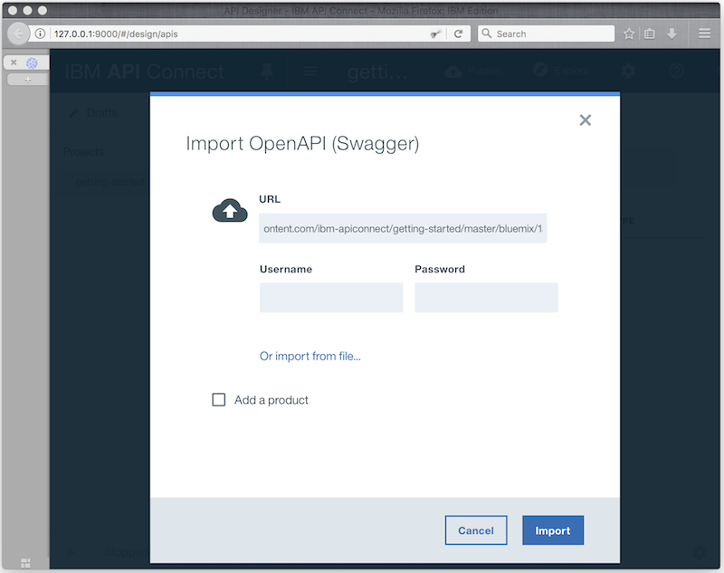

---
copyright:
  years: 2017
lastupdated: "2017-07-13"
---

{:new_window: target="blank"}
{:shortdesc: .shortdesc}
{:screen: .screen}
{:codeblock: .codeblock}
{:pre: .pre}

# Import your API spec, and proxy an existing REST service by using the Developer Toolkit
Duration: 5 mins  
Skill level: Beginner  


## Objective
This tutorial helps you get started quickly with {{site.data.keyword.apiconnect_full}} by illustrating how you can bring your existing API under management control. Start by importing an OpenAPI spec, and then create a passthrough API proxy for an existing REST service.

---

## Explore the sample app and test the target endpoints
A sample _weather provider_ app was created for this tutorial.

1. To explore the app, go to http://gettingstartedweatherapp.mybluemix.net/.  
2. Enter a valid 5-digit U.S. zip code to get the _**current weather**_ and _**today's forecast**_.  


  - The sample weather app was created using APIs that provide the weather data. The endpoint to get the **current** weather data is _**https:// myweatherprovider<span></span>.mybluemix.net/current?zipcode={zipcode}**_.
  - Test it out by going to https://myweatherprovider.mybluemix.net/current?zipcode=90210.  
  

  - Similarly, the endpoint to get the forecast data for **today** is _**https:// myweatherprovider<span></span>.mybluemix.net/today?zipcode={zipcode}**_.
  - Test it out by going to https://myweatherprovider.mybluemix.net/today?zipcode=90210.  
  


---

## Import the sample app's OpenAPI spec to create a REST API proxy
1. Launch the **API Designer**. In your terminal window, enter the following command: `apic edit`.
2. Log in using your IBMid.
    
3. In the **API Designer** navigation panel, select **Drafts > APIs**.
4. In the **APIs** panel, select **Add > Import API from a file or URL**.
5. There is an OpenAPI 2.0 definition of the weather API that you will use for this tutorial. In the "Import OpenAPI (Swagger)" dialog box, enter this URL:
https://raw.githubusercontent.com/ibm-apiconnect/getting-started/master/toolkit/1a-import/weather-provider-api_1.0.0.yaml.
6. Leave the _Add a product_ option unchecked and click **Import**.  
      
7. There are a few more steps before your API proxy is ready. In the API's **Design** view, scroll down to the **Host** panel.   
_You'll notice that the Host value is set to myweatherprovider.mybluemix.net. Change this value to_ ```$(catalog.host)``` _. This sets the base URL for your API proxy._
8. Save your API.  


## Test your API proxy

### Test with the _API Manager test tool_.
1. Select the **Assemble** tab.
2. Start the local test server by selecting the **Start servers** icon.
    

3. Click the play icon (►) to test your API proxy's target invocation.
    

4. In the test panel, select the **get /current** operation.  
  - Zipcode is a required parameter for this operation, so enter a valid U.S. zip code (for example, 90210).  
  - Select **invoke**, and verify that you see the following responses: 
    ```
    200 OK response
    Current weather data for 90210
    ```
        


### Test with the _Explore tool_.  
1. To test your API proxy endpoints, select **Explore**.
2. Select the **GET /current** operation from the palette.
3. Enter a valid U.S. zip code (for example, 90210) in the test box.
4. Select **Call operation** to see the response.  
  

## Conclusion

In this tutorial, you saw how an existing REST service can be invoked through an API passthrough proxy. You started by checking the availability of the sample service through the web browser. Then you created an API proxy in API Connect, and linked the proxy to the sample service to be invoked. Finally, you tested this service with the {{site.data.keyword.apiconnect_short}} internal testing tools.


