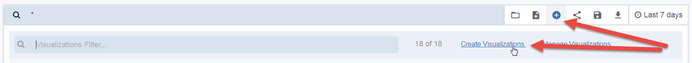

---

copyright:
  years: 2017, 2021
lastupdated: "2017-12-15"

subcollection: apiconnect

keywords: IBM Cloud, APIs, lifecycle, catalog, manage, toolkit, develop, dev portal, tutorial, API Connect V5

---

{:external: target="_blank" .external}
{:shortdesc: .shortdesc}
{:screen: .screen}
{:codeblock: .codeblock}
{:pre: .pre}

# Gaining insights from basic analytics
{: #tut_insights_analytics}

Duration: 30 mins  
Skill level: Beginner

## Objective
{: #object_tut_insights_analytics}

This is a basic introduction to API analytics in {{site.data.keyword.apiconnect_full}} V5. We'll tour the available analytics dashboards, and you can follow along with your own APIs.

## Prerequisites
{: #prereq_tut_insights_analytics}

In order to view your own API analytics, you must have an API Product created and published. Additionally, you'll need to call your API several times to generate some analytics data, preferably using a client ID from a registered application (not the pre-provisioned test app).

To generate the data in this tutorial, we used Postman's *Collection Runner* to call an API several times, with different data and client IDs. You can use a similar tool (like HttpRequester for Firefox), or just use cURL to call your API multiple times from the command line. You can obtain sample requests for your API by clicking the **Explore** link in {{site.data.keyword.apiconnect_short}}.

## Introduction to catalog analytics
{: #intro_tut_insights_analytics}

As an API owner, you need a way to assess the success and performance of the APIs you offer. The main place you'll look for analytics is at the catalog level. If you have not been introduced to catalogs, see [Working with Catalogs](https://www.ibm.com/support/knowledgecenter/en/SSFS6T/com.ibm.apic.apionprem.doc/conref_working_with_env.html){: external} in the IBM Knowledge Center for an introduction. 

You and your App developers can also access app-specific analytics in the Developer Portal, but we'll focus on Catalog Analytics in this tutorial.

You have access to up to 90 days of realtime and historical information regarding your APIs and Products that are published to that catalog. It also shows you who is calling them. If your catalog has multiple spaces, you can navigate to the Space level.

This tutorial consists of four activities that show you how to complete the following tasks:
* View analytics
* View event record details
* Build new dashboards
* Create new visualizations

## Activity 1: Viewing out of the box analytics
{: #act1_tut_insights_analytics}

1. In your {{site.data.keyword.apiconnect_short}} service on {{site.data.keyword.cloud_notm}}, launch your Dashboard and select the Catalog that you want to open. 
2. Click the *Analytics* tab.

    
  
You'll see the default Overview dashboard, which shows two bar chart visualizations that contain the following data from the last 7 days:
* 5 Most Active Products 
* 5 Most Active APIs 

3. Hover over any of the bars to see additional details, such as the API count, api names, and so on.

    

4. Use the search bar to filter the data shown. You can also select a different time filter and/or auto-refresh rate. The visualizations update to reflect your selections.

There are other dashboards that are provided out of the box for you.

5. Click the folder icon to load a saved dashboard, and select **api_default** from the dropdown list.

    

This dashboard has a different set of visualizations that display API status, errors, response times, total number of calls, and calls per day.

    

## Activity 2: Viewing event details
{: #act2_tut_insights_analytics}

Visualizations are a great way to get a useful overview of data, but you also need a way to navigate into the event records that populate the charts.

1. Hover over the arrow icon in the bottom-left corner of any visualization. A small arrow appears.
2. Click the arrow to see a table of the data that is used in that visualization. 
3. Click the **View Events** label to navigate into the individual event details for up to 100 records.

    

You can edit, move, and delete visualizations on your dashboard.

## Activity 3: Building new dashboards
{: #act3_tut_insights_analytics}

Now, let's create a new dashboard that will provide view of API traffic patterns. These are all available using built-in visualizations. 

1. Click the new dashboard icon and click the **Choose from existing visualizations** link. 

    
    A list of available visualizations is displayed.

2. Select a few visualizations to add to your dashboard.  For example:
  * Subscribed Apps
  * Apps per Plan 
  * Success Rate
  * API Calls per Day
  
  **Tip** When you select each visualization, the selection tab blocks your dashboard view, so you may not realize that the visualization was added to the dashboard. Select one visualization at a time and close the selection tab each time to see the changes to your dashboard.

3. Click **Save** and give your dashboard a name: `Subscriber Dashboard`.

   

    

## Activity 4: Creating new visualizations
{: #act4_tut_insights_analytics}

On the Subscriber Dashboard that we created, we included the built-in visualization that shows API Calls per Day. When we look at all of that information presented together, we'd really like to see the usage by App. Let's create a new visualization that shows this information.

1. Click **New Visualization** and select the **Create Visualizations** link.
    

2. Select **Line chart** as your visualization type. The initialized line chart has the Y-Axis setup with a count of API calls. This is appropriate for our chart.

3. Select the following:
	* Buckets type: **X-Axis**
	* Aggregation: **Date Histogram**
	* Custom Label: **Time** 
4. Click **Run** to see your chart. **Tip**: You might need to adjust your time frame to see data.

   

This chart (so far) shows a time series of API calls. We want to see API calls by app name.

5. Click the **Add sub-buckets** button.
6. Select the following:
	* Buckets type: **Split Lines**
	* Sub Aggregation: **Terms**
	* Field: **app_name**
	* Custom Label: **App**
	
   
8. Click **Run** to see your chart.
9. Click **Save** and give your chart a name `API Calls by App`.
10. To see your visualization in context, add it to the Subscriber dashboard.

   
 
There is other information available for visualizing details about API calls, callers, and so on. A full list of API events is available in the API Connect Knowledge Center, or in the list of Terms when you create visualizations.

## Conclusion
{: #conclusion_tut_insights_analytics}

The ability to visualize API analytics in different styles and combinations gives you an opportunity to draw conclusions or go deeper into your API data. You can use this insight to make decisions about which APIs to offer, when to replace or retire an API, who is consuming your APIs, and so on.

For example, APIs version 1 (v1) and version 2 (v2) from a provider named "ACME" have been running for several years. They deprecated v1 when they released v2. They also ensured that existing v1 consumers were aware that they had a certain timeline to move to v2. As this deadline approaches, ACME wants to see how quickly consumers are moving off v1, so they can offer assistance to valued partners. 

Using a visualization similar to the one we just built, ACME has this information available at a glance.

In this tutorial, we walked through a number of activities to help you create useful combinations of API and consumer data. Using visualizations and dashboards, we quickly created tools that can provide data to help make sure that we are offering the right mix of APIs.

---

## Next step
{: #next_tut_insights_analytics}
Learn [how to manage your APIs and versioning](/docs/apiconnect/tutorials?topic=apiconnect-tut_manage_version_landing).

Create > Manage > Secure > Socialize > **Analyze**  
