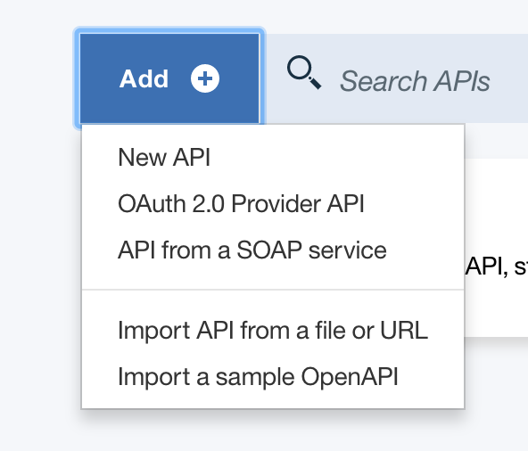
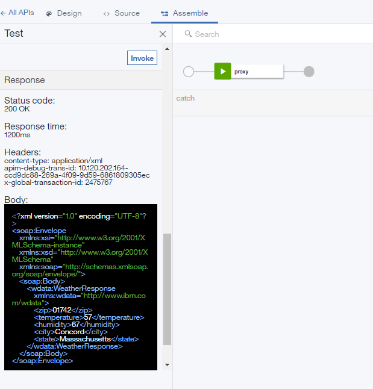

---

copyright:
  years: 2019
lastupdated: "2019-3-11"

subcollection: apiconnect

keywords: IBM Cloud, APIs, lifecycle, catalog, manage, toolkit, develop, dev portal, tutorial

---


{:external: target="_blank" .external}
{:shortdesc: .shortdesc}
{:screen: .screen}
{:codeblock: .codeblock}
{:pre: .pre}


# Managing a SOAP service
{: #tut_manage_soap_api}

**Duration**: 15 mins
**Skill level**: Beginner

---
## Objective
{: #object_tut_manage_soap_api}

Use API Manager to create a SOAP API that is a proxy for a SOAP-based weather service.

## Prerequisites
{: #prereq_tut_manage_soap_api}

- [Set up your {{site.data.keyword.apiconnect_short}} instance](/docs/apiconnect/tutorials?topic=apiconnect-tut_prereq_set_up_apic_instance).
- Copy the [weatherprovider.wsdl test](https://raw.githubusercontent.com/IBM-Bluemix-Docs/apiconnect/master/tutorials/weatherprovider.wsdl){: external} file to your local file system.

  Click **Raw** and then save the page on your local system as a `.wsdl` file.

---
## Setting up a SOAP API definition
{: #setup_tut_manage_soap_api}

1. Log in to {{site.data.keyword.cloud_notm}}: https://cloud.ibm.com.
2. In the {{site.data.keyword.cloud_notm}} **Dashboard**, click **Cloud Foundry Services**. 
3. Launch the {{site.data.keyword.apiconnect_short}} service. 
4. In {{site.data.keyword.apiconnect_short}}, make sure the navigation panel on the left side is open. If not, click **>>** to open it.  
5. Select **Drafts** in the navigation panel.   

6. In the menu, select **API from a SOAP service**.
  

7. The New API from WSDL dialog box opens. Click **Upload File**.
  

8. Select the `weatherprovider.wsdl` file that you saved previously.

9. The New API from WSDL dialog box reappears. Check the **weatherService** check box. Click **Done**.
  

10. The Design view of the API opens. 
  

11. Click  icon to save your changes. An "API Saved" confirmation notification appears momentarily.

12. In the page header, the **Design** tab indicates your present location. The **Source** tab displays the OopenAPI file that represents your API, and the **Assemble** tab provides a graphical interface for API processing. Click **Assemble**.
    

## Testing the SOAP API definition
{: #test_tut_manage_soap_api}

1. In the **Assemble** tab, click the **More actions** (three dots) icon and select **Generate a default product** from the menu.  
   

2. Accept the default options in the **New Product** dialog pop-up, and select **Create Product**. The **weatherService product 1.0.0** is created and published to the default Sandbox catalog.  
  
 
  In {{site.data.keyword.apiconnect_short}}, **Products** provides a mechanism to group APIs that are intended for a particular use. Products are published to a **Catalog**.
  
3. Save your changes.  

4. Click the test icon to test the API service. The Setup menu appears.

5. From the Products list, select `weatherService product 1.0.0`.  
  

6. Click **Next**.

7. In the list of Operations, select `post /weatherRequest`.  
  

8. Enter the following xml in the body field. You can select and copy the following example XML, then click the **body** field to activate the field and paste the example XML.  
  ```
  <?xml version="1.0" encoding="UTF-8"?>
  <soap:Envelope xmlns:xsi="http://www.w3.org/2001/XMLSchema-instance" xmlns:xsd="http://www.w3.org/2001/XMLSchema" xmlns:soap="http://schemas.xmlsoap.org/soap/envelope/">
   <soap:Body>
  <wdata:WeatherRequest xmlns:wdata="http://www.ibm.com/wdata">
       <zipcode>10504</zipcode>
  </wdata:WeatherRequest>
   </soap:Body>
  </soap:Envelope>
  ```
 
  

9. Click **Invoke**.
The API returns a Response **body** that contains information about the current weather.  
  

## Conclusion
{: #conclusion_tut_manage_soap_api}

In this tutorial, you completed the following tasks:
1. Set up a SOAP API definition.
2. Test your API definition by invoking an API that requests weather data.
3. Receive a Response **body** from the weather API endpoint indicating the result of your request.

---

## Next step
{: #next_tut_manage_soap_api}

[Expose your service as a REST API](/docs/apiconnect/tutorials?topic=apiconnect-tut_expose_soap_service) or [secure your API using OAuth 2.0](/docs/apiconnect/tutorials?topic=apiconnect-tut_secure_oauth_2).

Create > **Manage** > Secure > Socialize > Analyze
