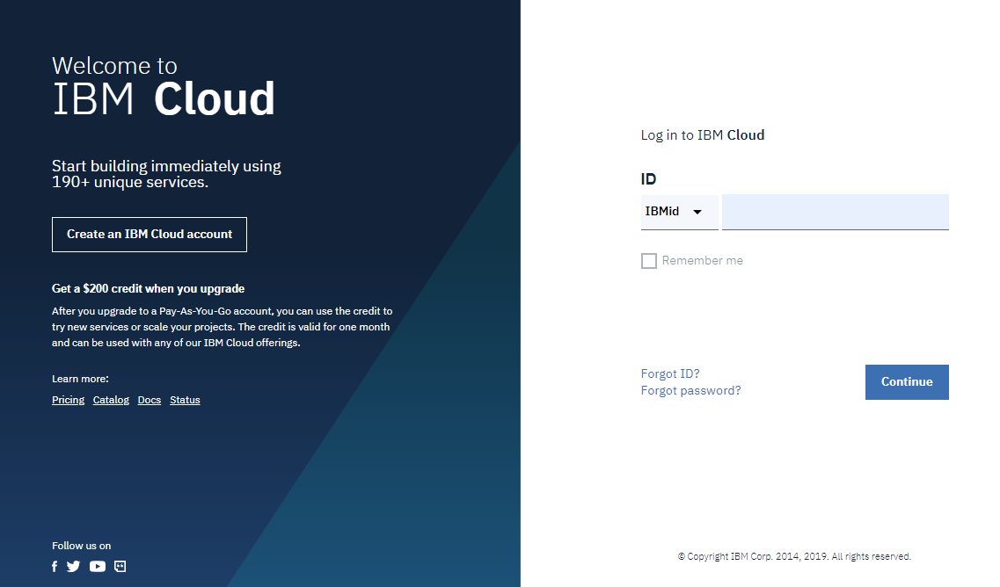

---

copyright:
  years: 2019, 2021
lastupdated: "2019-3-14"

keywords: IBM Cloud, APIs, lifecycle, catalog, manage, toolkit, develop, dev portal, tutorials, API Connect V5

subcollection: apiconnect

---

{:external: target="_blank" .external}
{:shortdesc: .shortdesc}
{:screen: .screen}
{:codeblock: .codeblock}
{:pre: .pre}

# Setting up an API Connect V5 instance
{: #tut_prereq_set_up_apic_instance}

**Duration**: 15 mins  
**Skill level**: Beginner  

## Prerequisites
{: #prereq_tut_prereq_set_up_apic_instance}

1. An IBMid - Used to access all of IBM's apps, communities, support and more .
2. An {{site.data.keyword.cloud_notm}} account - IBM's cloud platform that hosts API Connect along with other apps and services.
3. An {{site.data.keyword.apiconnect_full}} instance with at least a _Lite_ plan: A free version of API Connect V5, hosted on IBM Cloud.

---

## Set up your {{site.data.keyword.apiconnect_full}} instance
{: #provision_tut_prereq_set_up_apic_instance}

1. Sign up for your IBM Cloud ID at the following URL: [https://cloud.ibm.com/registration/](https://cloud.ibm.com/registration/){: external}.

	Already have an IBMid? Then skip the registration, and just create your free {{site.data.keyword.cloud_notm}} account at the following URL: [https://cloud.ibm.com/](https://cloud.ibm.com/){: external}.  

2. When you have your IBMid and {{site.data.keyword.cloud_notm}} account, create your {{site.data.keyword.apiconnect_short}} instance.  
  a. Log in to {{site.data.keyword.cloud_notm}} : [https://cloud.ibm.com/login](https://cloud.ibm.com/login){: external}.  
    
  b. Create your _organization_ in {{site.data.keyword.cloud_notm}}. You will be prompted to do this the first time that you log in.  
  
  c. Create your _space_.  
  
  d. Go to [https://cloud.ibm.com/catalog/services/api-connect](https://cloud.ibm.com/catalog/services/api-connect){: external}.  
    
  e. Select the _Lite_ pricing plan (free), and click **Create** to get started.  
    