---

copyright:
   years: 2019, 2021
lastupdated: "2019-3-14"

subcollection: apiconnect

keywords: IBM Cloud, APIs, lifecycle, catalog, manage, toolkit, develop, dev portal, tutorial, API Connect V5

---

{:external: target="_blank" .external}
{:shortdesc: .shortdesc}
{:screen: .screen}
{:codeblock: .codeblock}
{:pre: .pre}

# Securing your API with two-legged OAuth
{: #tut_secure_oauth_2}

Duration: 10 mins  
Skill level: Beginner

## Objective
{: #object_tut_secure_oauth_2}

This tutorial will guide you through securing your API using a two-legged OAuth 2.0 flow in API Connect V5. In this application flow, the OAuth client initiates a request with the authorization server, and received an access token. The OAuth client can then use the token to access protected resources through your API.

## Prerequisites
{: #prereq_tut_secure_oauth_2}

Before you begin, you must have completed the following tutorial.  
- [Securing an API with Client-ID and Client-Secret Keys with {{site.data.keyword.cloud_notm}}](/docs/apiconnect/tutorials?topic=apiconnect-tut_secure_id_secret_bm)
or
- [Securing an API with Client-ID and Client-Secret Keys with the Toolkit](/docs/apiconnect/tutorials?topic=apiconnect-tut_secure_id_secret_tk)

Note: This tutorial shows the steps and screenshots for accomplishing the task within the {{site.data.keyword.cloud_notm}} UI. You can also complete the same procedure by using the command line. You can view that procedure in the [IBM Knowledge Center](https://www.ibm.com/support/knowledgecenter/SSMNED_5.0.0/com.ibm.apic.toolkit.doc/tutorial_apionprem_security_OAuth_v506.html){: external}. 

## Procedure
{: #steps_tut_secure_oauth_2}

1. Create an OAuth Provider API and select your OAuth scheme.  
	a. Open **Drafts**, select **APIs**, and click **Add** > **OAuth 2.0 Provider API**.  
    
	b. Title it "OAuth Endpoint API". The name and base path should be populated automatically.  
	c. Select **Create API**.  
	d. In the newly created OAuth Endpoint API, navigate to the **OAuth 2** panel (or scroll down to it), and select "Confidential" as the Client Type.  
	e. Under Scopes, rename _scope1_ to _view_current_. Delete _scope2_ and _scope3_.  
	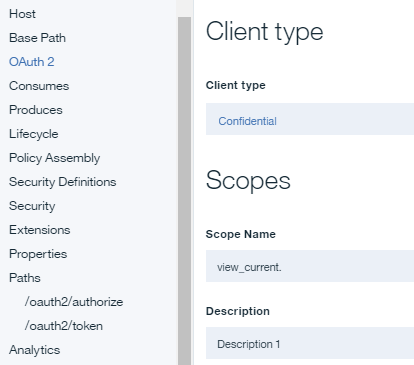 
	
	f. Under **Grants**, deselect **Implicit**, **Password**, and **Access Code**. Leave **Application** selected.  
	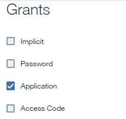  
	
	g. Save your API.  

2. Update the security definition of your Weather Provider API to include OAuth.  
	a. Switch over to your _Weather Provider API_. (Go back to APIs and then select _Weather Provider API_.)  
	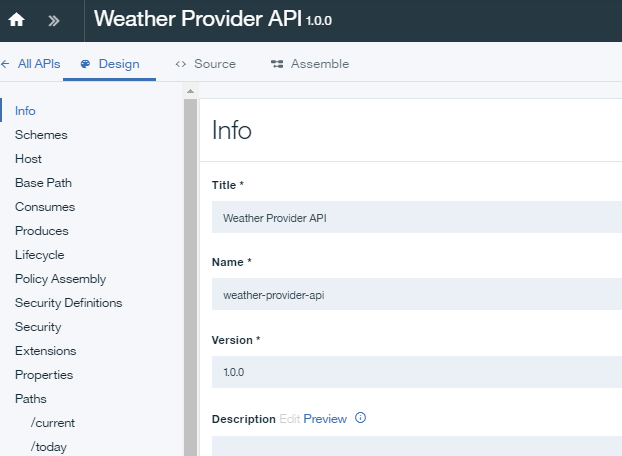
	
	b. Under Security Definitions, click the **+** icon add a new definition for OAuth. 
	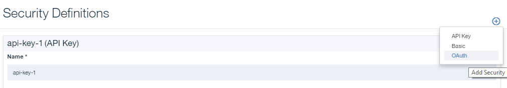
	c. Set the Name to "OAuth definition".  
	d. In the Flow field, select **Application**.  
	e. Enter the token URL _**your base URL**/oauth-endpoint-api/oauth2/token_.  
	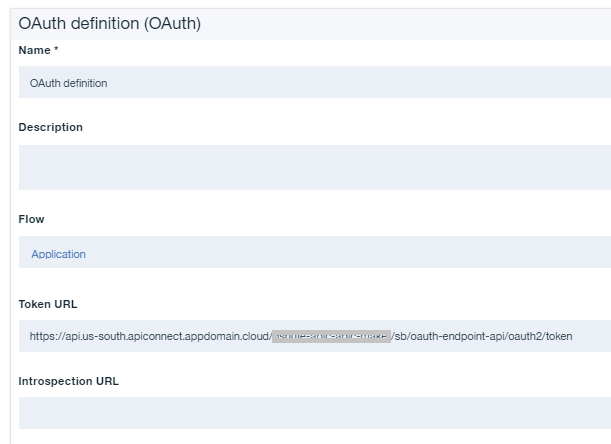
	
	f. Add a new Scope: view_current.  
	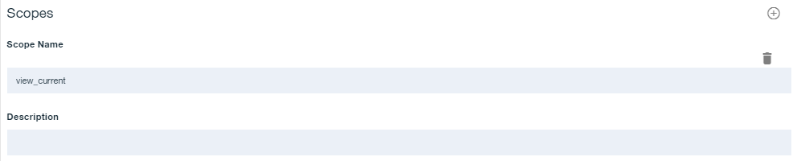
	g. Under **Security**, select **OAuth Definition** and **view_current**, and keep the Client ID and Client Secret selected.  
	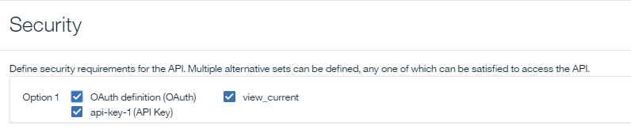
	
	h. Click Save.  
	
	i. Navigate back to **Drafts** and select **Products**.  Open the **Weather Provider API product**.
	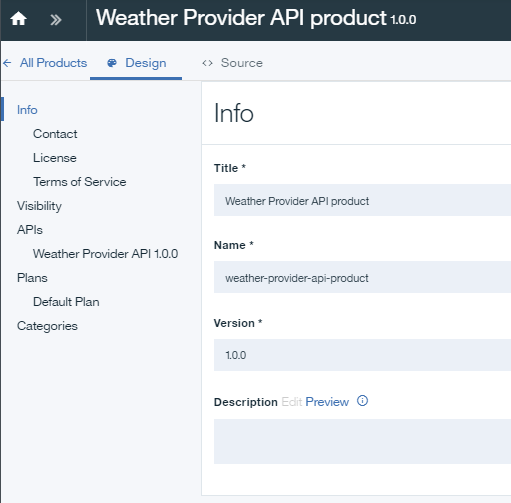
	
	j. Click **APIs** on the navigation bar. Click the **+** icon add a new API. Add the OAuth Endpoint API to your Weather Provider product.  
	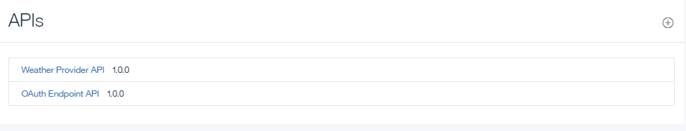
	k. Save the product, and stage it to your Sandbox.  
	

3. Test your OAuth security configuration.  
	a. Publish your updated product to the sandbox. Click **Dashboard > Sandbox**, and then publish your product.  
	  
	b. Accept the defaults on the Visibility dialog.  Click **Publish**.
	  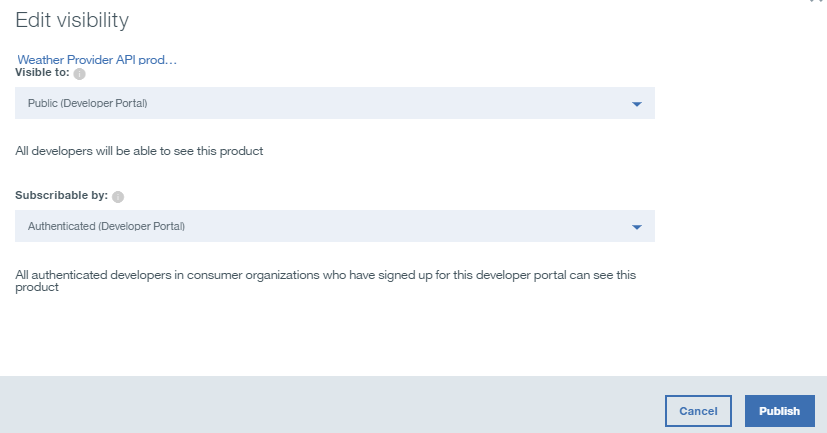
	  
	c. Click **Explore > Sandbox**.  
      
	d. In your **Weather Provider API**, click **GET /current** from the list of operations. 
	
	e. Click **Try It**. 
	
	f. In the right-hand panel, notice that Client ID and Client Secret are already populated.  
	
	g. In the **Parameters** section, enter _10504_ in the **zipcode** field.  
	  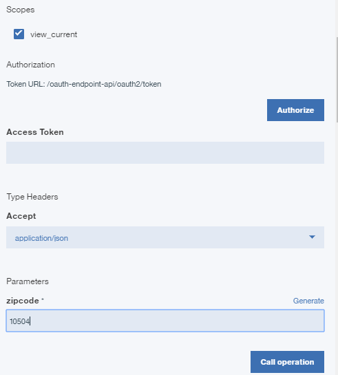
	
	h. In the **Authorization** section, click **Authorize** to get your access token.
	  
	
	i. After you've received your access token, click **Call operation** to complete your test.  
      

4. Notice that the request includes the access token, Client ID, and Client Secret. To pass only the access token in the request, you will need to remove the Client ID and Secret from the security requirements for the Weather Provider API.  
    

5. Save your Weather Provider API. Then stage and publish it to the Sandbox. From the Explore tool, run the same test as you previously did.  
    
    
## Conclusion
{: #conclusion_tut_secure_oauth_2}

In this tutorial, you learned how to create an OAuth Provider API, update the security definitin of an API to include OAuth, and test your security configuration.

---

## Next step
{: #next_tut_secure_oauth_2}

Start to socialize your API by [setting up and configuring a developer portal](/docs/apiconnect/tutorials?topic=apiconnect-tut_config_dev_portal).

Create > Manage > **Secure** > Socialize > Analyze
